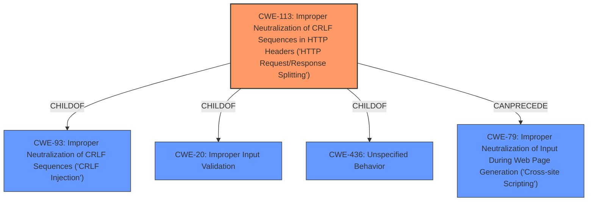

# Raw Analyzer Response for CVE-2022-3215

# Summary
| CWE ID | CWE Name | Confidence | CWE Abstraction Level | CWE Vulnerability Mapping Label | CWE-Vulnerability Mapping Notes |
|---|---|---|---|---|---|
| CWE-113 | Improper Neutralization of CRLF Sequences in HTTP Headers ('HTTP Request/Response Splitting') | 1.0 | Variant | Allowed | Primary CWE |
| CWE-79 | Improper Neutralization of Input During Web Page Generation ('Cross-site Scripting') | 0.5 | Base | Allowed | Secondary CWE |

## Evidence and Confidence

*   **Confidence Score:** 0.9
*   **Evidence Strength:** HIGH

## Relationship Analysis
The primary CWE identified is CWE-113, which is a Variant of CWE-93 (Improper Neutralization of CRLF Sequences) and is also a child of CWE-20 (Improper Input Validation) and CWE-436 (Unspecified Behavior). CWE-113 can precede CWE-79 (Cross-site Scripting) because injecting CRLF sequences can lead to the injection of malicious scripts. This hierarchical and chain relationship influenced the selection, prioritizing the specific Variant (CWE-113) as the root cause and acknowledging the potential for XSS (CWE-79) as a consequence.

## Vulnerability Chain
The vulnerability chain starts with **improper input validation**, leading to **HTTP response injection** due to the lack of neutralization of CRLF sequences. This, in turn, allows attackers to inject malicious headers, potentially leading to XSS or cache poisoning.

`Improper Input Validation` -> `CWE-113: Improper Neutralization of CRLF Sequences in HTTP Headers` -> `HTTP Response Injection` -> `CWE-79: Improper Neutralization of Input During Web Page Generation ('Cross-site Scripting')` / `Cache Poisoning`

## Summary of Analysis
The analysis is strongly based on the provided evidence, particularly the vulnerability description and the CVE reference links content summary. The vulnerability description explicitly mentions the **improper input validation** as a root cause and **HTTP response injection** as a weakness. The CVE reference links confirm that the root cause is the **improper neutralization of CRLF sequences** in HTTP headers.

The retriever results also support this classification, with CWE-113 being the top-ranked CWE. The hierarchical relationships and chain relationships confirm that CWE-113 is the most specific and relevant CWE for this vulnerability. While XSS (CWE-79) is a potential consequence, the root cause lies in the improper handling of CRLF sequences.

The selection of CWE-113 is at the optimal level of specificity because it directly addresses the **improper neutralization of CRLF sequences** in HTTP headers, which is the core issue identified in the vulnerability description.

Relevant CWE Information:

# Enhanced Context (25 CWEs)

## CWE-212: Improper Removal of Sensitive Information Before Storage or Transfer
**Abstraction Level**: Base
**Similarity Score**: 0.79
**Source**: dense

**Description**:
The product stores, transfers, or shares a resource that contains sensitive information, but it does not properly remove that information before the product makes the resource available to unauthorized actors.
**Rationale for not selecting**: This CWE is not applicable because the vulnerability is not about the storage or transfer of sensitive information, but rather about the **improper handling of CRLF sequences** in HTTP headers.

## CWE-113: Improper Neutralization of CRLF Sequences in HTTP Headers ('HTTP Request/Response Splitting')
**Abstraction Level**: Variant
**Similarity Score**: 0.79
**Source**: dense

**Description**:
The product receives data from an HTTP agent/component (e.g., web server, proxy, browser, etc.), but it does not neutralize or incorrectly neutralizes CR and LF characters before the data is included in outgoing HTTP headers.
**Rationale for selecting**: This CWE perfectly matches the vulnerability description, as it directly addresses the **improper neutralization of CRLF sequences** in HTTP headers. The vulnerability allows attackers to inject malicious headers, leading to HTTP response splitting.

## CWE-226: Sensitive Information in Resource Not Removed Before Reuse
**Abstraction Level**: Base
**Similarity Score**: 0.78
**Source**: dense

**Description**:
The product releases a resource such as memory or a file so that it can be made available for reuse, but it does not clear or "zeroize" the information contained in the resource before the product performs a critical state transition or makes the resource available for reuse by other entities.
**Rationale for not selecting**: This CWE is not applicable because the vulnerability is not about the reuse of resources with sensitive information, but rather about the **improper handling of CRLF sequences** in HTTP headers.

## CWE-74: Improper Neutralization of Special Elements in Output Used by a Downstream Component ('Injection')
**Abstraction Level**: Class
**Similarity Score**: 0.77
**Source**: dense

**Description**:
The product constructs all or part of a command, data structure, or record using externally-influenced input from an upstream component, but it does not neutralize or incorrectly neutralizes special elements that could modify how it is parsed or interpreted when it is sent to a downstream component.
**Rationale for not selecting**: While this CWE is related to injection vulnerabilities, it is too broad and does not specifically address the **improper handling of CRLF sequences** in HTTP headers. CWE-113 provides a more specific and accurate classification.

## CWE-41: Improper Resolution of Path Equivalence
**Abstraction Level**: Base
**Similarity Score**: 0.76
**Source**: dense

**Description**:
The product is vulnerable to file system contents disclosure through path equivalence. Path equivalence involves the use of special characters in file and directory names. The associated manipulations are intended to generate multiple names for the same object.
**Rationale for not selecting**: This CWE is not applicable because the vulnerability is not about file system path equivalence, but rather about the **improper handling of CRLF sequences** in HTTP headers.

## CWE-319: Cleartext Transmission of Sensitive Information
**Abstraction Level**: Base
**Similarity Score**: 0.76
**Source**: dense

**Description**:
The product transmits sensitive or security-critical data in cleartext in a communication channel that can be sniffed by unauthorized actors.
**Rationale for not selecting**: This CWE is not applicable because the vulnerability is not about the transmission of sensitive information in cleartext, but rather about the **improper handling of CRLF sequences** in HTTP headers.

## CWE-138: Improper Neutralization of Special Elements
**Abstraction Level**: Class
**Similarity Score**: 0.76
**Source**: dense

**Description**:
The product receives input from an upstream component, but it does not neutralize or incorrectly neutralizes special elements that could be interpreted as control elements or syntactic markers when they are sent to a downstream component.
**Rationale for not selecting**: This CWE is too broad and does not specifically address the **improper handling of CRLF sequences** in HTTP headers. CWE-113 provides a more specific and accurate classification.

## CWE-184: Incomplete List of Disallowed Inputs
**Abstraction Level**: Base
**Similarity Score**: 0.76
**Source**: dense

**Description**:
The product implements a protection mechanism that relies on a list of inputs (or properties of inputs) that are not allowed by policy or otherwise require other action to neutralize before additional processing takes place, but the list is incomplete.
**Rationale for not selecting**: While this CWE is related to input validation, it is not the primary issue in this vulnerability. The core problem is the **improper handling of CRLF sequences** in HTTP headers, which is directly addressed by CWE-113.

## CWE-80: Improper Neutralization of Script-Related HTML Tags in a Web Page (Basic XSS)
**Abstraction Level**: Variant
**Similarity Score**: 0.76
**Source**: dense

**Description**:
The product receives input from an upstream component, but it does not neutralize or incorrectly neutralizes special characters such as "<", ">", and "&" that could be interpreted as web-scripting elements when they