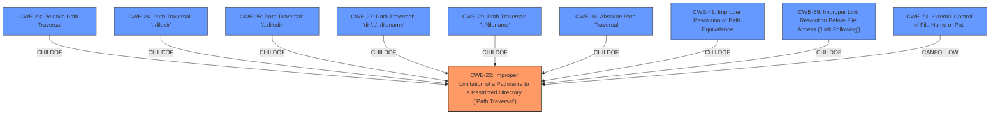

# Enhanced Analysis for CVE-2022-32199

# Summary
| CWE ID | CWE Name | Confidence | CWE Abstraction Level | CWE Vulnerability Mapping Label | CWE-Vulnerability Mapping Notes |
|---|---|---|---|---|---|
| CWE-22 | Improper Limitation of a Pathname to a Restricted Directory ('Path Traversal') | 1.0 | Base | Allowed | Primary CWE |

## Evidence and Confidence

*   **Confidence Score:** 1.0
*   **Evidence Strength:** HIGH

## Relationship Analysis
The primary relationship influencing the decision is the hierarchical structure with CWE-22 as the base class for path traversal vulnerabilities. The other CWEs (23, 24, 25, 27, 29, 36, 41, 59, 73) are either variants or related to path traversal but less directly applicable in this specific scenario. The base CWE-22 provides the best fit capturing the essence of **improper limitation of pathname to a restricted directory**.



## Vulnerability Chain
The vulnerability chain involves the following steps:
1.  **Root Cause:** **Improper limitation of pathname** to a restricted directory (CWE-22) due to **insufficient sanitization** of the `file` parameter.
2.  An attacker (authenticated admin user) provides a malicious `file` parameter containing **directory traversal sequences** (e.g., `../`).
3.  The application fails to neutralize these sequences.
4.  The application constructs a path based on the un-sanitized input.
5.  The attacker achieves **Arbitrary File Deletion** by specifying a path outside the intended directory.

## Summary of Analysis
The analysis strongly supports classifying this vulnerability as CWE-22 (Improper Limitation of a Pathname to a Restricted Directory).

The vulnerability description explicitly mentions a "**directory traversal sequence**" in the `file` parameter. The CVE Reference Links Content Summary confirms this, stating that the "**root cause of vulnerability** is due to **insufficient sanitization** of the `file` parameter... which allows for directory traversal." and that the application "**fails to properly validate the `file` parameter, allowing an attacker to use directory traversal sequences (e.g., `../`) to navigate outside the intended directory.**"

The retriever results also list CWE-22 as the top candidate with the highest similarity score.

CWE-22 is a Base level CWE, which is the preferred level of abstraction for mapping to root causes. The MITRE mapping guidance for CWE-22 states, "This CWE entry is at the Base level of abstraction, which is a preferred level of abstraction for mapping to the root causes of vulnerabilities."

The other CWEs considered were not as suitable:

*   CWE-23 (Relative Path Traversal): This is a child of CWE-22 and more specific. While the description mentions "../", using CWE-22 is more appropriate because it covers both relative and absolute path traversal.
*   CWE-36 (Absolute Path Traversal): This is a child of CWE-22 and specifically about absolute path traversal, which is not explicitly mentioned.
*   CWE-41 (Improper Resolution of Path Equivalence): This is related to path equivalence, which isn't the primary issue.
*   CWE-434 (Unrestricted Upload of File with Dangerous Type): This is not relevant as the issue is not related to file uploads.
*   CWE-89 (Improper Neutralization of Special Elements used in an SQL Command ('SQL Injection')): This is unrelated as the issue is not SQL injection.
*   CWE-79 (Improper Neutralization of Input During Web Page Generation ('Cross-site Scripting')): This is unrelated as the issue is not XSS.
*   CWE-27 (Path Traversal: 'dir/../../filename') and CWE-29 (Path Traversal: '\..\filename'): These are specific variants of relative path traversal.
*   CWE-59 (Improper Link Resolution Before File Access ('Link Following')): This is related to symlink issues, which are not part of the vulnerability.
*   CWE-73 (External Control of File Name or Path): This is a broader category, but CWE-22 is a more specific and accurate fit.

Therefore, CWE-22 provides the best fit because it accurately captures the root cause of the vulnerability which is the **improper limitation of a pathname to a restricted directory** due to **insufficient sanitization**, leading to **arbitrary file deletion** through **directory traversal**.


## CWE Relationship Analysis

Current CWEs represent these abstraction levels: .


### Vulnerability Chain Analysis

**Chain starting from CWE-89:**
- 89 (Improper Neutralization of Special Elements used in an SQL Command ('SQL Injection')) - ROOT


**Chain starting from CWE-434:**
- 434 (Unrestricted Upload of File with Dangerous Type) - ROOT


### CWE Relationship Diagram

```mermaid
graph TD
    classDef primary fill:#f96,stroke:#333,stroke-width:2px
    classDef secondary fill:#69f,stroke:#333
    classDef tertiary fill:#9e9,stroke:#333
```