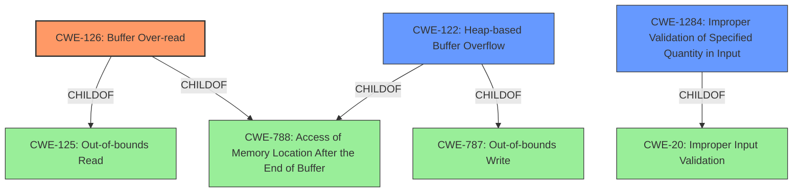

# Analysis for CVE-2022-32200

# Summary
| CWE ID | CWE Name | Confidence | CWE Abstraction Level | CWE Vulnerability Mapping Label | CWE-Vulnerability Mapping Notes |
|---|---|---|---|---|---|
| CWE-126 | Buffer Over-read | 0.9 | Variant | Allowed | Primary CWE |
| CWE-122 | Heap-based Buffer Overflow | 0.7 | Variant | Allowed | Secondary Candidate |
| CWE-1284 | Improper Validation of Specified Quantity in Input | 0.6 | Base | Allowed | Secondary Candidate |

## Evidence and Confidence

*   **Confidence Score:** 0.8
*   **Evidence Strength:** HIGH

## Relationship Analysis
The primary CWE is CWE-126, Buffer Over-read, which is a variant of CWE-125 (Out-of-bounds Read) and CWE-788 (Access of Memory Location After the End of Buffer). CWE-122 (Heap-based Buffer Overflow) is considered as a secondary candidate because the vulnerability description specifically mentions a "heap-based buffer over-read". CWE-1284 (Improper Validation of Specified Quantity in Input) is also considered because the root cause involves missing or insufficient validation of the string length.

## Vulnerability Chain
The chain of events is:
1.  **Improper Validation of Input** (CWE-1284): The application doesn't validate the length of the string read from the DWARF data.
2.  **Buffer Over-read** (CWE-126): The application reads beyond the allocated buffer on the heap.

## Summary of Analysis
The primary weakness is CWE-126 (Buffer Over-read) because the vulnerability description explicitly mentions a "**heap-based buffer over-read**". The "CVE Reference Links Content Summary" section provides strong evidence that the **root cause** is the lack of proper string length validation, leading to a read beyond the buffer's boundaries. The affected component is `_dwarf_check_string_valid` in `dwarf_util.c`, and the vulnerability occurs when processing corrupted DWARF files.

The retriever results also support CWE-126 as the top combined result.

CWE-122 (Heap-based Buffer Overflow) is a secondary candidate because it also aligns with the "heap-based buffer over-read" description. However, the primary action is reading past the buffer, making CWE-126 more specific.

CWE-1284 (Improper Validation of Specified Quantity in Input) is a contributing factor, as the code **fails to properly validate the length of a string** before attempting to read it. This lack of validation leads to the buffer over-read.

The selected CWEs are at the optimal level of specificity, as CWE-126 accurately describes the vulnerability, and CWE-1284 identifies the root cause.

Relevant CWE Information:

# Enhanced Context (25 CWEs)
The following CWEs were identified as potentially relevant to this vulnerability:

## CWE-191: Integer Underflow (Wrap or Wraparound)
**Abstraction Level**: Base
**Similarity Score**: 0.79

## CWE-197: Numeric Truncation Error
**Abstraction Level**: Base
**Similarity Score**: 0.79

## CWE-131: Incorrect Calculation of Buffer Size
**Abstraction Level**: Base
**Similarity Score**: 0.78

## CWE-124: Buffer Underwrite ('Buffer Underflow')
**Abstraction Level**: Base
**Similarity Score**: 0.77

## CWE-805: Buffer Access with Incorrect Length Value
**Abstraction Level**: Base
**Similarity Score**: 0.76

## CWE-681: Incorrect Conversion between Numeric Types
**Abstraction Level**: Base
**Similarity Score**: 0.76

## CWE-126: Buffer Over-read
**Abstraction Level**: Variant
**Similarity Score**: 0.75

## CWE-193: Off-by-one Error
**Abstraction Level**: Base
**Similarity Score**: 0.75

## CWE-125: Out-of-bounds Read
**Abstraction Level**: Base
**Similarity Score**: 0.75

## CWE-190: Integer Overflow or Wraparound
**Abstraction Level**: Base
**Similarity Score**: 0.74

## CWE-190: Integer Overflow or Wraparound
**Abstraction Level**: Base
**Similarity Score**: 7202.68

## CWE-193: Off-by-one Error
**Abstraction Level**: Base
**Similarity Score**: 6831.00

## CWE-197: Numeric Truncation Error
**Abstraction Level**: Base
**Similarity Score**: 6822.44

## CWE-125: Out-of-bounds Read
**Abstraction Level**: Base
**Similarity Score**: 6784.52

## CWE-1284: Improper Validation of Specified Quantity in Input
**Abstraction Level**: Base
**Similarity Score**: 6697.89

## CWE-120: Buffer Copy without Checking Size of Input ('Classic Buffer Overflow')
**Abstraction Level**: base
**Similarity Score**: 5.03

## CWE-195: Signed to Unsigned Conversion Error
**Abstraction Level**: variant
**Similarity Score**: 4.53

## CWE-617: Reachable Assertion
**Abstraction Level**: base
**Similarity Score**: 4.33

## CWE-1284: Improper Validation of Specified Quantity in Input
**Abstraction Level**: base
**Similarity Score**: 4.33

## CWE-123: Write-what-where Condition
**Abstraction Level**: base
**Similarity Score**: 4.33

## CWE-908: Use of Uninitialized Resource
**Abstraction Level**: base
**Similarity Score**: 4.33

## CWE-787: Out-of-bounds Write
**Abstraction Level**: base
**Similarity Score**: 3.89

## CWE-129: Improper Validation of Array Index
**Abstraction Level**: variant
**Similarity Score**: 3.88

## CWE-463: Deletion of Data Structure Sentinel
**Abstraction Level**: base
**Similarity Score**: 3.64

## CWE-464: Addition of Data Structure Sentinel
**Abstraction Level**: base
**Similarity Score**: 3.64