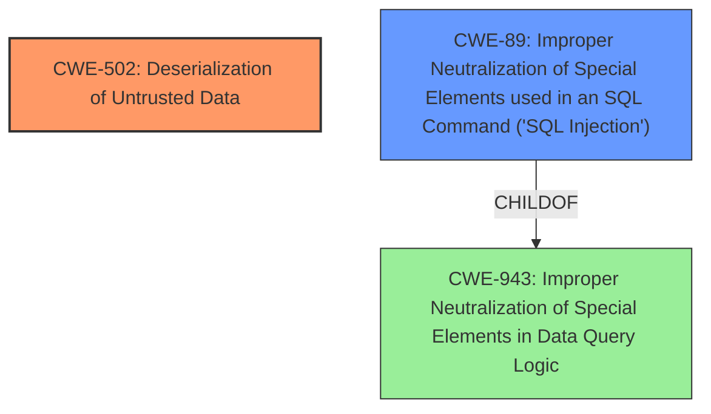

# Raw Analyzer Response for CVE-2022-32224

# Summary
| CWE ID | CWE Name | Confidence | CWE Abstraction Level | CWE Vulnerability Mapping Label | CWE-Vulnerability Mapping Notes |
|---|---|---|---|---|---|
| CWE-502 | Deserialization of Untrusted Data | 1.0 | Base | Allowed | Primary CWE |
| CWE-89 | Improper Neutralization of Special Elements used in an SQL Command ('SQL Injection') | 0.8 | Base | Allowed | Secondary CWE |

## Evidence and Confidence

*   **Confidence Score:** 0.9
*   **Evidence Strength:** HIGH

## Relationship Analysis
The primary weakness is CWE-502 **Deserialization of Untrusted Data**, as the vulnerability stems from the **improper serialization** of YAML data. The attack vector is SQL Injection (CWE-89), which allows the attacker to inject malicious YAML payloads into the database. CWE-502 is a base-level CWE and is therefore preferred. CWE-89 is a child of CWE-943 **Improper Neutralization of Special Elements in Data Query Logic**, which is a Class-level CWE.

## Vulnerability Chain
The vulnerability chain starts with **SQL Injection (CWE-89)**, which allows the attacker to inject malicious YAML payloads into the database. The injected data is then deserialized using `YAML.unsafe_load`, leading to **Deserialization of Untrusted Data (CWE-502)**. This allows the attacker to execute arbitrary code on the server, leading to Remote Code Execution.

## Summary of Analysis
The vulnerability description clearly indicates that the root cause is the use of `YAML.unsafe_load` to deserialize data from the database, which allows an attacker to inject malicious YAML payloads. This directly matches the description of CWE-502 **Deserialization of Untrusted Data**. The vulnerability description states "A possible escalation to RCE vulnerability exists when using YAML serialized columns in Active Record < 7.0.3.1, <6.1.6.1, <6.0.5.1 and <5.2.8.1 which could allow an attacker, that can manipulate data in the database (via means like SQL injection), the ability to escalate to an RCE.". The **attack vector** is stated as **SQL Injection**, this allows an attacker to manipulate data in the database, to inject the malicious YAML payloads.

CWE-502 **Deserialization of Untrusted Data** is the primary CWE because the **root cause** is the **improper serialization** of YAML data.
CWE-89 **Improper Neutralization of Special Elements used in an SQL Command ('SQL Injection')** is a secondary CWE because it is the attack vector that enables the injection of malicious data.

Other CWEs considered:

*   CWE-78 **Improper Neutralization of Special Elements used in an OS Command ('OS Command Injection')**: This CWE was considered because the impact of the vulnerability is Remote Code Execution. However, the root cause is not related to OS command injection, so this CWE was not selected.
*   CWE-94 **Improper Control of Generation of Code ('Code Injection')**: This CWE was considered because the impact of the vulnerability is Remote Code Execution. However, the root cause is not related to code injection, so this CWE was not selected.
*   CWE-434 **Unrestricted Upload of File with Dangerous Type**: This CWE was considered, but it's not applicable as the vulnerability doesn't involve file uploads.
*   CWE-1336 **Improper Neutralization of Special Elements Used in a Template Engine**: This CWE was considered, but it's not applicable as the vulnerability doesn't involve template engines.
*   CWE-943 **Improper Neutralization of Special Elements in Data Query Logic**: While SQL Injection (CWE-89) is involved, the primary issue is the deserialization of untrusted data (CWE-502), making CWE-943 a less direct fit.

# Relevant CWE Information:

## CWE-915: Improperly Controlled Modification of Dynamically-Determined Object Attributes
**Abstraction Level**: Base
**Similarity Score**: 0.76
**Source**: dense

**Description**:
The product receives input from an upstream component that specifies multiple attributes, properties, or fields that are to be initialized or updated in an object, but it does not properly control which attributes can be modified.

**Mapping Guidance**:
- Usage: Allowed
- Rationale: This CWE entry is at the Base level of abstraction, which is a preferred level of abstraction for mapping to the root causes of vulnerabilities.

## CWE-74: Improper Neutralization of Special Elements in Output Used by a Downstream Component ('Injection')
**Abstraction Level**: Class
**Similarity Score**: 0.76
**Source**: dense

**Description**:
The product constructs all or part of a command, data structure, or record using externally-influenced input from an upstream component, but it does not neutralize or incorrectly neutralizes special elements that could modify how it is parsed or interpreted when it is sent to a downstream component.

**Mapping Guidance**:
- Usage: Discouraged
- Rationale: CWE-74 is high-level and often misused when lower-level weaknesses are more appropriate.

## CWE-1236: Improper Neutralization of Formula Elements in a CSV File
**Abstraction Level**: Base
**Similarity Score**: 0.76
**Source**: dense

**Description**:
The product saves user-provided information into a Comma-Separated Value (CSV) file, but it does not neutralize or incorrectly neutralizes special elements that could be interpreted as a command when the file is opened by a spreadsheet product.

**Mapping Guidance**:
- Usage: Allowed
- Rationale: This CWE entry is at the Base level of abstraction, which is a preferred level of abstraction for mapping to the root causes of vulnerabilities.

## CWE-943: Improper Neutralization of Special Elements in Data Query Logic
**Abstraction Level**: Class
**Similarity Score**: 0.75
**Source**: dense

**Description**:
The product generates a query intended to access or manipulate data in a data store such as a database, but it does not neutralize or incorrectly neutralizes special elements that can modify the intended logic of the query.

**Mapping Guidance**:
- Usage: Allowed-with-Review
- Rationale: This CWE entry is a Class and might have Base-level children that would be more appropriate

## CWE-917: Improper Neutralization of Special Elements used in an Expression Language Statement ('Expression Language Injection')
**Abstraction Level**: Base
**Similarity Score**: 0.74
**Source**: dense

**Description**:
The product constructs all or part of an expression language (EL) statement in a framework such as a Java Server Page (JSP) using externally-influenced input from an upstream component, but it does not neutralize or incorrectly neutralizes special elements that could modify the intended EL statement before it is executed.

**Mapping Guidance**:
- Usage: Allowed
- Rationale: This CWE entry is at the Base level of abstraction, which is a preferred level of abstraction for mapping to the root causes of vulnerabilities.

## CWE-73: External Control of File Name or Path
**Abstraction Level**: Base
**Similarity Score**: 0.73
**Source**: dense

**Description**:
The product allows user input to control or influence paths or file names that are used in filesystem operations.

**Mapping Guidance**:
- Usage: Allowed
- Rationale: This CWE entry is at the Base level of abstraction, which is a preferred level of abstraction for mapping to the root causes of vulnerabilities.

## CWE-99: Improper Control of Resource Identifiers ('Resource Injection')
**Abstraction Level**: Class
**Similarity Score**: 0.73
**Source**: dense

**Description**:
The product receives input from an upstream component, but it does not restrict or incorrectly restricts the input before it is used as an identifier for a resource that may be outside the intended sphere of control.

**Mapping Guidance**:
- Usage: Allowed-with-Review
- Rationale: This CWE entry is a Class and might have Base-level children that would be more appropriate

## CWE-138: Improper Neutralization of Special Elements
**Abstraction Level**: Class
**Similarity Score**: 0.73
**Source**: dense

**Description**:
The product receives input from an upstream component, but it does not neutralize or incorrectly neutralizes special elements that could be interpreted as control elements or syntactic markers when they are sent to a downstream component.

**Mapping Guidance**:
- Usage: Discouraged
- Rationale: This CWE entry is a level-