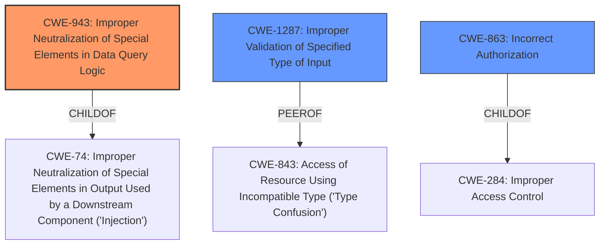

# Analysis Report for CVE-2022-32226

# Vulnerability Analysis Report: CVE-2022-32226

## Description


## Analysis (with Relationship Data)

# Summary
| CWE ID | CWE Name | Confidence | CWE Abstraction Level | CWE Vulnerability Mapping Label | CWE-Vulnerability Mapping Notes |
|---|---|---|---|---|---|
| CWE-943 | Improper Neutralization of Special Elements in Data Query Logic | 0.9 | Class | Primary | Allowed-with-Review |
| CWE-1287 | Improper Validation of Specified Type of Input | 0.7 | Base | Secondary | Allowed |
| CWE-863 | Incorrect Authorization | 0.6 | Class | Secondary | Allowed-with-Review |

## Evidence and Confidence

*   **Confidence Score:** 0.8
*   **Evidence Strength:** HIGH

## Relationship Analysis
The primary CWE, CWE-943, is a child of CWE-74 (Improper Neutralization of Special Elements in Output Used by a Downstream Component ('Injection')). This hierarchical relationship indicates that CWE-943 is a more specific type of injection related to data queries. CWE-1287 (Improper Validation of Specified Type of Input) is a peer of CWE-843 (Access of Resource Using Incompatible Type ('Type Confusion')), suggesting a related but distinct weakness involving type validation. CWE-863 (Incorrect Authorization) is related to CWE-284 (Improper Access Control).



## Vulnerability Chain
The vulnerability chain starts with **improper access control** due to a **missing** type validation in the `getUsersOfRoom` Meteor server method. This allows injection of MongoDB query operator objects, which bypasses the room access permission check. The chain is:

1.  **Improper Input Validation** (CWE-1287)
2.  **Improper Neutralization of Special Elements in Data Query Logic** (CWE-943)
3.  **Incorrect Authorization** (CWE-863)

## Summary of Analysis
The initial analysis identified **improper access control** as the root cause, leading to a bypass of room access permissions. The vulnerability description clearly states that "input data in the getUsersOfRoom Meteor server method is not type validated, so that MongoDB query operator objects are accepted by the server, so that instead of a matching rid String a$regex query can be executed, bypassing the room access permission check for every but the first matching room." This statement supports the selection of CWE-943.

CWE-943 (Improper Neutralization of Special Elements in Data Query Logic) is the primary CWE because the vulnerability specifically involves the injection of MongoDB query operator objects to bypass intended query logic. The server accepts these objects due to **missing** type validation, leading to **improper access control**.

CWE-1287 (Improper Validation of Specified Type of Input) is a secondary CWE because the root cause is the **lack of** type validation of the input data, which allows the injection of malicious query operators. This directly contributes to the primary weakness of CWE-943.

CWE-863 (Incorrect Authorization) is also a secondary CWE because the successful injection of malicious query operators leads to a bypass of authorization checks.

CWE-943 is selected as the primary CWE due to its specific relevance to the vulnerability's exploitation mechanism involving MongoDB queries. The other CWEs are considered as contributing factors that enable this primary weakness.

Other CWEs Considered:
*   CWE-639 (Authorization Bypass Through User-Controlled Key): While this CWE involves authorization bypass, it is more relevant to cases where a user directly manipulates a key value. In this case, the bypass is achieved through injection of query operators, making CWE-943 more appropriate.
*   CWE-807 (Reliance on Untrusted Inputs in a Security Decision): This CWE is too generic. The vulnerability description points to a more specific issue of improper neutralization in data queries.
*   CWE-74 (Improper Neutralization of Special Elements in Output Used by a Downstream Component ('Injection')): While CWE-943 is a child of CWE-74, CWE-943 is more specific to data query logic, making it a better fit.
*   CWE-94 (Improper Control of Generation of Code ('Code Injection')): This CWE is relevant when the product constructs code segments. The vulnerability involves manipulation of queries, not code generation.


## CWE Relationship Analysis

Current CWEs represent these abstraction levels: .


### Vulnerability Chain Analysis

**Chain starting from CWE-807:**
- 807 (Reliance on Untrusted Inputs in a Security Decision) - ROOT


**Chain starting from CWE-94:**
- 94 (Improper Control of Generation of Code ('Code Injection')) - ROOT


### CWE Relationship Diagram

```mermaid
graph TD
    classDef primary fill:#f96,stroke:#333,stroke-width:2px
    classDef secondary fill:#69f,stroke:#333
    classDef tertiary fill:#9e9,stroke:#333
```


*Report generated on 2025-03-31 03:11:05*
