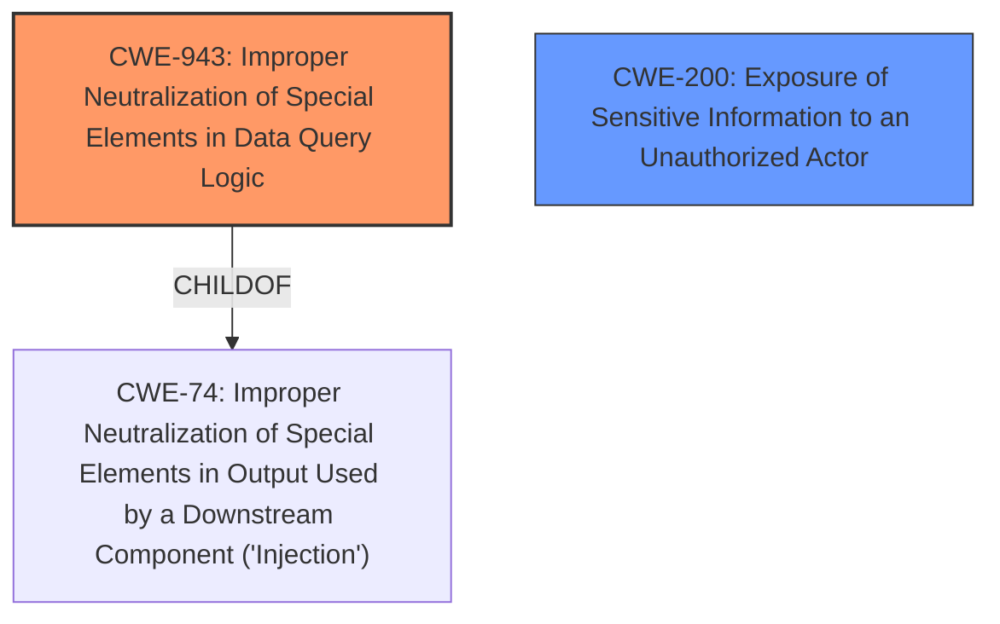

# Raw Analyzer Response for CVE-2022-32229

# Summary
| CWE ID | CWE Name | Confidence | CWE Abstraction Level | CWE Vulnerability Mapping Label | CWE-Vulnerability Mapping Notes |
|---|---|---|---|---|---|
| CWE-943 | Improper Neutralization of Special Elements in Data Query Logic | 0.9 | Class | Allowed-with-Review | Primary CWE |
| CWE-200 | Exposure of Sensitive Information to an Unauthorized Actor | 0.5 | Class | Discouraged | Secondary Candidate |

## Evidence and Confidence

*   **Confidence Score:** 0.7
*   **Evidence Strength:** MEDIUM

## Relationship Analysis
The primary CWE selected is CWE-943 (Improper Neutralization of Special Elements in Data Query Logic), a child of CWE-74 (Improper Neutralization of Special Elements in Output Used by a Downstream Component ('Injection')). The vulnerability description indicates that a **lack of sanitization of user inputs** leads to **MongoDB injection**, which allows unauthorized users to access private thread messages, resulting in information disclosure. CWE-200 (Exposure of Sensitive Information to an Unauthorized Actor) was considered as a secondary candidate, but it represents the impact rather than the root cause.

## Vulnerability Chain
The vulnerability chain starts with the **lack of sanitization of user inputs**, leading to **MongoDB injection** (CWE-943). This, in turn, results in the exposure of private thread messages to unauthorized users, causing information disclosure. The root cause is the improper neutralization in data query logic, and the impact is information exposure.

## Summary of Analysis
The initial analysis identified several potential CWEs based on the vulnerability description. The primary weakness is the **lack of sanitization of user inputs** which results in **MongoDB injection** (CWE-943). The vulnerability description states: "A information disclosure vulnerability exists in Rockert.Chat <v5 due to /api/v1/chat.getThreadsList **lack of sanitization of user inputs** and can therefore leak private thread messages to unauthorized users via **Mongo DB injection**."

CWE-943 (Improper Neutralization of Special Elements in Data Query Logic) is the most appropriate because it directly addresses the **improper neutralization** in the context of data query logic (MongoDB injection). While CWE-200 (Exposure of Sensitive Information to an Unauthorized Actor) could be considered, it represents the impact of the vulnerability (information disclosure) rather than the root cause.

The selection of CWE-943 is at the optimal level of specificity, as it accurately reflects the nature of the vulnerability, which involves **MongoDB injection** due to the **lack of sanitization of user inputs**.

Relevant CWE Information:

# Enhanced Context (25 CWEs)

## CWE-74: Improper Neutralization of Special Elements in Output Used by a Downstream Component ('Injection')
**Abstraction Level**: Class
**Similarity Score**: 0.76
**Source**: dense

**Description**:
The product constructs all or part of a command, data structure, or record using externally-influenced input from an upstream component, but it does not neutralize or incorrectly neutralizes special elements that could modify how it is parsed or interpreted when it is sent to a downstream component.

**Mapping Guidance**:
- Usage: Discouraged
- Rationale: CWE-74 is high-level and often misused when lower-level weaknesses are more appropriate.

## CWE-943: Improper Neutralization of Special Elements in Data Query Logic
**Abstraction Level**: Class
**Similarity Score**: 6811.00
**Source**: sparse

**Description**:
The product generates a query intended to access or manipulate data in a data store such as a database, but it does not neutralize or incorrectly neutralizes special elements that can modify the intended logic of the query.

**Mapping Guidance**:
- Usage: Allowed-with-Review
- Rationale: This CWE entry is a Class and might have Base-level children that would be more appropriate

### CWE-943 Technical Explanation:
- **How the vulnerability's details match the CWE's characteristics:** The vulnerability involves **MongoDB injection** due to **lack of sanitization of user inputs**. This directly aligns with CWE-943, which describes improper neutralization of special elements in data query logic.
- **The security implications and potential impact:** The security implication is unauthorized access to private thread messages. The potential impact is information disclosure.
- **Any parent-child relationships or chain patterns that influenced your mapping:** CWE-943 is a child of CWE-74 (Improper Neutralization of Special Elements in Output Used by a Downstream Component ('Injection')).
- **Whether the weakness is primary or secondary in the vulnerability:** The weakness is the primary cause of the vulnerability.
- **How the official MITRE mapping guidance influenced your decision:** The mapping guidance suggests that CWE-943 is a suitable choice when dealing with improper neutralization in data query logic.

### CWE-200 Technical Explanation:
- **How the vulnerability's details match the CWE's characteristics:** The vulnerability leads to information disclosure, which aligns with CWE-200 (Exposure of Sensitive Information to an Unauthorized Actor).
- **The security implications and potential impact:** The security implication is the exposure of sensitive information to unauthorized users.
- **Any parent-child relationships or chain patterns that influenced your mapping:** CWE-200 is a child of CWE-668 (Exposure of Resource to Wrong Sphere).
- **Whether the weakness is primary or secondary in the vulnerability:** The weakness is a secondary impact of the vulnerability.
- **How the official MITRE mapping guidance influenced your decision:** The mapping guidance discourages the use of CWE-200 as it represents the impact rather than the root cause.

### Other CWEs Considered:
- CWE-74: Improper Neutralization of Special Elements in Output Used by a Downstream Component ('Injection') - While related, it's a higher-level class. CWE-943 is more specific to data query logic.
- CWE-78: Improper Neutralization of Special Elements used in an OS Command ('OS Command Injection') - Not applicable, as the vulnerability involves data query logic, not OS commands.
- CWE-79: Improper Neutralization of Input During Web Page Generation ('Cross-site Scripting') - Not applicable, as the vulnerability involves **MongoDB injection**, not web page generation.
- CWE-22: Improper Limitation of a Pathname to a Restricted Directory ('Path Traversal') - Not applicable, as the vulnerability involves data query logic, not pathnames.