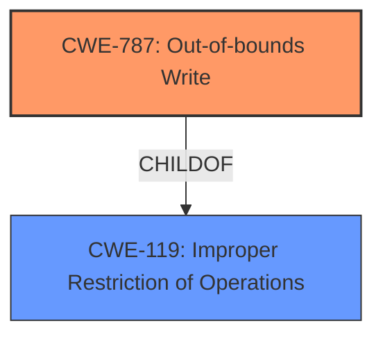

# Analysis for CVE-2022-32239

# Summary
| CWE ID | CWE Name | Confidence | CWE Abstraction Level | CWE Vulnerability Mapping Label | CWE-Vulnerability Mapping Notes |
|---|---|---|---|---|---|
| CWE-787 | Out-of-bounds Write | 0.7 | Base | Allowed | Primary CWE |
| CWE-119 | Improper Restriction of Operations within the Bounds of a Memory Buffer | 0.5 | Class | Discouraged | Secondary Candidate |

## Evidence and Confidence

*   **Confidence Score:** 0.7
*   **Evidence Strength:** LOW

## Relationship Analysis
The primary relationship that impacted my decision was the parent-child relationship between CWE-119 and CWE-787. CWE-787 is a more specific case of CWE-119, and since the vulnerability description indicates a crash caused by processing manipulated JPEG 2000 files, it strongly suggests memory corruption due to an out-of-bounds write. While CWE-119 is a broader classification, the available information points towards the more specific CWE-787.

## Vulnerability Chain
The chain of events is as follows:
1.  A manipulated JPEG 2000 file is opened.
2.  The application attempts to process the file.
3.  Due to a flaw in the image processing logic, an out-of-bounds write occurs (CWE-787).
4.  The application crashes.

The root cause is the improper handling of the manipulated image file, leading to a memory corruption issue.

## Summary of Analysis
The initial analysis focused on identifying a CWE that best represents the **root cause** of the vulnerability. The description indicates that opening manipulated JPEG 2000 files causes the application to crash. While the provided evidence is limited, the crash suggests a memory corruption issue, specifically an out-of-bounds write.

The primary decision is based on the fact that opening a manipulated file causes a crash. This is consistent with CWE-787.

The graph relationships influenced the decision because CWE-787 is a child of CWE-119. Since there is not sufficient evidence to select a more detailed cause, I selected CWE-787 as a reasonable level of specificity.

Relevant CWE Information:

*   **CWE-787: Out-of-bounds Write** The product writes data past the end, or before the beginning, of the intended buffer. This aligns with the crash symptom resulting from processing a manipulated file.

*   **CWE-119: Improper Restriction of Operations within the Bounds of a Memory Buffer** This is a more general case of memory corruption, and could apply, but the evidence points toward a more specific out-of-bounds write.

I considered other CWEs, such as CWE-125 (Out-of-bounds Read) and CWE-190 (Integer Overflow or Wraparound), but these did not seem as directly relevant to the crash described in the vulnerability report.

# Enhanced Context (25 CWEs)
The following CWEs were identified as potentially relevant to this vulnerability:

## CWE-191: Integer Underflow (Wrap or Wraparound)
**Abstraction Level**: Base
**Similarity Score**: 0.76
**Source**: dense

## CWE-125: Out-of-bounds Read
**Abstraction Level**: Base
**Similarity Score**: 0.76
**Source**: dense

## CWE-131: Incorrect Calculation of Buffer Size
**Abstraction Level**: Base
**Similarity Score**: 0.75
**Source**: dense

## CWE-805: Buffer Access with Incorrect Length Value
**Abstraction Level**: Base
**Similarity Score**: 0.75
**Source**: dense

## CWE-197: Numeric Truncation Error
**Abstraction Level**: Base
**Similarity Score**: 0.75
**Source**: dense

## CWE-126: Buffer Over-read
**Abstraction Level**: Variant
**Similarity Score**: 0.74
**Source**: dense

## CWE-788: Access of Memory Location After End of Buffer
**Abstraction Level**: Base
**Similarity Score**: 0.74
**Source**: dense

## CWE-667: Improper Locking
**Abstraction Level**: Class
**Similarity Score**: 0.74
**Source**: dense

## CWE-124: Buffer Underwrite ('Buffer Underflow')
**Abstraction Level**: Base
**Similarity Score**: 0.74
**Source**: dense

## CWE-823: Use of Out-of-range Pointer Offset
**Abstraction Level**: Base
**Similarity Score**: 0.74
**Source**: dense

## CWE-427: Uncontrolled Search Path Element
**Abstraction Level**: Base
**Similarity Score**: 8047.67
**Source**: sparse

## CWE-190: Integer Overflow or Wraparound
**Abstraction Level**: Base
**Similarity Score**: 7894.32
**Source**: sparse

## CWE-125: Out-of-bounds Read
**Abstraction Level**: Base
**Similarity Score**: 7677.36
**Source**: sparse

## CWE-119: Improper Restriction of Operations within the Bounds of a Memory Buffer
**Abstraction Level**: Class
**Similarity Score**: 7561.16
**Source**: sparse

## CWE-1284: Improper Validation of Specified Quantity in Input
**Abstraction Level**: Base
**Similarity Score**: 7453.49
**Source**: sparse

## CWE-41: Improper Resolution of Path Equivalence
**Abstraction Level**: base
**Similarity Score**: 5.03
**Source**: graph

## CWE-130: Improper Handling of Length Parameter Inconsistency
**Abstraction Level**: base
**Similarity Score**: 4.33
**Source**: graph

## CWE-190: Integer Overflow or Wraparound
**Abstraction Level**: base
**Similarity Score**: 4.33
**Source**: graph

## CWE-22: Improper Limitation of a Pathname to a Restricted Directory ('Path Traversal')
**Abstraction Level**: base
**Similarity Score**: 4.33
**Source**: graph

## CWE-770: Allocation of Resources Without Limits or Throttling
**Abstraction Level**: base
**Similarity Score**: 4.33
**Source**: graph

## CWE-1284: Improper Validation of Specified Quantity in Input
**Abstraction Level**: base
**Similarity Score**: 4.33
**Source**: graph

## CWE-617: Reachable Assertion
**Abstraction Level**: base
**Similarity Score**: 3.89
**Source**: graph

## CWE-426: Untrusted Search Path
**Abstraction Level**: base
**Similarity Score**: 3.64
**Source**: graph

## CWE-427: Uncontrolled Search Path Element
**Abstraction Level**: base
**Similarity Score**: 3.64
**Source**: graph

## CWE-128: Wrap-around Error
**Abstraction Level**: base
**Similarity Score**: 3.57
**Source**: graph