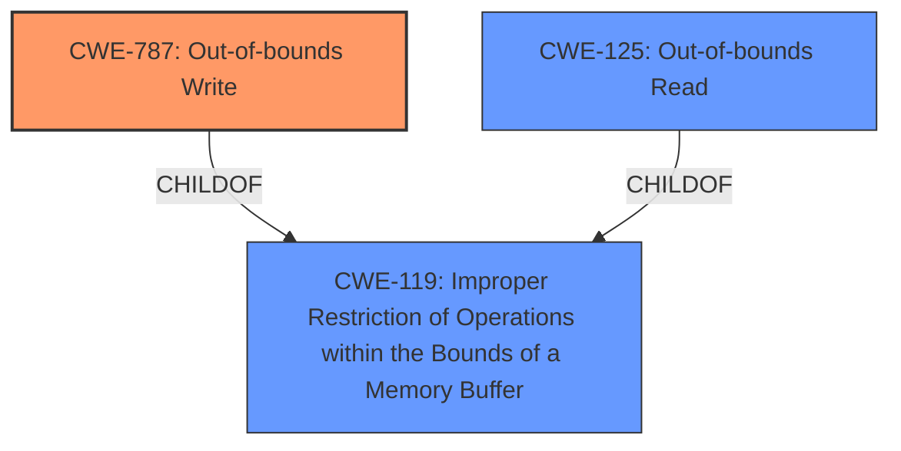

# Raw Analyzer Response for CVE-2022-32240

# Summary
| CWE ID | CWE Name | Confidence | CWE Abstraction Level | CWE Vulnerability Mapping Label | CWE-Vulnerability Mapping Notes |
|---|---|---|---|---|---|
| CWE-787 | Out-of-bounds Write | 0.7 | Base | Allowed | Primary CWE |
| CWE-119 | Improper Restriction of Operations within the Bounds of a Memory Buffer | 0.4 | Class | Discouraged | Secondary CWE |
| CWE-125 | Out-of-bounds Read | 0.3 | Base | Allowed | Secondary CWE |

## Evidence and Confidence

*   **Confidence Score:** 0.7
*   **Evidence Strength:** MEDIUM

## Relationship Analysis
The primary CWE is CWE-787, which is a child of CWE-119. CWE-119 is a class-level CWE that is often misused, and the recommendation is to use a more specific CWE. CWE-787 is a base-level CWE that describes writing outside the bounds of a buffer. CWE-125 (Out-of-bounds Read) is also a child of CWE-119 and could be related if a read occurs out of bounds of a buffer.

## Vulnerability Chain
The chain of events is as follows:
1.  A user opens a manipulated Jupiter Tesselation file.
2.  The application attempts to process the file.
3.  An **out-of-bounds write** occurs, leading to a crash.

## Summary of Analysis
The vulnerability description indicates that the application crashes when opening a manipulated Jupiter Tesselation file. The key phrase "manipulated Jupiter Tesselation (.jt, JTReader.x3d) files" suggests that the file is crafted to exploit a weakness in the application. The phrase "application crashes" indicates a potential **out-of-bounds write** or other memory corruption issue.

The CWE for similar CVE Descriptions lists "CWE-NVD-noinfo" as the primary match and CWE-787 (Out-of-bounds Write) as one of the top CWEs.

The Retriever Results list CWE-119 (Improper Restriction of Operations within the Bounds of a Memory Buffer) as the top result. However, the mapping guidance for CWE-119 discourages its use and recommends using lower-level CWEs such as CWE-787 (Out-of-bounds Write) or CWE-125 (Out-of-bounds Read).

The vulnerability description indicates a crash, which can be caused by an **out-of-bounds write** (CWE-787). Therefore, CWE-787 is the most appropriate CWE for this vulnerability.
Since the application crashes, it's possible there's an associated read of out-of-bounds data as well, so CWE-125 (Out-of-bounds Read) is also a candidate.

CWE-20 (Improper Input Validation) was considered but not selected because the description focuses on the crash resulting from a manipulated file, rather than on the lack of input validation. Although input validation might be a contributing factor, the primary weakness is the out-of-bounds write.

Relevant CWE Information:

# Enhanced Context (25 CWEs)

## CWE-789: Memory Allocation with Excessive Size Value
**Abstraction Level**: Variant
**Similarity Score**: 0.81
The description states that the product allocates memory with an untrusted size value, but doesn't validate the size, allowing allocation of arbitrary amounts of memory. While this is related to resource consumption, the vulnerability description provided specifically mentions a crash, which is a more direct result of writing to an invalid memory location. The description provided doesn't mention memory allocation issues, so this CWE is not appropriate.

## CWE-1325: Improperly Controlled Sequential Memory Allocation
**Abstraction Level**: Base
**Similarity Score**: 0.79
The description states the product manages memory allocation for each object, but doesn't limit the total memory consumed. Similar to CWE-789, this is related to resource consumption and is not mentioned in the provided vulnerability description, so this CWE is not appropriate.

## CWE-131: Incorrect Calculation of Buffer Size
**Abstraction Level**: Base
**Similarity Score**: 0.78
The description states that the product doesn't calculate the buffer size correctly, potentially leading to a buffer overflow. This is a possibility, but there is no direct evidence in the description to support this.

## CWE-805: Buffer Access with Incorrect Length Value
**Abstraction Level**: Base
**Similarity Score**: 0.78
The description states that the product uses an incorrect length value, which causes it to access memory outside the bounds of the buffer. This is similar to CWE-787, but the description provided focuses on the **out-of-bounds write**, so CWE-787 is more appropriate.

## CWE-126: Buffer Over-read
**Abstraction Level**: Variant
**Similarity Score**: 0.77
The description states that the product reads from a buffer using access mechanisms such as indexes or pointers that reference memory locations after the targeted buffer. The primary issue described is the crash after opening the file, which could be a result of a read of out-of-bounds data.

## CWE-125: Out-of-bounds Read
**Abstraction Level**: Base
**Similarity Score**: 0.77
The description states that the product reads data past the end or before the beginning of the intended buffer. The primary issue described is the crash after opening the file, which could be a result of a read of out-of-bounds data.

## CWE-404: Improper Resource Shutdown or Release
**Abstraction Level**: Class
**Similarity Score**: 0.76
The description states that the product doesn't release or incorrectly releases a resource before it's made available for reuse. The vulnerability description doesn't mention resource management issues, so this CWE is not appropriate.

## CWE-191: Integer Underflow (Wrap or Wraparound)
**Abstraction Level**: Base
**Similarity Score**: 0.76
The description states that the product subtracts one value from another, such that the result is less than the minimum allowable integer value, which produces a value that is not equal to the correct result. The vulnerability description doesn't mention integer underflow issues, so this CWE is not appropriate.

## CWE-681: Incorrect Conversion between Numeric Types
**Abstraction Level**: Base
**Similarity Score**: 0.76
The description states that when converting between data types, data can be omitted or translated in a way that produces unexpected values. The vulnerability description doesn't mention type conversion issues, so this CWE is not appropriate.

## CWE-119: Improper Restriction of Operations within the Bounds of a Memory Buffer
**Abstraction Level**: Class
**Similarity Score**: 0.76
The description states that the product performs operations on a memory buffer, but it reads from or writes to a memory location outside the buffer's intended boundary. This is a high-level description of the issue. It's recommended to use a more specific CWE.

## CWE-190: Integer Overflow or Wraparound
**Abstraction Level**: Base
**Similarity Score**: 6257.78
The description states that the product performs a calculation that can produce an integer overflow. The vulnerability description doesn't mention integer overflow issues, so this CWE is not appropriate.

## CWE-1284: Improper Validation of Specified Quantity in Input
**Abstraction Level**: Base
**Similarity Score**: 6150.17
The description states that the product receives input that is expected to specify a quantity, but it does not validate or incorrectly validates that the quantity has the required properties. The vulnerability description could be related to input validation, but the focus of the description is not on this aspect.

## CWE-41: Improper Resolution of Path Equivalence
**Abstraction Level**: base
**Similarity Score**: 5.03
This CWE relates to path equivalence issues, which are not relevant to this vulnerability.

## CWE-22: Improper Limitation of a Pathname to a Restricted Directory ('Path Traversal')
**Abstraction Level**: base
**Similarity Score**: 4.33
This CWE relates to path traversal issues, which are not relevant to this vulnerability.

## CWE-770: Allocation of Resources Without Limits or Throttling
**Abstraction Level**: base
**Similarity Score**: 4.33
This CWE relates to resource allocation issues, which are not the primary focus of this