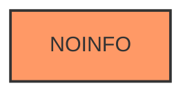

# Analysis Report for CVE-2022-32241

# Vulnerability Analysis Report: CVE-2022-32241

## Description


## Analysis (with Relationship Data)

# Summary
| CWE ID | CWE Name | Confidence | CWE Abstraction Level | CWE Vulnerability Mapping Label | CWE-Vulnerability Mapping Notes |
|---|---|---|---|---|---|
| CWE-NVD-noinfo | NVD no info | 1.0 | N/A | Primary | N/A |

## Evidence and Confidence

*   **Confidence Score:** 1.0
*   **Evidence Strength:** LOW

## Relationship Analysis
There are no relationships to analyze because the assessment is NOINFO.



## Vulnerability Chain
There is no chain of root cause and weaknesses because the assessment is NOINFO.

## Summary of Analysis
The assessment is based on the lack of information about the root cause of the vulnerability. The CVE Reference Links Content Summary states: "The provided content is related to SAP security practices... However, there is **no specific information about the vulnerability described in CVE-2022-32241**."

Because there is no information, CWE-NVD-noinfo is the correct classification.
```
NVD analysts have not provided enough information to perform a more specific CWE assignment.
```
There is no way to select a more specific CWE than CWE-NVD-noinfo.

Relevant CWE Information:

# Enhanced Context (25 CWEs)

## CWE-805: Buffer Access with Incorrect Length Value
**Abstraction Level**: Base
**Similarity Score**: 0.77

Not considered because there is no evidence to suggest a buffer access issue.

## CWE-126: Buffer Over-read
**Abstraction Level**: Variant
**Similarity Score**: 0.77

Not considered because there is no evidence to suggest a buffer over-read.

## CWE-131: Incorrect Calculation of Buffer Size
**Abstraction Level**: Base
**Similarity Score**: 0.77

Not considered because there is no evidence to suggest an incorrect buffer size calculation.

## CWE-125: Out-of-bounds Read
**Abstraction Level**: Base
**Similarity Score**: 0.77

Not considered because there is no evidence to suggest an out-of-bounds read.

## CWE-127: Buffer Under-read
**Abstraction Level**: Variant
**Similarity Score**: 0.77

Not considered because there is no evidence to suggest a buffer under-read.

## CWE-788: Access of Memory Location After End of Buffer
**Abstraction Level**: Base
**Similarity Score**: 0.77

Not considered because there is no evidence to suggest memory access after the end of a buffer.

## CWE-124: Buffer Underwrite ('Buffer Underflow')
**Abstraction Level**: Base
**Similarity Score**: 0.76

Not considered because there is no evidence to suggest a buffer underwrite.

## CWE-191: Integer Underflow (Wrap or Wraparound)
**Abstraction Level**: Base
**Similarity Score**: 0.76

Not considered because there is no evidence to suggest an integer underflow.

## CWE-119: Improper Restriction of Operations within the Bounds of a Memory Buffer
**Abstraction Level**: Class
**Similarity Score**: 0.75

Not considered because there is no evidence to suggest a memory buffer operation issue.

## CWE-252: Unchecked Return Value
**Abstraction Level**: Base
**Similarity Score**: 0.75

Not considered because there is no evidence to suggest an unchecked return value.

## CWE-427: Uncontrolled Search Path Element
**Abstraction Level**: Base
**Similarity Score**: 7746.38

Not considered because there is no evidence to suggest an uncontrolled search path element.

## CWE-119: Improper Restriction of Operations within the Bounds of a Memory Buffer
**Abstraction Level**: Class
**Similarity Score**: 7281.86

Not considered because there is no evidence to suggest a memory buffer operation issue.

## CWE-125: Out-of-bounds Read
**Abstraction Level**: Base
**Similarity Score**: 7275.19

Not considered because there is no evidence to suggest an out-of-bounds read.

## CWE-190: Integer Overflow or Wraparound
**Abstraction Level**: Base
**Similarity Score**: 7132.26

Not considered because there is no evidence to suggest an integer overflow.

## CWE-1284: Improper Validation of Specified Quantity in Input
**Abstraction Level**: Base
**Similarity Score**: 7071.30

Not considered because there is no evidence to suggest improper validation of input quantity.

## CWE-41: Improper Resolution of Path Equivalence
**Abstraction Level**: base
**Similarity Score**: 5.03

Not considered because there is no evidence to suggest an improper resolution of path equivalence.

## CWE-22: Improper Limitation of a Pathname to a Restricted Directory ('Path Traversal')
**Abstraction Level**: base
**Similarity Score**: 4.33

Not considered because there is no evidence to suggest a path traversal issue.

## CWE-770: Allocation of Resources Without Limits or Throttling
**Abstraction Level**: base
**Similarity Score**: 4.33

Not considered because there is no evidence to suggest a resource allocation issue.

## CWE-73: External Control of File Name or Path
**Abstraction Level**: base
**Similarity Score**: 4.33

Not considered because there is no evidence to suggest external control of file name or path.

## CWE-190: Integer Overflow or Wraparound
**Abstraction Level**: base
**Similarity Score**: 4.33

Not considered because there is no evidence to suggest an integer overflow.

## CWE-787: Out-of-bounds Write
**Abstraction Level**: base
**Similarity Score**: 4.33

Not considered because there is no evidence to suggest an out-of-bounds write.

## CWE-825: Expired Pointer Dereference
**Abstraction Level**: base
**Similarity Score**: 4.33

Not considered because there is no evidence to suggest an expired pointer dereference.

## CWE-617: Reachable Assertion
**Abstraction Level**: base
**Similarity Score**: 3.89

Not considered because there is no evidence to suggest a reachable assertion.

## CWE-476: NULL Pointer Dereference
**Abstraction Level**: base
**Similarity Score**: 3.89

Not considered because there is no evidence to suggest a null pointer dereference.

## CWE-1284: Improper Validation of Specified Quantity in Input
**Abstraction Level**: base
**Similarity Score**: 3.65

Not considered because there is no evidence to suggest improper validation of input quantity.


## CWE Relationship Analysis

Current CWEs represent these abstraction levels: .


### Vulnerability Chain Analysis

**Chain starting from CWE-41:**
- 41 (Improper Resolution of Path Equivalence) - ROOT


**Chain starting from CWE-119:**
- 119 (Improper Restriction of Operations within the Bounds of a Memory Buffer) - ROOT


### CWE Relationship Diagram

```mermaid
graph TD
    classDef primary fill:#f96,stroke:#333,stroke-width:2px
    classDef secondary fill:#69f,stroke:#333
    classDef tertiary fill:#9e9,stroke:#333
```


*Report generated on 2025-03-31 02:49:54*
