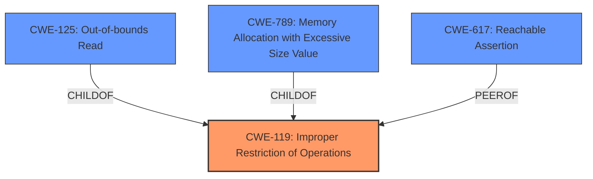

# Analysis for CVE-2022-32242

# Summary
| CWE ID | CWE Name | Confidence | CWE Abstraction Level | CWE Vulnerability Mapping Label | CWE-Vulnerability Mapping Notes |
|---|---|---|---|---|---|
| CWE-119 | Improper Restriction of Operations within the Bounds of a Memory Buffer | 0.75 | Class | Primary | Discouraged, but the description suggests a memory corruption issue, making this a reasonable starting point given the limited information. |
| CWE-125 | Out-of-bounds Read | 0.6 | Base | Secondary | Allowed, as a potential cause of the crash. |
| CWE-789 | Memory Allocation with Excessive Size Value | 0.5 | Variant | Secondary | Allowed, if the manipulated file leads to a memory allocation error. |
| CWE-617 | Reachable Assertion | 0.4 | Base | Secondary | Allowed, if an assertion is triggered. |

## Evidence and Confidence

*   **Confidence Score:** 0.6
*   **Evidence Strength:** LOW

## Relationship Analysis
The primary relationship influencing the selection is the parent-child relationship, primarily from CWE-119 to more specific buffer handling issues like CWE-125 and CWE-789. The chain relationships also influenced the selection, particularly the potential for integer overflows (not selected, due to lack of evidence) leading to memory corruption.

## Vulnerability Chain
The potential chain of events based on the description is:
1.  User opens a manipulated file.
2.  The application attempts to process the file.
3.  **Root Cause:** The application **fails to** properly handle the manipulated file, possibly due to an out-of-bounds read or memory allocation error.
4.  **Impact:** The application crashes.

The weakness is the improper handling of the manipulated file, while the crash is the impact.

## Summary of Analysis
The analysis is based on the limited information provided in the vulnerability description. The description indicates that the application crashes when opening manipulated Radiance Picture files. The key phrase is "**impact:** crashes," which suggests a denial-of-service vulnerability. The absence of detailed information about the root cause makes precise CWE mapping challenging.

The primary CWE selected is CWE-119, "Improper Restriction of Operations within the Bounds of a Memory Buffer," because it is a general class for buffer-related errors. However, CWE-119 is discouraged as a primary mapping, and its children are more preferred. Given the crash, out-of-bounds read (CWE-125) and excessive memory allocation (CWE-789) are considered as secondary candidates. CWE-617 is also considered because the crash could be due to a triggered assertion.

The graph relationships influenced the selection by showing how CWE-119 relates to more specific buffer handling issues.

The selected CWEs are at an appropriate level of specificity, given the limited information. More detailed analysis of the application's behavior when processing manipulated files would be needed to identify a more precise root cause.

Relevant CWE Information:

*   CWE-119: While discouraged, it acts as a high-level starting point due to the likelihood of memory corruption.
*   CWE-125: Out-of-bounds read is a potential cause of the crash if the application attempts to read past the end of a buffer.
*   CWE-789: Excessive memory allocation could lead to a crash if the application attempts to allocate more memory than available.
*   CWE-617: The application might have an assertion that is triggered by the manipulated file, causing it to crash.

I considered other CWEs, such as CWE-20 (Improper Input Validation), but rejected it because the description does not explicitly mention input validation issues. I also considered CWE-190 (Integer Overflow or Wraparound), but there is no evidence of integer handling issues in the description.