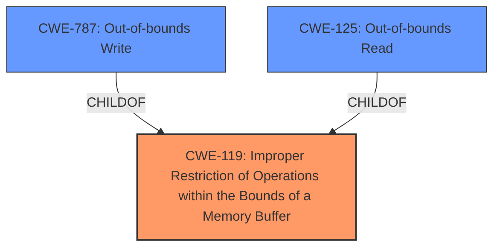

# Analysis for CVE-2022-32243

# Summary
| CWE ID  | CWE Name  | Confidence | CWE Abstraction Level | CWE Vulnerability Mapping Label | CWE-Vulnerability Mapping Notes |
|----------------|--------------------------------------------------------------------------------------------------------------------------------------------------------------------------------------|------------------|---------------------------|----------------------------------------------------------------------------------------------------------------------------------------------------------------------------------------|--------------------------------------|
| CWE-119 | Improper Restriction of Operations within the Bounds of a Memory Buffer | 0.6 | Class | Primary | Discouraged |
| CWE-787 | Out-of-bounds Write | 0.5 | Base | Secondary | Allowed |
| CWE-125 | Out-of-bounds Read | 0.4 | Base | Secondary | Allowed |

## Evidence and Confidence

*   **Confidence Score:** 0.6
*   **Evidence Strength:** LOW

## Relationship Analysis
The primary CWE identified is CWE-119, which is a Class-level CWE. The analysis also considered more specific Base and Variant level CWEs such as CWE-787 (Out-of-bounds Write) and CWE-125 (Out-of-bounds Read) which are children of CWE-119. The relationship analysis helped in understanding the potential for more specific CWE mappings, but the limited evidence makes a definitive selection challenging.

## Vulnerability Chain
The vulnerability chain, based on the provided information, is as follows:

1.  The user opens a manipulated Scalable Vector Graphics file (.svg, svg.x3d) from an untrusted source.
2.  The SAP 3D Visual Enterprise Viewer attempts to process this file.
3.  Due to a flaw in how the application handles the manipulated SVG file, a buffer is accessed improperly, leading to an out-of-bounds read or write (CWE-125 or CWE-787).
4.  The application crashes and becomes temporarily unavailable (CWE-119).

The root cause appears to be related to the **improper handling of the SVG file leading to memory corruption**.

## Summary of Analysis
The initial analysis focused on the **crashing behavior** resulting from opening a manipulated SVG file in SAP 3D Visual Enterprise Viewer. The primary CWE initially considered was CWE-119 (Improper Restriction of Operations within the Bounds of a Memory Buffer), driven by its high ranking in the Retriever Results and the general description of memory corruption leading to a crash.

However, due to limited details in the description and the absence of CVE Reference Links Content Summary, the confidence in this assessment is moderate. While CWE-119 is a good starting point, it is a Class-level CWE and the mapping guidance discourages its use when more specific CWEs are applicable. Given the **crashing impact**, out-of-bounds access is suspected. Therefore, both CWE-787 (Out-of-bounds Write) and CWE-125 (Out-of-bounds Read) were considered as potential secondary CWEs. Without more details on the specific **root cause** (e.g., whether the crash is due to writing beyond buffer bounds or reading from an invalid memory location), choosing between CWE-787 and CWE-125 is speculative.

Ultimately, the decision to primarily map to CWE-119 is based on the **crashing impact** and the suggestion that a memory buffer is involved, while acknowledging the lack of specific details to select a more precise Base or Variant level CWE.

Relevant CWE Information:

# Enhanced Context (25 CWEs)
The following CWEs were identified as potentially relevant to this vulnerability:

## CWE-131: Incorrect Calculation of Buffer Size
**Abstraction Level**: Base
**Similarity Score**: 0.78
**Source**: dense

**Description**:
The product does not correctly calculate the size to be used when allocating a buffer, which could lead to a buffer overflow.

**Mapping Guidance**:
- Usage: Allowed
- Rationale: This CWE entry is at the Base level of abstraction, which is a preferred level of abstraction for mapping to the root causes of vulnerabilities.

## CWE-125: Out-of-bounds Read
**Abstraction Level**: Base
**Similarity Score**: 0.78
**Source**: dense

**Description**:
The product reads data past the end, or before the beginning, of the intended buffer.

**Mapping Guidance**:
- Usage: Allowed
- Rationale: This CWE entry is at the Base level of abstraction, which is a preferred level of abstraction for mapping to the root causes of vulnerabilities.

## CWE-191: Integer Underflow (Wrap or Wraparound)
**Abstraction Level**: Base
**Similarity Score**: 0.78
**Source**: dense

**Description**:
The product subtracts one value from another, such that the result is less than the minimum allowable integer value, which produces a value that is not equal to the correct result.

**Mapping Guidance**:
- Usage: Allowed
- Rationale: This CWE entry is at the Base level of abstraction, which is a preferred level of abstraction for mapping to the root causes of vulnerabilities.

## CWE-126: Buffer Over-read
**Abstraction Level**: Variant
**Similarity Score**: 0.77
**Source**: dense

**Description**:
The product reads from a buffer using buffer access mechanisms such as indexes or pointers that reference memory locations after the targeted buffer.

**Mapping Guidance**:
- Usage: Allowed
- Rationale: This CWE entry is at the Variant level of abstraction, which is a preferred level of abstraction for mapping to the root causes of vulnerabilities.

## CWE-805: Buffer Access with Incorrect Length Value
**Abstraction Level**: Base
**Similarity Score**: 0.77
**Source**: dense

**Description**:
The product uses a sequential operation to read or write a buffer, but it uses an incorrect length value that causes it to access memory that is outside of the bounds of the buffer.

**Mapping Guidance**:
- Usage: Allowed
- Rationale: This CWE entry is at the Base level of abstraction, which is a preferred level of abstraction for mapping to the root causes of vulnerabilities.

## CWE-119: Improper Restriction of Operations within the Bounds of a Memory Buffer
**Abstraction Level**: Class
**Similarity Score**: 0.77
**Source**: dense

**Description**:
The product performs operations on a memory buffer, but it reads from or writes to a memory location outside the buffer's intended boundary. This may result in read or write operations on unexpected memory locations that could be linked to other variables, data structures, or internal program data.

**Mapping Guidance**:
- Usage: Discouraged
- Rationale: CWE-119 is commonly misused in low-information vulnerability reports when lower-level CWEs could be used instead, or when more details about the vulnerability are available.

## CWE-1289: Improper Validation of Unsafe Equivalence in Input
**Abstraction Level**: Base
**Similarity Score**: 0.77
**Source**: dense

**Description**:
The product receives an input value that is used as a resource identifier or other type of reference, but it does not validate or incorrectly validates that the input is equivalent to a potentially-unsafe value.

**Mapping Guidance**:
- Usage: Allowed
- Rationale: This CWE entry is at the Base level of abstraction, which is a preferred level of abstraction for mapping to the root causes of vulnerabilities.

## CWE-252: Unchecked Return Value
**Abstraction Level**: Base
**Similarity Score**: 0.77
**Source**: dense

**Description**:
The product does not check the return value from a method or function, which can prevent it from detecting unexpected states and conditions.

**Mapping Guidance**:
- Usage: Allowed
- Rationale: This CWE entry is at the Base level of abstraction, which is a preferred level of abstraction for mapping to the root causes of vulnerabilities.

## CWE-129: Improper Validation of Array Index
**Abstraction Level**: Variant
**Similarity Score**: 0.76
**Source**: dense

**Description**:
The product uses untrusted input when calculating or using an array index, but the product does not validate or incorrectly validates the index to ensure the index references a valid position within the array.

**Mapping Guidance**:
- Usage: Allowed
- Rationale: This CWE entry is at the Variant level of abstraction, which is a preferred level of abstraction for mapping to the root causes of vulnerabilities.

## CWE-197: Numeric Truncation Error
**Abstraction Level**: Base
**Similarity Score**: 0.76
**Source**: dense

**Description**:
Trunc