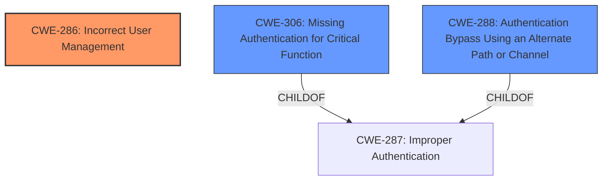

# Raw Analyzer Response for CVE-2022-32260

# Summary
| CWE ID | CWE Name | Confidence | CWE Abstraction Level | CWE Vulnerability Mapping Label | CWE-Vulnerability Mapping Notes |
|---|---|---|---|---|---|
| CWE-286 | Incorrect User Management | 1.0 | Class | Allowed-with-Review | Primary CWE: The application creates temporary user credentials for UMC users, which leads to authentication bypass |
| CWE-306 | Missing Authentication for Critical Function | 0.7 | Base | Allowed | Secondary CWE: If the UMC component lacks authentication, the temporary credentials could be exploited more easily. |
| CWE-288 | Authentication Bypass Using an Alternate Path or Channel | 0.6 | Base | Allowed | Secondary CWE: An alternate path using temporary credentials exists which bypasses the normal authentication |

## Evidence and Confidence

*   **Confidence Score:** 0.8
*   **Evidence Strength:** MEDIUM

## Relationship Analysis
The primary weakness is CWE-286 **Incorrect User Management**, which is a Class-level CWE. The vulnerability involves the creation of temporary user credentials that can be used for authentication bypass. This is directly related to how users are managed within the system.

CWE-306 **Missing Authentication for Critical Function** is a potential related weakness, as the vulnerability is exploitable due to the lack of proper authentication checks for the UMC component when using temporary credentials. CWE-306 is a child of CWE-287 **Improper Authentication**.

CWE-288 **Authentication Bypass Using an Alternate Path or Channel** is also a secondary candidate, as the vulnerability allows bypassing normal authentication flow.

## Vulnerability Chain
The vulnerability chain starts with the **incorrect creation of temporary user credentials** (CWE-286), leading to a potential **authentication bypass** which is the impact. If the UMC component lacks proper authentication mechanisms (CWE-306), the temporary credentials could be more easily exploited.
- Root Cause: CWE-286 **Incorrect User Management**: Application creates temporary user credentials for UMC users.
- Weakness: The temporary credentials can be used to bypass normal authentication. (CWE-288)
- Impact: Authentication Bypass, Privilege Escalation

## Summary of Analysis
The primary CWE is CWE-286 **Incorrect User Management**, as the **incorrect creation and management of temporary credentials** is the root cause. This is supported by the vulnerability description and the CVE reference summary. The retriever results also list CWE-286 as the top match.

The evidence from the "CVE Reference Links Content Summary" indicates that the **application creates temporary user credentials** and highlights "**Incorrect User Management (CWE-286)**" as the source of the vulnerability. The "**impact: authentication bypass**" is a direct consequence of this weakness.

CWE-306 **Missing Authentication for Critical Function** is considered as a secondary CWE because the exploitation of the temporary credentials might be easier if the UMC component lacks proper authentication. This is a reasonable assumption based on the information provided.

CWE-288 **Authentication Bypass Using an Alternate Path or Channel** is also a considered as a secondary CWE because the vulnerability provides an alternate path to bypass the normal authentication flow.

The selection of CWE-286 as the primary CWE is at the optimal level of specificity, as it directly addresses the root cause related to the management of user credentials. While CWE-284 **Improper Access Control** is a parent of CWE-286, it is too broad and doesn't specifically address the user management aspect.

Relevant CWE Information:

# Enhanced Context (25 CWEs)
The following CWEs were identified as potentially relevant to this vulnerability:

## CWE-303: Incorrect Implementation of Authentication Algorithm
**Abstraction Level**: Base
**Similarity Score**: 0.79
**Source**: dense

**Description**:
The requirements for the product dictate the use of an established authentication algorithm, but the implementation of the algorithm is incorrect.

**Mapping Guidance**:
- Usage: Allowed
- Rationale: This CWE entry is at the Base level of abstraction, which is a preferred level of abstraction for mapping to the root causes of vulnerabilities.

## CWE-807: Reliance on Untrusted Inputs in a Security Decision
**Abstraction Level**: Base
**Similarity Score**: 0.78
**Source**: dense

**Description**:
The product uses a protection mechanism that relies on the existence or values of an input, but the input can be modified by an untrusted actor in a way that bypasses the protection mechanism.

**Mapping Guidance**:
- Usage: Allowed
- Rationale: This CWE entry is at the Base level of abstraction, which is a preferred level of abstraction for mapping to the root causes of vulnerabilities.

## CWE-1391: Use of Weak Credentials
**Abstraction Level**: Class
**Similarity Score**: 0.77
**Source**: dense

**Description**:
The product uses weak credentials (such as a default key or hard-coded password) that can be calculated, derived, reused, or guessed by an attacker.

**Mapping Guidance**:
- Usage: Allowed-with-Review
- Rationale: This CWE entry is a Class and might have Base-level children that would be more appropriate

## CWE-274: Improper Handling of Insufficient Privileges
**Abstraction Level**: Base
**Similarity Score**: 0.77
**Source**: dense

**Description**:
The product does not handle or incorrectly handles when it has insufficient privileges to perform an operation, leading to resultant weaknesses.

**Mapping Guidance**:
- Usage: Discouraged
- Rationale: This CWE entry could be deprecated in a future version of CWE.

## CWE-1390: Weak Authentication
**Abstraction Level**: Class
**Similarity Score**: 0.77
**Source**: dense

**Description**:
The product uses an authentication mechanism to restrict access to specific users or identities, but the mechanism does not sufficiently prove that the claimed identity is correct.

**Mapping Guidance**:
- Usage: Allowed-with-Review
- Rationale: This CWE entry is a Class and might have Base-level children that would be more appropriate

## CWE-280: Improper Handling of Insufficient Permissions or Privileges
**Abstraction Level**: Base
**Similarity Score**: 0.77
**Source**: dense

**Description**:
The product does not handle or incorrectly handles when it has insufficient privileges to access resources or functionality as specified by their permissions. This may cause it to follow unexpected code paths that may leave the product in an invalid state.

**Mapping Guidance**:
- Usage: Allowed
- Rationale: This CWE entry is at the Base level of abstraction, which is a preferred level of abstraction for mapping to the root causes of vulnerabilities.

## CWE-288: Authentication Bypass Using an Alternate Path or Channel
**Abstraction Level**: Base
**Similarity Score**: 0.77
**Source**: dense

**Description**:
The product requires authentication, but the product has an alternate path or channel that does not require authentication.

**Mapping Guidance**:
- Usage: Allowed
- Rationale: This CWE entry is at the Base level of abstraction, which is a preferred level of abstraction for mapping to the root causes of vulnerabilities.

## CWE-345: Insufficient Verification of Data Authenticity
**Abstraction Level**: Class
**Similarity Score**: 0.77
**Source**: dense

**Description**:
The product does not sufficiently verify the origin or authenticity of data, in a way that causes it to accept invalid data.

**Mapping Guidance**:
- Usage: Discouraged
- Rationale: This CWE entry is a level-1 Class (i.e., a child of a Pillar). It might have lower-level children that would be more appropriate

## CWE-798: Use of Hard-coded Credentials
**Abstraction Level**: Base
**Similarity Score**: 0.77
**Source**: dense

**Description**:
The product contains hard-coded credentials, such as a password or cryptographic key.

**Mapping Guidance**:
- Usage: Allowed
- Rationale: This CWE entry is at the Base level of abstraction, which is a preferred level of abstraction for mapping to the root causes of vulnerabilities.

## CWE-668: Exposure of Resource to Wrong Sphere
**Abstraction Level**: Class
**Similarity Score**: 0.76
**Source**: dense

**Description**:
The product exposes a resource to the wrong control sphere, providing unintended actors with inappropriate access to the resource.

**Mapping Guidance**:
- Usage: Discouraged