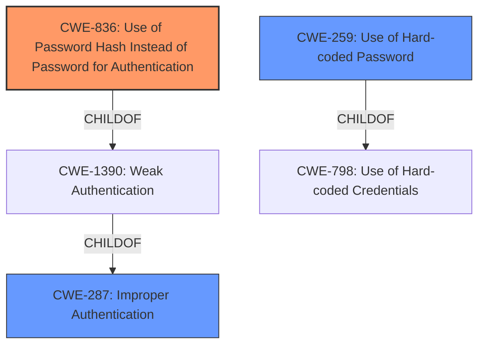

# Enhanced Analysis for CVE-2022-32282

# Summary
| CWE ID  | CWE Name                                                        | Confidence | CWE Abstraction Level | CWE Vulnerability Mapping Label | CWE-Vulnerability Mapping Notes |
|---------|-----------------------------------------------------------------|------------|-----------------------|---------------------------------|-----------------------------------|
| CWE-836 | Use of Password Hash Instead of Password for Authentication       | 0.9        | Base                  | Allowed                         | Primary CWE                       |
| CWE-259 | Use of Hard-coded Password                                       | 0.5        | Variant               | Allowed                         | Secondary Candidate             |
| CWE-287 | Improper Authentication                                           | 0.3        | Class                 | Discouraged                     | Secondary Candidate             |

## Evidence and Confidence

*   **Confidence Score:** 0.9
*   **Evidence Strength:** HIGH

## Relationship Analysis
The primary relationship is that CWE-836 is a base-level weakness related to authentication, specifically how password hashes are used. It falls under the broader category of CWE-1390 (Weak Authentication), which in turn is a child of CWE-287 (Improper Authentication). While CWE-287 is a high-level classification and discouraged, CWE-836 provides a more specific and accurate description of the vulnerability. CWE-259 is a peer of CWE-321 and a child of CWE-798 (Use of Hard-coded Credentials) it is related in that it is a credentialing problem.mermaid



## Vulnerability Chain
The vulnerability chain starts with the **improper password check**, leading to the ability to use a password hash directly for authentication. This results in a privilege escalation/account takeover.
  - Root Cause: **Improper Password Check**
  - Weakness: CWE-836 Use of Password Hash Instead of Password for Authentication
  - Impact: Privilege escalation/account takeover

## Summary of Analysis
The initial assessment identified CWE-836 as the primary weakness due to the system's flawed password verification process, which allows direct authentication using password hashes. This is supported by the following evidence:
- Vulnerability Description Key Phrases: "**improper password check**"
- CVE Reference Links Content Summary: "**Use of password hash for authentication**: The system allows using the stored password hash directly as the password for login, bypassing proper password verification."

The analysis considered the retriever results, particularly the high scores for CWE-836 and CWE-259. While CWE-259 (Use of Hard-coded Password) was considered due to the presence of password-related issues, it was ultimately deemed less relevant because the vulnerability stems from the **improper handling of password hashes**, rather than the use of hard-coded passwords. The system's logic allows direct authentication using the hash, regardless of whether the password was initially hard-coded or not.

CWE-287 (Improper Authentication) was also considered but is too high-level and less descriptive than CWE-836. The decision to select CWE-836 is based on its specific description of the vulnerability mechanism and its alignment with the provided evidence. It accurately represents the root cause where a password hash is incorrectly accepted as a valid password, bypassing the need for the actual password.

Relevant CWE Information:

# Enhanced Context (25 CWEs)

## CWE-1391: Use of Weak Credentials
**Abstraction Level**: Class
**Similarity Score**: 0.78

## CWE-288: Authentication Bypass Using an Alternate Path or Channel
**Abstraction Level**: Base
**Similarity Score**: 0.78

## CWE-798: Use of Hard-coded Credentials
**Abstraction Level**: Base
**Similarity Score**: 0.78

## CWE-303: Incorrect Implementation of Authentication Algorithm
**Abstraction Level**: Base
**Similarity Score**: 0.77

## CWE-807: Reliance on Untrusted Inputs in a Security Decision
**Abstraction Level**: Base
**Similarity Score**: 0.77

## CWE-836: Use of Password Hash Instead of Password for Authentication
**Abstraction Level**: Base
**Similarity Score**: 0.77

## CWE-305: Authentication Bypass by Primary Weakness
**Abstraction Level**: Base
**Similarity Score**: 0.76

## CWE-302: Authentication Bypass by Assumed-Immutable Data
**Abstraction Level**: Base
**Similarity Score**: 0.76

## CWE-1390: Weak Authentication
**Abstraction Level**: Class
**Similarity Score**: 0.76

## CWE-289: Authentication Bypass by Alternate Name
**Abstraction Level**: Base
**Similarity Score**: 0.76

## CWE-259: Use of Hard-coded Password
**Abstraction Level**: Variant
**Similarity Score**: 5697.25

## CWE-798: Use of Hard-coded Credentials
**Abstraction Level**: Base
**Similarity Score**: 5619.25

## CWE-1390: Weak Authentication
**Abstraction Level**: Class
**Similarity Score**: 5414.18

## CWE-916: Use of Password Hash With Insufficient Computational Effort
**Abstraction Level**: Base
**Similarity Score**: 5385.34

## CWE-287: Improper Authentication
**Abstraction Level**: Class
**Similarity Score**: 5299.29

## CWE-321: Use of Hard-coded Cryptographic Key
**Abstraction Level**: variant
**Similarity Score**: 4.01

## CWE-259: Use of Hard-coded Password
**Abstraction Level**: variant
**Similarity Score**: 4.01

## CWE-257: Storing Passwords in a Recoverable Format
**Abstraction Level**: base
**Similarity Score**: 3.64

## CWE-420: Unprotected Alternate Channel
**Abstraction Level**: base
**Similarity Score**: 3.64

## CWE-481: Assigning instead of Comparing
**Abstraction Level**: variant
**Similarity Score**: 2.68

## CWE-798: Use of Hard-coded Credentials
**Abstraction Level**: Base
**Similarity Score**: 2.50

## CWE-288: Authentication Bypass Using an Alternate Path or Channel
**Abstraction Level**: Base
**Similarity Score**: 2.50

## CWE-836: Use of Password Hash Instead of Password for Authentication
**Abstraction Level**: Base
**Similarity Score**: 2.49

## CWE-306: Missing Authentication for Critical Function
**Abstraction Level**: base
**Similarity Score**: 2.47

## CWE-89: Improper Neutralization of Special Elements used in an SQL Command ('SQL Injection')
**Abstraction Level**: base
**Similarity Score**: 2.47
```


## CWE Relationship Analysis

Current CWEs represent these abstraction levels: .


### Vulnerability Chain Analysis

**Chain starting from CWE-89:**
- 89 (Improper Neutralization of Special Elements used in an SQL Command ('SQL Injection')) - ROOT


**Chain starting from CWE-259:**
- 259 (Use of Hard-coded Password) - ROOT


### CWE Relationship Diagram

```mermaid
graph TD
    classDef primary fill:#f96,stroke:#333,stroke-width:2px
    classDef secondary fill:#69f,stroke:#333
    classDef tertiary fill:#9e9,stroke:#333
```