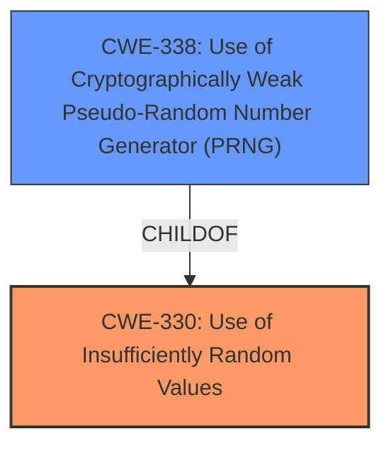

# Raw Analyzer Response for CVE-2022-32296

# Summary
| CWE ID  | CWE Name                                                   | Confidence | CWE Abstraction Level | CWE Vulnerability Mapping Label | CWE-Vulnerability Mapping Notes |
| :-------- | :--------------------------------------------------------- | :---------- | :---------------------- | :------------------------------ | :------------------------------ |
| CWE-330 | Use of Insufficiently Random Values                       | 0.9         | Class                   | Primary                         | Discouraged                  |
| CWE-338 | Use of Cryptographically Weak Pseudo-Random Number Generator (PRNG) | 0.7         | Base                    | Secondary                       | Allowed                       |

## Evidence and Confidence

*   **Confidence Score:** 0.8
*   **Evidence Strength:** HIGH

## Relationship Analysis

The primary relationship that influenced the selection was the hierarchical relationship between CWE-330 and CWE-338. CWE-338 is a child of CWE-330, indicating a more specific type of insufficient randomness related to cryptographic PRNGs. The analysis considered other peer relationships but ultimately determined that CWE-330 and its child CWE-338 best captured the essence of the **weakness** in the TCP source port selection algorithm. The abstraction levels were also considered, preferring the more specific Base level CWE-338 where applicable.

## Vulnerability Chain

The vulnerability chain starts with the **use of Algorithm 4 (Double-Hash Port Selection Algorithm) of RFC 6056**, which leads to the **use of insufficiently random values** (CWE-330) or more specifically a **use of cryptographically weak pseudo-random number generator (PRNG)** (CWE-338). This results in **predictable port selection**, which allows attackers to **identify clients by observing what source ports are used.**

## Summary of Analysis

The initial assessment focused on the **root cause** described as "**use of Algorithm 4 (Double-Hash Port Selection Algorithm) of RFC 6056**" and the resulting ability to "**identify clients by observing what source ports are used**". The "CVE Reference Links Content Summary" helped solidify the understanding of the vulnerability, highlighting the **predictable port selection** due to a **weakness** in the randomization of TCP source ports.

The Retriever Results pointed to several candidate CWEs, including CWE-330 (Use of Insufficiently Random Values) and CWE-338 (Use of Cryptographically Weak Pseudo-Random Number Generator (PRNG)). Given the cryptographic nature of the port selection algorithm, both CWE-330 and CWE-338 were strong candidates.

The decision to select CWE-330 as the primary CWE was influenced by its broader applicability to the **root cause**, which is the **use of insufficiently random values**. While CWE-338 is more specific, it is still relevant as the PRNG is used in a cryptographic context.

The evidence supporting this decision is extracted from the "CVE Reference Links Content Summary":

*   "The vulnerability stems from a **weakness** in the randomization of TCP source port selection."
*   "The core issue is with the `G()` function that generates a source port based on a device-specific key."
*   "The hash function used in the algorithm produces collisions that are not random enough for security purposes, allowing an attacker to predict the generated source ports."

CWE-330 is at the optimal level of specificity because it directly addresses the **root cause**: the **use of insufficiently random values** in a security-sensitive context. CWE-338 provides further detail by specifying that this randomness issue is related to a PRNG.

Relevant CWE Information:

# Enhanced Context (25 CWEs)

## CWE-208: Observable Timing Discrepancy
**Abstraction Level**: Base
**Similarity Score**: 0.79
**Source**: dense

**Description**:
Two separate operations in a product require different amounts of time to complete, in a way that is observable to an actor and reveals security-relevant information about the state of the product, such as whether a particular operation was successful or not.

**Mapping Guidance**:
- Usage: Allowed
- Rationale: This CWE entry is at the Base level of abstraction, which is a preferred level of abstraction for mapping to the root causes of vulnerabilities.

*Not Used:* While timing discrepancies could potentially arise from the algorithm, the primary **weakness** is the insufficient randomness, not the timing.

## CWE-330: Use of Insufficiently Random Values
**Abstraction Level**: Class
**Similarity Score**: 0.78
**Source**: dense

**Description**:
The product uses insufficiently random numbers or values in a security context that depends on unpredictable numbers.

**Mapping Guidance**:
- Usage: Discouraged
- Rationale: This CWE entry is a level-1 Class (i.e., a child of a Pillar). It might have lower-level children that would be more appropriate

*Used as primary:* The vulnerability description states the **root cause** is the **use of Algorithm 4 (Double-Hash Port Selection Algorithm) of RFC 6056** which leads to TCP servers being able to identify clients by observing which source ports are used. This matches the description of CWE-330.

## CWE-203: Observable Discrepancy
**Abstraction Level**: Base
**Similarity Score**: 0.78
**Source**: dense

**Description**:
The product behaves differently or sends different responses under different circumstances in a way that is observable to an unauthorized actor, which exposes security-relevant information about the state of the product, such as whether a particular operation was successful or not.

**Mapping Guidance**:
- Usage: Allowed
- Rationale: This CWE entry is at the Base level of abstraction, which is a preferred level of abstraction for mapping to the root causes of vulnerabilities.

*Not Used:* Similar to CWE-208, while the behavior is observable, the core issue is the **insufficient randomness** that makes the behavior predictable.

## CWE-328: Use of Weak Hash
**Abstraction Level**: Base
**Similarity Score**: 0.76
**Source**: dense

**Description**:
The product uses an algorithm that produces a digest (output value) that does not meet security expectations for a hash function that allows an adversary to reasonably determine the original input (preimage attack), find another input that can produce the same hash (2nd preimage attack), or find multiple inputs that evaluate to the same hash (birthday attack).

**Mapping Guidance**:
- Usage: Allowed
- Rationale: This CWE entry is at the Base level of abstraction, which is a preferred level of abstraction for mapping to the root causes of vulnerabilities.

*Not Used:* The algorithm uses a weak hash algorithm, but the core issue is that the resulting values are not random enough. Therefore it is more accurate to classify this issue as CWE-330.

## CWE-338: Use of Cryptographically Weak Pseudo-Random Number Generator (PRNG)
**Abstraction Level**: Base
**Similarity Score**: 6974.19
**Source**: sparse

**Description**:
The product uses a Pseudo-Random Number Generator (PRNG) in a security context, but the PRNG's algorithm is not cryptographically strong.

**Mapping Guidance**:
- Usage: Allowed
- Rationale: This CWE entry is at the Base level of abstraction, which is a preferred level of abstraction for mapping to the root causes of vulnerabilities.

*Used as secondary:* The PRNG is a specific type of random value generator and its weakness causes the overall randomness to be insufficient.