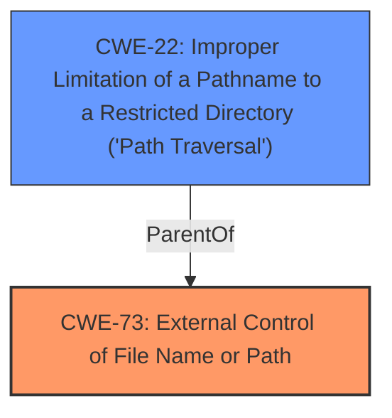

# Raw Analyzer Response for CVE-2022-32328

# Summary
| CWE ID | CWE Name | Confidence | CWE Abstraction Level | CWE Vulnerability Mapping Label | CWE-Vulnerability Mapping Notes |
|---|---|---|---|---|---|
| CWE-73 | External Control of File Name or Path | 1.0 | Base | Allowed | Primary CWE |
| CWE-22 | Improper Limitation of a Pathname to a Restricted Directory ('Path Traversal') | 0.8 | Base | Allowed | Secondary CWE |

## Evidence and Confidence

*   **Confidence Score:** 0.9
*   **Evidence Strength:** HIGH

## Relationship Analysis
The primary CWE is CWE-73, which describes the root cause of the vulnerability: external control of a file name or path. CWE-22 is a related weakness that describes the specific case of path traversal, where an attacker can access files outside of the intended directory. Both CWEs are at the Base level of abstraction.

## Vulnerability Chain
The vulnerability chain starts with the **external control of the file path** (CWE-73). This leads to the ability to manipulate the path and potentially traverse directories (CWE-22). The final impact is **arbitrary file deletion**, which can cause data loss and denial of service.

## Summary of Analysis
The initial analysis identified several potential CWEs, including CWE-22, CWE-73, and CWE-434. However, after careful consideration of the vulnerability description and the relationships between the CWEs, I concluded that CWE-73 is the most accurate primary mapping because the root cause is the **external control of the file name or path**, which is then exploited to achieve arbitrary file deletion. CWE-22 is included as a secondary CWE because path traversal is a common technique used to exploit this vulnerability, but it is not the root cause.

The following evidence supports this decision:

*   The vulnerability description states that the application uses a `path` parameter received via a POST request **without proper validation or sanitization**, which allows an attacker to specify an arbitrary file path.
*   The **Root cause of vulnerability** is from the `delete_img` function within the `/ffos/classes/Master.php` file. The application uses a `path` parameter received via a POST request **without proper validation or sanitization**, which allows an attacker to specify an arbitrary file path.
*   The impact of exploitation is data loss, denial of service, and potential system compromise.
*   The attack vector is an HTTP POST request with a `path` parameter containing the full path to the file to be deleted.

The chosen CWEs are at the Base level of abstraction, which is the preferred level for mapping to root causes.

Relevant CWE Information:

# Enhanced Context (25 CWEs)
The following CWEs were identified as potentially relevant to this vulnerability:

## CWE-41: Improper Resolution of Path Equivalence
**Abstraction Level**: Base
**Similarity Score**: 0.80
**Source**: dense

**Description**:
The product is vulnerable to file system contents disclosure through path equivalence. Path equivalence involves the use of special characters in file and directory names. The associated manipulations are intended to generate multiple names for the same object.

**Why Not Selected:** This CWE is focused on disclosure rather than deletion.

## CWE-73: External Control of File Name or Path
**Abstraction Level**: Base
**Similarity Score**: 0.80
**Source**: dense

**Description**:
The product allows user input to control or influence paths or file names that are used in filesystem operations.

**Mapping Guidance**:
- Usage: Allowed
- Rationale: This CWE entry is at the Base level of abstraction, which is a preferred level of abstraction for mapping to the root causes of vulnerabilities.

**Why Selected:** This CWE accurately describes the **root cause** of the vulnerability, where user-controlled input is used to specify the file path to be deleted. The description and mapping guidance directly align with the vulnerability details.

## CWE-23: Relative Path Traversal
**Abstraction Level**: Base
**Similarity Score**: 0.80
**Source**: dense

**Description**:
The product uses external input to construct a pathname that should be within a restricted directory, but it does not properly neutralize sequences such as ".." that can resolve to a location that is outside of that directory.

**Mapping Guidance**:
- Usage: Allowed
- Rationale: This CWE entry is at the Base level of abstraction, which is a preferred level of abstraction for mapping to the root causes of vulnerabilities.

**Why Selected:** While path traversal is a common technique used to exploit CWE-73, it is not the **root cause** of the vulnerability. It's a potential method the attacker can use to specify a file outside the intended directory.

## CWE-184: Incomplete List of Disallowed Inputs
**Abstraction Level**: Base
**Similarity Score**: 0.79
**Source**: dense

**Description**:
The product implements a protection mechanism that relies on a list of inputs (or properties of inputs) that are not allowed by policy or otherwise require other action to neutralize before additional processing takes place, but the list is incomplete.

**Mapping Guidance**:
- Usage: Allowed
- Rationale: This CWE entry is at the Base level of abstraction, which is a preferred level of abstraction for mapping to the root causes of vulnerabilities.

**Why Not Selected:** While this could be a contributing factor, the primary issue is the **lack of any validation or sanitization** of the file path, rather than an incomplete list of disallowed inputs.

## CWE-74: Improper Neutralization of Special Elements in Output Used by a Downstream Component ('Injection')
**Abstraction Level**: Class
**Similarity Score**: 0.79
**Source**: dense

**Description**:
The product constructs all or part of a command, data structure, or record using externally-influenced input from an upstream component, but it does not neutralize or incorrectly neutralizes special elements that could modify how it is parsed or interpreted when it is sent to a downstream component.

**Mapping Guidance**:
- Usage: Discouraged
- Rationale: CWE-74 is high-level and often misused when lower-level weaknesses are more appropriate.

**Why Not Selected:** This is a high-level CWE, and more specific CWEs like CWE-73 and CWE-22 are more appropriate.

## CWE-138: Improper Neutralization of Special Elements
**Abstraction Level**: Class
**Similarity Score**: 0.78
**Source**: dense

**Description**:
The product receives input from an upstream component, but it does not neutralize or incorrectly neutralizes special elements that could be interpreted as control elements or syntactic markers when they are sent to a downstream component.

**Mapping Guidance**:
- Usage: Discouraged
- Rationale: This CWE entry is a level-1 Class (i.e., a child of a Pillar). It might have lower-level children that would be more appropriate

**Why Not Selected:** This is a high-level CWE, and more specific CWEs like CWE-73 and CWE-22 are more appropriate.

## CWE-36: Absolute Path Traversal
**Abstraction Level**: Base
**Similarity Score**: 0.78
**Source**: dense

**Description**:
The product uses external input to construct a pathname that should be within a restricted directory, but it does not properly neutralize absolute path sequences such as "/abs/path" that can resolve to a location that is outside of that directory.

**Mapping Guidance**:
- Usage: Allowed
- Rationale: This CWE entry is at the Base level of abstraction, which is a preferred level of abstraction for mapping to the root causes of vulnerabilities.

**Why Not Selected:** While this is a potential variation of Path Traversal, the description did not explicitly state whether relative or absolute paths were being used.

## CWE-472: External Control of Assumed-Immutable Web Parameter
**Abstraction Level**: Base
**Similarity Score**: 0.77
**Source**: dense

**Description**:
The web application does not sufficiently verify inputs that are assumed to be immutable but are actually externally controllable, such as hidden form fields.

**Mapping Guidance**:
- Usage: Allowed
- Rationale: This CWE entry is at the Base level of abstraction, which is a preferred level of abstraction for mapping to the root causes of vulnerabilities.

**Why Not Selected:** This CWE focuses on parameters assumed to be immutable. The `path` parameter is not assumed to be immutable.

## CWE-1289: Improper Validation of Unsafe Equivalence in Input
**Abstraction Level**: Base
**Similarity Score**: 0.77
**Source**: dense

**Description**:
The product receives an input value that is used as a resource identifier or other type of reference, but it does not validate or incorrectly validates that the input is equivalent to a potentially-unsafe value.

**Mapping Guidance**:
- Usage: Allowed
- Rationale: This CWE entry is at the Base level