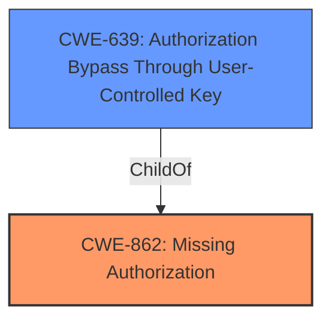

# Analysis Report for CVE-2022-3244

# Vulnerability Analysis Report: CVE-2022-3244

## Description


## Analysis (with Relationship Data)

# Summary
| CWE ID | CWE Name | Confidence | CWE Abstraction Level | CWE Vulnerability Mapping Label | CWE-Vulnerability Mapping Notes |
|---|---|---|---|---|---|
| CWE-862 | Missing Authorization | 1.0 | Class | Primary | Allowed-with-Review |
| CWE-639 | Authorization Bypass Through User-Controlled Key | 0.7 | Base | Secondary | Allowed |

## Evidence and Confidence

*   **Confidence Score:** 0.85
*   **Evidence Strength:** HIGH

## Relationship Analysis
The primary relationship that influenced the selection was the ChildOf relationship where CWE-862 (Missing Authorization) is a parent to CWE-639 (Authorization Bypass Through User-Controlled Key). While CWE-639 could potentially fit, the vulnerability description centers more on the general **missing authorization** aspect rather than a specific user-controlled key. Therefore, the higher-level CWE-862 is more appropriate as the primary classification, with CWE-639 as a secondary consideration if the "nonce" weakness is further analyzed and found to be user-controlled.



## Vulnerability Chain
The vulnerability chain starts with the **missing authorization** check, which allows authenticated users with insufficient privileges to access plugin features. The potential for insecure nonce handling may allow authenticated users to bypass other authorization checks that may be present.
- **Root Cause:** Missing Authorization (CWE-862)
- **Weakness:** Potential Insecure Nonce Handling (Implied)
- **Impact:** Unauthorized access to plugin features, potential data modification/manipulation

## Summary of Analysis
The initial analysis pointed towards CWE-862 (Missing Authorization) as the primary weakness due to the explicit mention of **missing authorization** in the vulnerability description and the CVE Reference Links Content Summary. The **rootcause** is clearly a **missing authorization** check which allows authenticated users to access plugin features they should not have access to.

The Retriever Results also support this, with CWE-862 being a strong candidate. Further analysis considered CWE-639 (Authorization Bypass Through User-Controlled Key) because the vulnerability description mentions that authenticated users can access features "if they manage to get the related nonce," which could indicate user-controlled key manipulation.

The final decision is to classify this vulnerability primarily as CWE-862 (Missing Authorization) because the **rootcause** is a general **missing authorization** check. CWE-639 is considered a secondary classification if further investigation reveals that the nonce handling is indeed user-controlled and the bypass is achieved through manipulation of the nonce value.

The selected CWEs are at the optimal level of specificity, with CWE-862 being a Class-level CWE and CWE-639 being a Base-level CWE, providing a balance between generality and detail.

Relevant CWE Information:

# Enhanced Context (25 CWEs)
The following CWEs were identified as potentially relevant to this vulnerability:

## CWE-639: Authorization Bypass Through User-Controlled Key
**Abstraction Level**: Base
**Similarity Score**: 0.77
**Source**: dense

**Description**:
The system's authorization functionality does not prevent one user from gaining access to another user's data or record by modifying the key value identifying the data.

**Mapping Guidance**:
- Usage: Allowed
- Rationale: This CWE entry is at the Base level of abstraction, which is a preferred level of abstraction for mapping to the root causes of vulnerabilities.

## CWE-862: Missing Authorization
**Abstraction Level**: Class
**Status:** Incomplete

### Description
The product does not perform an authorization check when an actor attempts to access a resource or perform an action.

### Extended Description
Not provided

### Alternative Terms
AuthZ: "AuthZ" is typically used as an abbreviation of "authorization" within the web application security community. It is distinct from "AuthN" (or, sometimes, "AuthC") which is an abbreviation of "authentication." The use of "Auth" as an abbreviation is discouraged, since it could be used for either authentication or authorization.

### Relationships
ChildOf -> CWE-285
ChildOf -> CWE-284

### Mapping Guidance
**Usage:** Allowed-with-Review
**Rationale:** This CWE entry is a Class and might have Base-level children that would be more appropriate
**Comments:** Examine children of this entry to see if there is a better fit
**Reasons:**
- Abstraction

### Additional Notes
**[Terminology]** Assuming a user with a given identity, authorization is the process of determining whether that user can access a given resource, based on the user's privileges and any permissions or other access-control specifications that apply to the resource.


## CWE Relationship Analysis

Current CWEs represent these abstraction levels: .


### Vulnerability Chain Analysis

**Chain starting from CWE-862:**
- 862 (Missing Authorization) - ROOT


**Chain starting from CWE-285:**
- 285 (Improper Authorization) - ROOT


### CWE Relationship Diagram

```mermaid
graph TD
    classDef primary fill:#f96,stroke:#333,stroke-width:2px
    classDef secondary fill:#69f,stroke:#333
    classDef tertiary fill:#9e9,stroke:#333
```


*Report generated on 2025-03-31 09:32:34*
