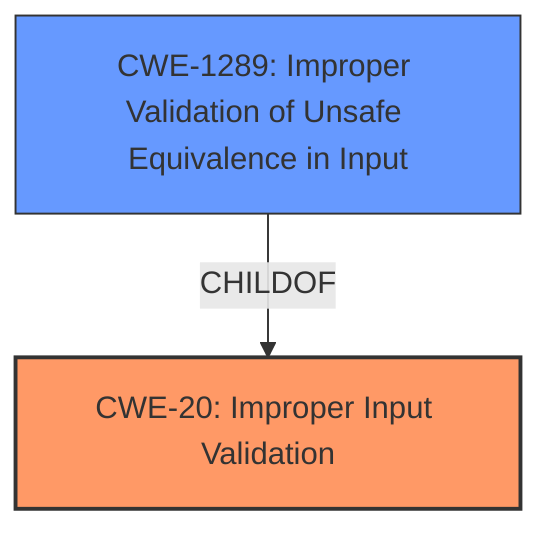

# Analysis for CVE-2022-32483

# Summary
| CWE ID | CWE Name | Confidence | CWE Abstraction Level | CWE Vulnerability Mapping Label | CWE-Vulnerability Mapping Notes |
|---|---|---|---|---|---|
| CWE-20 | Improper Input Validation | 0.9 | Class | Primary | Discouraged |
| CWE-1289 | Improper Validation of Unsafe Equivalence in Input | 0.6 | Base | Secondary | Allowed |

## Evidence and Confidence

*   **Confidence Score:** 0.9
*   **Evidence Strength:** HIGH

## Relationship Analysis
The primary relationship considered here is the ChildOf relationship. CWE-20 is a child of CWE-707, which represents broader improper validation issues. However, based on the description, a lower-level CWE isn't immediately obvious, making CWE-20 the most appropriate Class-level classification.
CWE-1289 is a Base level child of CWE-20, and represents "Improper Validation of Unsafe Equivalence in Input" and is another potential classification.

## Vulnerability Chain
The vulnerability chain is relatively simple:
1.  **Root Cause:** **Improper Input Validation** (CWE-20) within the Dell BIOS.
2.  **Impact:** Modification of UEFI variable, potentially leading to unauthorized changes to the system's boot process or other firmware settings.

## Summary of Analysis
The initial analysis identified **improper input validation** as the root cause. The provided vulnerability description and key phrases, along with the CVE reference content summary, all support this.

The primary CWE match from similar CVE descriptions is CWE-20, which aligns with the identified root cause. While CWE-20 is discouraged due to its high-level nature, the provided information doesn't clearly point to a more specific CWE. Therefore, CWE-20 is selected as the primary CWE.

The retriever results also list CWE-20 as the top combined result.

CWE-1289 "Improper Validation of Unsafe Equivalence in Input" might be applicable. The vulnerability description does not provide enough information to confirm if the input validation issue involves unsafe equivalence.

Relevant CWE Information:

# Enhanced Context (25 CWEs)
The following CWEs were identified as potentially relevant to this vulnerability:

## CWE-1289: Improper Validation of Unsafe Equivalence in Input
**Abstraction Level**: Base
**Similarity Score**: 0.75
**Source**: dense

**Description**:
The product receives an input value that is used as a resource identifier or other type of reference, but it does not validate or incorrectly validates that the input is equivalent to a potentially-unsafe value.

**Mapping Guidance**:
- Usage: Allowed
- Rationale: This CWE entry is at the Base level of abstraction, which is a preferred level of abstraction for mapping to the root causes of vulnerabilities.

## CWE-20: Improper Input Validation
**Abstraction:** Class
**Status:** Stable

### Description
The product receives input or data, but it does
        not validate or incorrectly validates that the input has the
        properties that are required to process the data safely and
        correctly.

### Extended Description

Input validation is a frequently-used technique for checking potentially dangerous inputs in order to ensure that the inputs are safe for processing within the code, or when communicating with other components. When software does not validate input properly, an attacker is able to craft the input in a form that is not expected by the rest of the application. This will lead to parts of the system receiving unintended input, which may result in altered control flow, arbitrary control of a resource, or arbitrary code execution.

### Mapping Guidance
**Usage:** Discouraged
**Rationale:** CWE-20 is commonly misused in low-information vulnerability reports when lower-level CWEs could be used instead, or when more details about the vulnerability are available [REF-1287]. It is not useful for trend analysis. It is also a level-1 Class (i.e., a child of a Pillar).
**Comments:** Consider lower-level children such as Improper Use of Validation Framework (CWE-1173) or improper validation involving specific types or properties of input such as Specified Quantity (CWE-1284); Specified Index, Position, or Offset (CWE-1285); Syntactic Correctness (CWE-1286); Specified Type (CWE-1287); Consistency within Input (CWE-1288); or Unsafe Equivalence (CWE-1289).

### Observed Examples
- **CVE-2024-37032:** Large language model (LLM) management tool does not validate the format of a digest value (CWE-1287) from a private, untrusted model registry, enabling relative path traversal (CWE-23), a.k.a. Probllama
- **CVE-2022-45918:** Chain: a learning management tool debugger uses external input to locate previous session logs (CWE-73) and does not properly validate the given path (CWE-20), allowing for filesystem path traversal using "../" sequences (CWE-24)
- **CVE-2021-30860:** Chain: improper input validation (CWE-20) leads to integer overflow (CWE-190) in mobile OS, as exploited in the wild per CISA KEV.

### Considered But Not Used:

*   CWE-119: Improper Restriction of Operations within the Bounds of a Memory Buffer - While buffer overflows can be a consequence of improper input validation, the description doesn't explicitly mention memory corruption.
*   CWE-665: Improper Initialization - The vulnerability is about how input is validated, not about the initialization of variables.
*   CWE-287: Improper Authentication and CWE-269: Improper Privilege Management - The attacker already has admin privileges, so this is not an authentication or privilege management issue.
*   CWE-453: Insecure Default Variable Initialization - While this could be related, the focus is on the validation of input, not the default initialization of variables.
*   CWE-770: Allocation of Resources Without Limits or Throttling - This is not a resource allocation issue.
*   CWE-285: Improper Authorization - The problem is not with authorization, but with the validation of input before it is used.
*   CWE-347: Improper Verification of Cryptographic Signature - This is not a cryptographic signature issue.
*   CWE-639: Authorization Bypass Through User-Controlled Key - This is not about bypassing authorization.
*   CWE-863: Incorrect Authorization - The issue is not with the authorization process itself, but rather with the validation of the input used in the process.
*   CWE-1284: Improper Validation of Specified Quantity in Input - There is no mention of an improper quantity.
*   CWE-41: Improper Resolution of Path Equivalence - There is no mention of path equivalence.
*   CWE-22: Improper Limitation of a Pathname to a Restricted Directory ('Path Traversal') - There is no mention of path traversal.
*   CWE-73: External Control of File Name or Path - There is no mention of external control of file name or path.
*   CWE-190: Integer Overflow or Wraparound - There is no mention of integer overflow.
*   CWE-125: Out-of-bounds Read - There is no mention of out-of-bounds read.
*   CWE-789: Memory Allocation with Excessive Size Value - There is no mention of excessive memory allocation.
*   CWE-266: Incorrect Privilege Assignment - There is no mention of privilege assignment.
*   CWE-843: Access of Resource Using Incompatible Type ('Type Confusion') - There is no mention of type confusion.
*   CWE-274: Improper Handling of Insufficient Privileges - There is no mention of insufficient privileges.
*   CWE-807: Reliance on Untrusted Inputs in a Security Decision - There is no mention of security decision.
*   CWE-345: Insufficient Verification of Data Authenticity - There is no mention of data authenticity.
*   CWE-664: Improper Control of a Resource Through its Lifetime - There is no mention of resource lifetime.
*   CWE-404: Improper Resource Shutdown or Release - There is no mention of resource shutdown.
*   CWE-653: Improper Isolation or Compartmentalization - There is no mention of isolation.
*   CWE-657: Violation of Secure Design Principles - There is no specific design principle.
*   CWE-691: Insufficient Control Flow Management - There is no mention of