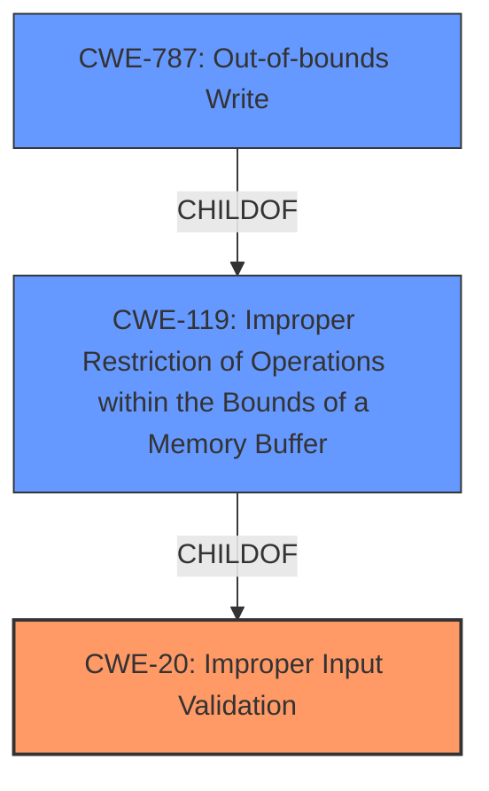

# Analysis Report for CVE-2022-32486

# Vulnerability Analysis Report: CVE-2022-32486

## Description


## Analysis (with Relationship Data)

# Summary
| CWE ID | CWE Name | Confidence | CWE Abstraction Level | CWE Vulnerability Mapping Label | CWE-Vulnerability Mapping Notes |
|---|---|---|---|---|---|
| CWE-20 | Improper Input Validation | 0.9 | Class | Primary | Discouraged, but selected because it aligns with the **improper input validation** root cause. |
| CWE-787 | Out-of-bounds Write | 0.6 | Base | Secondary | Allowed, considered as a potential impact of the **improper input validation**.|

## Evidence and Confidence

*   **Confidence Score:** 0.9
*   **Evidence Strength:** HIGH

## Relationship Analysis
The primary relationship that influenced the decision was the parent-child relationship between CWE-20 and its potential consequences, such as buffer overflows. While CWE-20 is a class-level CWE and generally discouraged, its direct match to the **improper input validation** root cause made it the most suitable primary classification.



## Vulnerability Chain
The vulnerability chain starts with **improper input validation** (CWE-20), which can lead to out-of-bounds write (CWE-787) and ultimately arbitrary code execution in SMRAM.
  - Root Cause: CWE-20 (**improper input validation**)
  - Impact: CWE-787 (Out-of-bounds Write), arbitrary code execution

## Summary of Analysis
The initial analysis focused on identifying the **root cause** of the vulnerability, which is clearly stated as **improper input validation**. While CWE-20 is a class-level CWE and the mapping guidance discourages its use when more specific CWEs are available, it directly reflects the described weakness. The "**improper input validation**" key phrase directly supports this mapping. The description states "Dell BIOS contains an **improper input validation** vulnerability. A local authenticated malicious user may potentially exploit this vulnerability by using an SMI to gain arbitrary code execution in SMRAM."
The "CVE Reference Links Content Summary" also supports this:
**Root cause of vulnerability:**
- The Dell BIOS contains an **improper input validation** vulnerability.
**Weaknesses/vulnerabilities present:**
- **Improper input validation**.
CWE-787 (Out-of-bounds Write) was considered as a potential consequence of **improper input validation**, leading to arbitrary code execution.

The selection of CWE-20 is at the optimal level of specificity because it accurately captures the **root cause** of the vulnerability as described in the provided information. Although more specific variants of CWE-20 exist (e.g., CWE-1284, CWE-1285), the available evidence does not provide enough detail to determine the specific type of **input validation** error.

Relevant CWE Information:

# Enhanced Context (25 CWEs)
The following CWEs were identified as potentially relevant to this vulnerability:

## CWE-665: Improper Initialization
CWE-665 was considered but rejected because the vulnerability description focuses on input validation rather than initialization problems.

## CWE-1289: Improper Validation of Unsafe Equivalence in Input
CWE-1289 was considered, but the description does not indicate unsafe equivalency issue.

## CWE-667: Improper Locking
CWE-667 was considered, but locking is not a factor in the vulnerability description.

## CWE-404: Improper Resource Shutdown or Release
CWE-404 was considered, but this is not a resource release issue.

## CWE-691: Insufficient Control Flow Management
CWE-691 was considered but is too abstract.

## CWE-226: Sensitive Information in Resource Not Removed Before Reuse
CWE-226 was considered, but this is not related to sensitive data.

## CWE-653: Improper Isolation or Compartmentalization
CWE-653 was considered, but isolation is not relevant.

## CWE-664: Improper Control of a Resource Through its Lifetime
CWE-664 was considered but is too abstract.

## CWE-657: Violation of Secure Design Principles
CWE-657 was considered but is too abstract.

## CWE-662: Improper Synchronization
CWE-662 was considered, but synchronization is not relevant.

## CWE-119: Improper Restriction of Operations within the Bounds of a Memory Buffer
CWE-119 was considered, but it is a more general case of the potential impact.

## CWE-125: Out-of-bounds Read
CWE-125 was considered, but an out-of-bounds read is not the primary issue.

## CWE-190: Integer Overflow or Wraparound
CWE-190 was considered, but there's no explicit evidence of an integer overflow.

## CWE-1284: Improper Validation of Specified Quantity in Input
CWE-1284 was considered, but the available information does not specify a quantity-related input validation issue.

## CWE-367: Time-of-check Time-of-use (TOCTOU) Race Condition
CWE-367 was considered, but the description does not suggest a race condition.

## CWE-41: Improper Resolution of Path Equivalence
CWE-41 was considered, but paths are not mentioned.

## CWE-22: Improper Limitation of a Pathname to a Restricted Directory ('Path Traversal')
CWE-22 was considered, but paths are not mentioned.

## CWE-770: Allocation of Resources Without Limits or Throttling
CWE-770 was considered, but resource allocation is not the issue.

## CWE-73: External Control of File Name or Path
CWE-73 was considered, but paths are not mentioned.

## CWE-190: Integer Overflow or Wraparound
CWE-190 was considered, but there's no explicit evidence of an integer overflow.

## CWE-120: Buffer Copy without Checking Size of Input ('Classic Buffer Overflow')
CWE-120 was considered, but the description doesn't focus on a buffer copy operation.

## CWE-123: Write-what-where Condition
CWE-123 was considered, but it's not directly supported by the description.

## CWE-125: Out-of-bounds Read
CWE-125 was considered, but an out-of-bounds read is not the primary issue.

## CWE-843: Access of Resource Using Incompatible Type ('Type Confusion')
CWE-843 was considered, but type confusion is not evident.

## CWE-1284: Improper Validation of Specified Quantity in Input
CWE-1284 was considered, but the available information does not specify a quantity-related input validation issue.


## CWE Relationship Analysis

Current CWEs represent these abstraction levels: .


### Vulnerability Chain Analysis

**Chain starting from CWE-41:**
- 41 (Improper Resolution of Path Equivalence) - ROOT


**Chain starting from CWE-119:**
- 119 (Improper Restriction of Operations within the Bounds of a Memory Buffer) - ROOT


### CWE Relationship Diagram

```mermaid
graph TD
    classDef primary fill:#f96,stroke:#333,stroke-width:2px
    classDef secondary fill:#69f,stroke:#333
    classDef tertiary fill:#9e9,stroke:#333
```


*Report generated on 2025-03-30 18:20:21*
