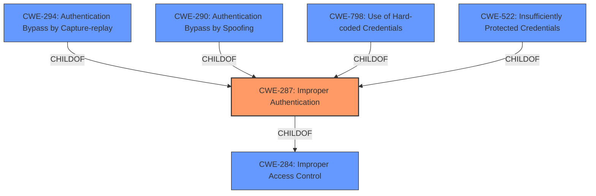

# Analysis Report for CVE-2022-32514

# Vulnerability Analysis Report: CVE-2022-32514

## Description


## Analysis (with Relationship Data)

# Summary
| CWE ID | CWE Name | Confidence | CWE Abstraction Level | CWE Vulnerability Mapping Label | CWE-Vulnerability Mapping Notes |
|---|---|---|---|---|---|
| CWE-287 | Improper Authentication | 1.0 | Class | Primary | Discouraged |

## Evidence and Confidence

*   **Confidence Score:** 1.0
*   **Evidence Strength:** HIGH

## Relationship Analysis
The primary CWE identified is CWE-287 **Improper Authentication**, which is a Class-level CWE. The retriever results suggest other Base-level CWEs like CWE-294 **Authentication Bypass by Capture-replay**, CWE-290 **Authentication Bypass by Spoofing**, and CWE-798 **Use of Hard-coded Credentials** as potential candidates. However, the provided description does not give enough details to pinpoint the exact mechanism of the **improper authentication**. Therefore, sticking with the broader CWE-287 is more appropriate. CWE-287 is a child of the Pillar CWE-284 **Improper Access Control**, but CWE-284 is too abstract for this vulnerability.



## Vulnerability Chain
The vulnerability chain starts with **Improper Authentication** (CWE-287), which leads to an attacker gaining control of the device.

## Summary of Analysis
The initial analysis strongly pointed to CWE-287 **Improper Authentication** based on the description and key phrases provided: "**Improper Authentication** vulnerability exists that could allow an attacker to gain control of the device when logging into a web page." The CVE Reference Links Content Summary also explicitly mentions "**Weaknesses/vulnerabilities present**: CWE-287: Improper Authentication. The vulnerability allows an attacker to bypass authentication when logging into a web page."

The Retriever Results further reinforce the relevance of CWE-287. While the mapping guidance for CWE-287 discourages its use due to its high-level nature, the lack of specific details about the authentication bypass mechanism prevents selecting a more specific child CWE. The evidence overwhelmingly supports CWE-287 as the primary weakness. The abstraction level is optimal, given the limited information.

Relevant CWE Information:

# Enhanced Context (25 CWEs)

## CWE-287: Improper Authentication
**Abstraction:** Class
**Status:** Draft

### Description
When an actor claims to have a given identity, the product does not prove or insufficiently proves that the claim is correct.

### Extended Description
Not provided

### Alternative Terms
authentification: An alternate term is "authentification", which appears to be most commonly used by people from non-English-speaking countries.
AuthN: "AuthN" is typically used as an abbreviation of "authentication" within the web application security community. It is also distinct from "AuthZ," which is an abbreviation of "authorization." The use of "Auth" as an abbreviation is discouraged, since it could be used for either authentication or authorization.
AuthC: "AuthC" is used as an abbreviation of "authentication," but it appears to used less frequently than "AuthN."

### Relationships
ChildOf -> CWE-284
ChildOf -> CWE-284

### Mapping Guidance
**Usage:** Discouraged
**Rationale:** This CWE entry might be misused when lower-level CWE entries are likely to be applicable. It is a level-1 Class (i.e., a child of a Pillar).
**Comments:** Consider children or descendants, beginning with CWE-1390: Weak Authentication or CWE-306: Missing Authentication for Critical Function.
**Reasons:**
- Frequent Misuse
**Suggested Alternatives:**
- CWE-1390: Weak Authentication
- CWE-306: Missing Authentication for Critical Function


## CWE Relationship Analysis

Current CWEs represent these abstraction levels: .


### Vulnerability Chain Analysis

**Chain starting from CWE-290:**
- 290 (Authentication Bypass by Spoofing) - ROOT


**Chain starting from CWE-294:**
- 294 (Authentication Bypass by Capture-replay) - ROOT


### CWE Relationship Diagram

```mermaid
graph TD
    classDef primary fill:#f96,stroke:#333,stroke-width:2px
    classDef secondary fill:#69f,stroke:#333
    classDef tertiary fill:#9e9,stroke:#333
```


*Report generated on 2025-03-31 03:13:53*
