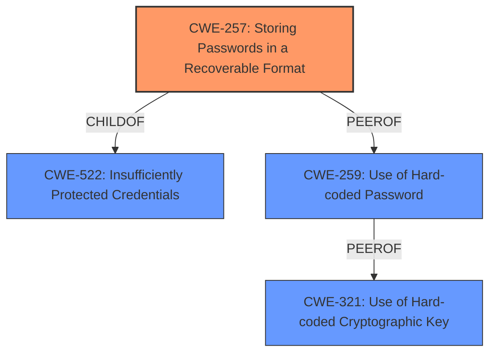

# Analysis for CVE-2022-32519

# Summary
| CWE ID | CWE Name | Confidence | CWE Abstraction Level | CWE Vulnerability Mapping Label | CWE-Vulnerability Mapping Notes |
|---|---|---|---|---|---|
| CWE-257 | Storing Passwords in a Recoverable Format | 1.0 | Base | Allowed | Primary CWE |

## Evidence and Confidence

*   **Confidence Score:** 1.0
*   **Evidence Strength:** HIGH

## Relationship Analysis
The primary relationship that influenced my decision was the direct match of the vulnerability description to CWE-257. Specifically, the description states a "**CWE-257 Storing Passwords in a Recoverable Format** vulnerability exists". Additionally, CWE-257 is a Base level CWE, which is the preferred level of abstraction. The Retriever Results also listed CWE-257 as the top result.

## Vulnerability Chain
The vulnerability chain starts with the **root cause** of storing passwords in a recoverable format (CWE-257). This leads to the impact of unwanted access to the DCE instance.

## Summary of Analysis
My analysis is primarily based on the direct evidence from the vulnerability description, which explicitly states "**CWE-257 Storing Passwords in a Recoverable Format** vulnerability exists". This clear statement makes CWE-257 the most appropriate choice.

The graph relationships, while informative, did not significantly alter my decision since the description explicitly mentioned CWE-257. Other CWEs such as CWE-522, CWE-259, and CWE-321 were considered but were not as directly supported by the provided text.

The selection of CWE-257 is at the optimal level of specificity because it's a Base CWE and precisely describes the **weakness** of storing passwords in a recoverable format.

Relevant CWE Information:

# Enhanced Context (25 CWEs)

## CWE-257: Storing Passwords in a Recoverable Format
**Abstraction Level**: Base
**Similarity Score**: 0.80
**Source**: dense

**Description**:
The storage of passwords in a recoverable format makes them subject to password reuse attacks by malicious users. In fact, it should be noted that recoverable encrypted passwords provide no significant benefit over plaintext passwords since they are subject not only to reuse by malicious attackers but also by malicious insiders. If a system administrator can recover a password directly, or use a brute force search on the available information, the administrator can use the password on other accounts.

**Mapping Guidance**:
- Usage: Allowed
- Rationale: This CWE entry is at the Base level of abstraction, which is a preferred level of abstraction for mapping to the root causes of vulnerabilities.