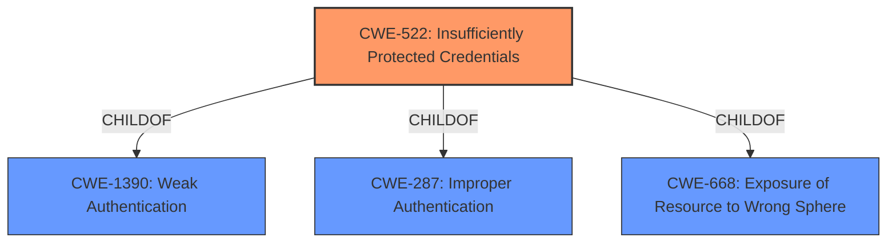

# Analysis Report for CVE-2022-32520

# Vulnerability Analysis Report: CVE-2022-32520

## Description


## Analysis (with Relationship Data)

# Summary
| CWE ID  | CWE Name                                        | Confidence | CWE Abstraction Level | CWE Vulnerability Mapping Label | CWE-Vulnerability Mapping Notes |
|---------|-------------------------------------------------|------------|-----------------------|---------------------------------|-----------------------------------|
| CWE-522 | Insufficiently Protected Credentials            | 1.0        | Class                 | Primary CWE                     | Allowed-with-Review               |

## Evidence and Confidence

*   **Confidence Score:** 1.0
*   **Evidence Strength:** HIGH

## Relationship Analysis
The primary CWE, CWE-522, is a Class-level CWE. It has several children that describe more specific scenarios of **insufficiently protected credentials**. Given the limited information, mapping to the Class level is appropriate.



## Vulnerability Chain
The vulnerability chain starts with **insufficiently protected credentials** (CWE-522), leading to unwanted access to a DCE instance.

## Summary of Analysis
The analysis is based on the provided evidence, which includes the vulnerability description and key phrases. The description explicitly mentions "**Insufficiently Protected Credentials**", which aligns with CWE-522.
The retriever results also show that CWE-522 is a strong candidate, further reinforcing the selection.
The decision to map to the Class level (CWE-522) is based on the limited information available. While more specific Base or Variant level CWEs could potentially apply, there isn't enough detail to justify a more granular mapping.
The selection of CWE-522 is at the optimal level of specificity given the available evidence.

Relevant CWE Information:

## Enhanced Context (25 CWEs)

### CWE-522: Insufficiently Protected Credentials
**Abstraction:** Class
**Status:** Incomplete

### Description
The product transmits or stores authentication credentials, but it uses an insecure method that is susceptible to unauthorized interception and/or retrieval.

### Extended Description
Not provided

### Alternative Terms
None

### Relationships
ChildOf -> CWE-1390
ChildOf -> CWE-287
ChildOf -> CWE-668

### Mapping Guidance
**Usage:** Allowed-with-Review
**Rationale:** This CWE entry is a Class and might have Base-level children that would be more appropriate
**Comments:** Examine children of this entry to see if there is a better fit
**Reasons:**
- Abstraction


## CWE Relationship Analysis

Current CWEs represent these abstraction levels: .


### Vulnerability Chain Analysis

**Chain starting from CWE-522:**
- 522 (Insufficiently Protected Credentials) - ROOT


**Chain starting from CWE-668:**
- 668 (Exposure of Resource to Wrong Sphere) - ROOT


### CWE Relationship Diagram

```mermaid
graph TD
    classDef primary fill:#f96,stroke:#333,stroke-width:2px
    classDef secondary fill:#69f,stroke:#333
    classDef tertiary fill:#9e9,stroke:#333
```


*Report generated on 2025-03-31 04:55:36*
