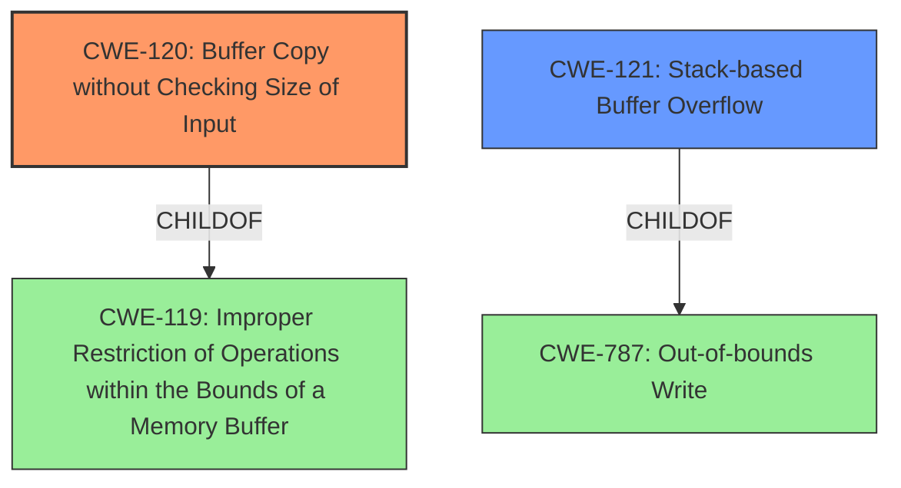

# Enhanced Analysis for CVE-2022-32524

# Summary
| CWE ID | CWE Name | Confidence | CWE Abstraction Level | CWE Vulnerability Mapping Label | CWE-Vulnerability Mapping Notes |
|---|---|---|---|---|---|
| CWE-120 | Buffer Copy without Checking Size of Input ('Classic Buffer Overflow') | 1.0 | Base | Primary | Allowed-with-Review |
| CWE-121 | Stack-based Buffer Overflow | 0.7 | Variant | Secondary | Allowed |

## Evidence and Confidence

*   **Confidence Score:** 0.85
*   **Evidence Strength:** HIGH

## Relationship Analysis
The primary relationship influencing the decision is the parent-child relationship between CWE-119 (Improper Restriction of Operations within the Bounds of a Memory Buffer) and CWE-120 (Buffer Copy without Checking Size of Input). CWE-120 is a more specific case of CWE-119. CWE-121 is also a child of CWE-787 Out-of-bounds Write, but more specific to Stack-based. Since the vulnerability description specifies a stack-based buffer overflow due to missing input size checks, both CWE-120 and CWE-121 are relevant. The abstraction levels also guided the selection, with the base level CWE-120 being preferred as the primary mapping target.



## Vulnerability Chain
The vulnerability chain is straightforward:
1.  **Root Cause:** **CWE-120 Buffer Copy without Checking Size of Input** - The software copies data into a buffer without validating the size of the input.
2.  **Weakness:** Stack-based buffer overflow (CWE-121) - The overflow occurs on the stack.
3.  **Impact:** Potential Remote Code Execution - The attacker can potentially execute arbitrary code.

## Summary of Analysis
The initial analysis identified CWE-120 as the primary weakness based on the vulnerability description explicitly mentioning **"CWE-120 Buffer Copy without Checking Size of Input"**. The description also highlights a stack-based buffer overflow, which is a direct consequence of copying data without checking its size, this confirms that CWE-121 is also relevant.

The evidence is strong because the vulnerability description explicitly mentions **CWE-120 Buffer Copy without Checking Size of Input**. This is further supported by the description of a stack-based buffer overflow occurring due to sending specially crafted time reduced data messages, which is a clear indicator of a missing size check during the buffer copy operation.

The graph relationships influenced the final selection by highlighting the connection between CWE-120 and the more general CWE-119. However, CWE-120 is more specific and accurately reflects the vulnerability's root cause. The relationship with CWE-121 helps to define the specific type of buffer overflow, which is stack-based.

The selected CWEs are at the optimal level of specificity. CWE-120 accurately describes the **root cause** of the vulnerability (**improper** buffer copy), while CWE-121 specifies the location of the overflow (stack).

Relevant CWE Information:

# Enhanced Context (25 CWEs)

## CWE-120: Buffer Copy without Checking Size of Input ('Classic Buffer Overflow')
**Abstraction:** Base
**Status:** Incomplete

### Description
The product copies an input buffer to an output buffer without verifying that the size of the input buffer is less than the size of the output buffer, leading to a buffer overflow.
## CWE-121: Stack-based Buffer Overflow
**Abstraction:** Variant
**Status:** Draft

### Description
A stack-based buffer overflow condition is a condition where the buffer being overwritten is allocated on the stack (i.e., is a local variable or, rarely, a parameter to a function).

## CWE-119: Improper Restriction of Operations within the Bounds of a Memory Buffer
**Abstraction:** Class
**Status:** Stable

### Description
The product performs operations on a memory buffer, but it reads from or writes to a memory location outside the buffer's intended boundary. This may result in read or write operations on unexpected memory locations that could be linked to other variables, data structures, or internal program data.
## CWE-190: Integer Overflow or Wraparound
**Abstraction:** Base
**Status:** Stable

### Description
The product performs a calculation that can
         produce an integer overflow or wraparound when the logic
         assumes that the resulting value will always be larger than
         the original value. This occurs when an integer value is
         incremented to a value that is too large to store in the
         associated representation. When this occurs, the value may
         become a very small or negative number.

## CWE-125: Out-of-bounds Read
**Abstraction:** Base
**Status:** Draft

### Description
The product reads data past the end, or before the beginning, of the intended buffer.

## CWE-805: Buffer Access with Incorrect Length Value
**Abstraction:** Base
**Status:** Incomplete

### Description
The product uses a sequential operation to read or write a buffer, but it uses an incorrect length value that causes it to access memory that is outside of the bounds of the buffer.
## CWE-128: Wrap-around Error
**Abstraction:** Base
**Status:** Incomplete

### Description
Wrap around errors occur whenever a value is incremented past the maximum value for its type and therefore "wraps around" to a very small, negative, or undefined value.

## CWE-122: Heap-based Buffer Overflow
**Abstraction:** Variant
**Status:** Draft

### Description
A heap overflow condition is a buffer overflow, where the buffer that can be overwritten is allocated in the heap portion of memory, generally meaning that the buffer was allocated using a routine such as malloc().

## CWE-124: Buffer Underwrite ('Buffer Underflow')
**Abstraction:** Base
**Status:** Incomplete

### Description
The product writes to a buffer using an index or pointer that references a memory location prior to the beginning of the buffer.

## CWE-193: Off-by-one Error
**Abstraction:** Base
**Status:** Draft

### Description
A product calculates or uses an incorrect maximum or minimum value that is 1 more, or 1 less, than the correct value.

### Other Considered CWEs:
- CWE-119: Considered but not used as CWE-120 is a more specific type of CWE-119. The guidance discourages using CWE-119 when a more specific CWE is available.
- CWE-125, CWE-124, CWE-805: These relate to out-of-bounds reads/writes with incorrect length values. The given vulnerability is related to copying a buffer without checking the size.
- CWE-190, CWE-128, CWE-193: Integer overflows/wraparounds and off-by-one errors are not the primary cause of the vulnerability. They could be related, but the description focuses on the lack of size validation during the buffer copy operation.
- CWE-122: This is Heap-based, while the problem is Stack-based.


## CWE Relationship Analysis

Current CWEs represent these abstraction levels: .


### Vulnerability Chain Analysis

**Chain starting from CWE-190:**
- 190 (Integer Overflow or Wraparound) - ROOT


**Chain starting from CWE-805:**
- 805 (Buffer Access with Incorrect Length Value) - ROOT


### CWE Relationship Diagram

```mermaid
graph TD
    classDef primary fill:#f96,stroke:#333,stroke-width:2px
    classDef secondary fill:#69f,stroke:#333
    classDef tertiary fill:#9e9,stroke:#333
```