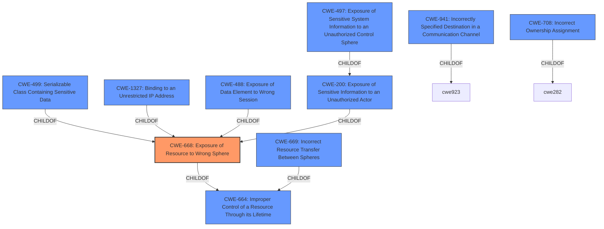

# Enhanced Analysis for CVE-2022-32530

# Summary
| CWE ID | CWE Name | Confidence | CWE Abstraction Level | CWE Vulnerability Mapping Label | CWE-Vulnerability Mapping Notes |
|---|---|---|---|---|---|
| CWE-668 | Exposure of Resource to Wrong Sphere | 1 | Class | Primary | Allowed-with-Review, but used because no more specific CWE is available. |

## Evidence and Confidence

*   **Confidence Score:** 1
*   **Evidence Strength:** HIGH

## Relationship Analysis
The primary CWE selected is CWE-668 **CWE-668 Exposure of Resource to Wrong Sphere**. This CWE is a Class-level weakness. Several other CWEs were considered, particularly children and related CWEs of CWE-668. The relationships considered were primarily hierarchical (ChildOf) and peer relationships. The abstraction level influenced the decision to stick with the Class level because more specific Base or Variant level CWEs didn't fully capture the vulnerability details.



## Vulnerability Chain
The vulnerability chain starts with the **CWE-668 Exposure of Resource to Wrong Sphere**. The mobile application **fails to properly isolate** its resources and functionality. This allows a **malicious application** to interact with exposed components, potentially leading to **misleading users**, **incorrect actions**, and **unauthorized control** over plant systems.

## Summary of Analysis
The initial assessment identified **CWE-668 Exposure of Resource to Wrong Sphere** as the primary weakness, based on the vulnerability description. The description states: "A **CWE-668 Exposure of Resource to Wrong Sphere** vulnerability exists that could cause users to be misled...when a mobile device has been compromised by a malicious application."

The "CVE Reference Links Content Summary" reinforces this by stating: "The root cause is a **CWE-668 Exposure of Resource to Wrong Sphere** vulnerability. This means the Geo SCADA Mobile application exposes resources or functionality in a way that can be accessed by a malicious application on the same device."

The retriever results also highlight CWE-668 as the top candidate, with a similarity score of 0.470 and 6658.07.

Although CWE-668 is discouraged due to its high-level nature, no more specific CWE adequately captures the essence of the vulnerability, which involves a failure to properly isolate resources, allowing a malicious application to interfere with the intended functionality of the Geo SCADA Mobile application.

CWE-200 **CWE-200 Exposure of Sensitive Information to an Unauthorized Actor** was considered, but it focuses more on direct exposure of sensitive data, which is not the primary issue here. The main problem is the lack of isolation, which can then lead to various impacts, including potential exposure of information, but the root cause is the lack of isolation.

CWE-497 **CWE-497 Exposure of Sensitive System Information to an Unauthorized Control Sphere** was also considered, but it is also more focused on the exposure of system-level information, not necessarily the primary issue in this case.

CWE-669 **CWE-669 Incorrect Resource Transfer Between Spheres** was considered but this CWE is about the incorrect transfer of a resource from one sphere to another, which doesn't quite fit.

CWE-488 **CWE-488 Exposure of Data Element to Wrong Session** was considered, but this is more specific to session management issues, which isn't the core problem here.

Therefore, despite the discouraged usage, **CWE-668 Exposure of Resource to Wrong Sphere** remains the most accurate representation of the root cause, as it directly addresses the failure to properly isolate resources and functionality, enabling unauthorized access from a malicious application.

Relevant CWE Information:

# Enhanced Context (25 CWEs)
The following CWEs were identified as potentially relevant to this vulnerability:

## CWE-668: Exposure of Resource to Wrong Sphere
**Abstraction Level**: Class
**Similarity Score**: 0.78
**Source**: dense

**Description**:
The product exposes a resource to the wrong control sphere, providing unintended actors with inappropriate access to the resource.

**Mapping Guidance**:
- Usage: Discouraged
- Rationale: CWE-668 is high-level and is often misused as a catch-all when lower-level CWE IDs might be applicable. It is sometimes used for low-information vulnerability reports [REF-1287]. It is a level-1 Class (i.e., a child of a Pillar). It is not useful for trend analysis.


## CWE-669: Incorrect Resource Transfer Between Spheres
**Abstraction Level**: Class
**Similarity Score**: 0.77
**Source**: dense

**Description**:
The product does not properly transfer a resource/behavior to another sphere, or improperly imports a resource/behavior from another sphere, in a manner that provides unintended control over that resource.

**Mapping Guidance**:
- Usage: Allowed-with-Review
- Rationale: This CWE entry is a Class and might have Base-level children that would be more appropriate


## CWE-708: Incorrect Ownership Assignment
**Abstraction Level**: Base
**Similarity Score**: 0.76
**Source**: dense

**Description**:
The product assigns an owner to a resource, but the owner is outside of the intended control sphere.

**Mapping Guidance**:
- Usage: Allowed
- Rationale: This CWE entry is at the Base level of abstraction, which is a preferred level of abstraction for mapping to the root causes of vulnerabilities.


## CWE-404: Improper Resource Shutdown or Release
**Abstraction Level**: Class
**Similarity Score**: 0.76
**Source**: dense

**Description**:
The product does not release or incorrectly releases a resource before it is made available for re-use.

**Mapping Guidance**:
- Usage: Allowed-with-Review
- Rationale: This CWE entry is a Class and might have Base-level children that would be more appropriate


## CWE-226: Sensitive Information in Resource Not Removed Before Reuse
**Abstraction Level**: Base
**Similarity Score**: 0.75
**Source**: dense

**Description**:
The product releases a resource such as memory or a file so that it can be made available for reuse, but it does not clear or "zeroize" the information contained in the resource before the product performs a critical state transition or makes the resource available for reuse by other entities.

**Mapping Guidance**:
- Usage: Allowed
- Rationale: This CWE entry is at the Base level of abstraction, which is a preferred level of abstraction for mapping to the root causes of vulnerabilities.


## CWE-664: Improper Control of a Resource Through its Lifetime
**Abstraction Level**: Pillar
**Similarity Score**: 0.75
**Source**: dense

**Description**:
The product does not maintain or incorrectly maintains control over a resource throughout its lifetime of creation, use, and release.

**Mapping Guidance**:
- Usage: Discouraged
- Rationale: This CWE entry is high-level when lower-level children are available.


## CWE-653: Improper Isolation or Compartmental


## CWE Relationship Analysis

Current CWEs represent these abstraction levels: .


### Vulnerability Chain Analysis

**Chain starting from CWE-200:**
- 200 (Exposure of Sensitive Information to an Unauthorized Actor) - ROOT


**Chain starting from CWE-941:**
- 941 (Incorrectly Specified Destination in a Communication Channel) - ROOT


### CWE Relationship Diagram

```mermaid
graph TD
    classDef primary fill:#f96,stroke:#333,stroke-width:2px
    classDef secondary fill:#69f,stroke:#333
    classDef tertiary fill:#9e9,stroke:#333
```