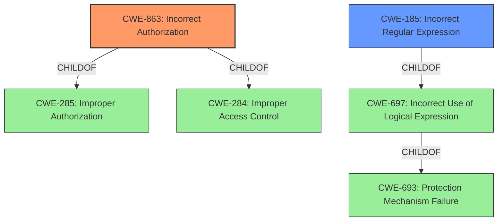

# Analysis for CVE-2022-32532

# Summary
| CWE ID | CWE Name | Confidence | CWE Abstraction Level | CWE Vulnerability Mapping Label | CWE-Vulnerability Mapping Notes |
|---|---|---|---|---|---|
| CWE-863 | Incorrect Authorization | 0.9 | Class | Primary | Allowed-with-Review |
| CWE-185 | Incorrect Regular Expression | 0.7 | Class | Secondary | Allowed-with-Review |

## Evidence and Confidence

*   **Confidence Score:** 0.8
*   **Evidence Strength:** MEDIUM

## Relationship Analysis
The primary relationship influencing the decision is the ChildOf relationship of CWE-863 to CWE-285 (Improper Authorization) and CWE-284 (Improper Access Control). CWE-185 (Incorrect Regular Expression) is related to CWE-697 (Incorrect Use of Logical Expression) which is a child of the Protection Mechanism Failure pillar (CWE-693). The main factor here is that the **misconfigured RegexRequestMatcher** leads to an authorization bypass.

## Vulnerability Chain
The vulnerability chain starts with a **misconfigured RegexRequestMatcher** (potentially related to **incorrect regular expression**) leading to an authorization bypass.

## Summary of Analysis
The analysis indicates that the primary weakness is **CWE-863 Incorrect Authorization** because the **misconfigured RegexRequestMatcher** directly leads to an authorization bypass. The vulnerability description explicitly states that the application is "possibly vulnerable to an authorization bypass." This is strong evidence supporting the selection of CWE-863.

CWE-185 is a secondary consideration because the **misconfiguration** likely stems from an **incorrect regular expression**, but the direct impact is the authorization failure. Selecting CWE-863 is a good fit because the vulnerability description states the application is "possibly vulnerable to an authorization bypass."

I am selecting CWE-863 and CWE-185 at the Class level as there is no variant or base that better describes the **misconfiguration** of the regex that leads to the authorization bypass.

Relevant CWE Information:

# Enhanced Context (25 CWEs)
The following CWEs were identified as potentially relevant to this vulnerability:

## Vulnerability Description
Apache Shiro before 1.9.1, A RegexRequestMatcher can be **misconfigured to be bypassed** on some servlet containers. Applications using RegExPatternMatcher with `.` in the regular expression are possibly vulnerable to an **authorization bypass**.

### Vulnerability Description Key Phrases
- **rootcause:** **misconfigured A RegexRequestMatcher**
- **impact:** authorization bypass
- **product:** Apache Shiro
- **version:** before 1.9.1
- **component:** RegExPatternMatcher

## Retriever Results

### Top Combined Results

| Rank | CWE ID | Name | Abstraction | Usage  | Retrievers | Individual Scores |
|------|--------|------|-------------|-------|------------|-------------------|
| 1 | 863 | Incorrect Authorization | Class | Allowed-with-Review | sparse | 0.221 |
| 2 | 1333 | Inefficient Regular Expression Complexity | Base | Allowed | sparse | 0.210 |
| 3 | 552 | Files or Directories Accessible to External Parties | Base | Allowed | sparse | 0.198 |
| 4 | 917 | Improper Neutralization of Special Elements used in an Expression Language Statement ('Expression Language Injection') | Base | Allowed | sparse | 0.186 |
| 5 | 201 | Insertion of Sensitive Information Into Sent Data | Base | Allowed | sparse | 0.184 |
| 6 | 185 | Incorrect Regular Expression | Class | Allowed-with-Review | dense | 0.537 |
| 7 | 182 | Collapse of Data into Unsafe Value | Base | Allowed | graph | 0.002 |
| 8 | 306 | Missing Authentication for Critical Function | Base | Allowed | sparse | 0.183 |
| 9 | 668 | Exposure of Resource to Wrong Sphere | Class | Discouraged | sparse | 0.183 |
| 10 | 732 | Incorrect Permission Assignment for Critical Resource | Class | Allowed-with-Review | sparse | 0.183 |

**CWE-863 Incorrect Authorization**: The vulnerability description explicitly states "authorization bypass," making this the most relevant CWE. The **root cause** is the **misconfiguration** which directly leads to the bypass. This aligns perfectly with the CWE description: "The product performs an authorization check...but it does not correctly perform the check." The usage is "Allowed-with-Review" because it's a Class, but given the direct evidence, it's a suitable choice.

**CWE-185 Incorrect Regular Expression**: While not the primary issue, the **misconfigured RegexRequestMatcher** strongly suggests a problem with the regular expression itself. CWE-185's description, "The product specifies a regular expression in a way that causes data to be improperly matched or compared," aligns with the potential root cause. The usage is "Allowed-with-Review" because it's a Class, however, there are no more specific Base/Variants of the CWE.

**CWE-1333 Inefficient Regular Expression Complexity**: This is less likely because the issue is not about performance (excessive CPU cycles) but about a functional bypass due to **misconfiguration**. Therefore, this CWE is not appropriate.

**CWE-552 Files or Directories Accessible to External Parties**: This is not relevant as the issue is not about file access, but about bypassing authorization checks.

**CWE-917 Improper Neutralization of Special Elements used in an Expression Language Statement ('Expression Language Injection')**: This is not relevant because the vulnerability is related to how the regular expression is configured, not about injecting code into an expression language statement.

**CWE-201 Insertion of Sensitive Information Into Sent Data**: This is not relevant because the issue is not about sensitive information being sent, but about bypassing authorization.

**CWE-182 Collapse of Data into Unsafe Value**: This is not relevant as the issue is not about collapsing data, but about bypassing authorization.

**CWE-306 Missing Authentication for Critical Function**: This is not relevant because the authorization is present but the **misconfigured RegexRequestMatcher** isn't performing the check correctly.

**CWE-668 Exposure of Resource to Wrong Sphere**: This is too high-level and generic. CWE-863 provides a more specific description of the authorization failure. Additionally, the Mapping Guidance recommends against using it and to "Closely analyze the specific mistake."

**CWE-732 Incorrect Permission Assignment for Critical Resource**: This is not relevant because the issue is related to the **misconfigured RegexRequestMatcher** and not about incorrect permission assignments for a critical resource.