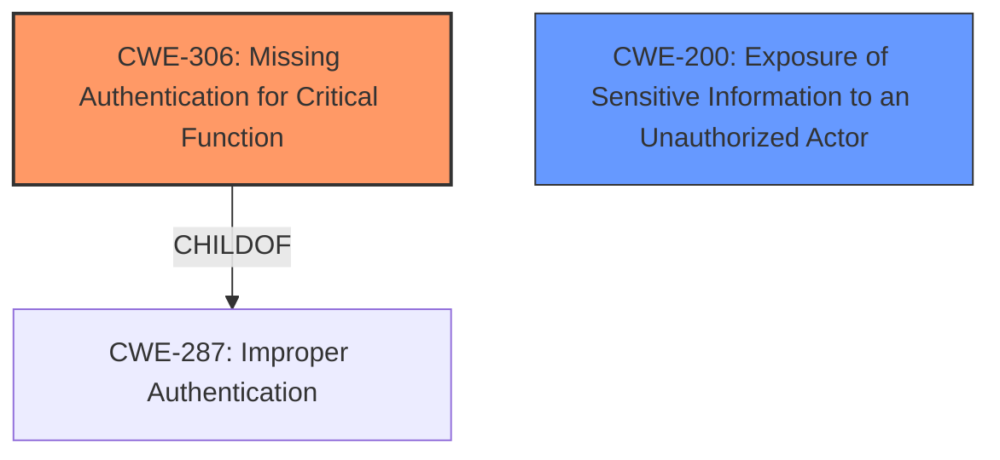

# Raw Analyzer Response for CVE-2022-32559

# Summary
| CWE ID | CWE Name | Confidence | CWE Abstraction Level | CWE Vulnerability Mapping Label | CWE-Vulnerability Mapping Notes |
|---|---|---|---|---|---|
| CWE-306 | Missing Authentication for Critical Function | 0.8 | Base | Allowed | Primary CWE |
| CWE-200 | Exposure of Sensitive Information to an Unauthorized Actor | 0.6 | Class | Discouraged | Secondary Candidate |

## Evidence and Confidence

*   **Confidence Score:** 0.7
*   **Evidence Strength:** MEDIUM

## Relationship Analysis
The primary CWE selected is CWE-306, which directly addresses the **lack of authentication** for a critical function (metrics endpoint). The secondary CWE, CWE-200, describes the general impact of exposing sensitive information. CWE-306 is a child of CWE-287 (Improper Authentication), providing a more specific classification.

## Vulnerability Chain
The vulnerability chain begins with the **missing authentication** (CWE-306) for the metrics endpoint, leading directly to the **exposure of sensitive information** (metrics) to unauthorized actors.
  - Root Cause: CWE-306
  - Impact: Exposure of Sensitive Information

## Summary of Analysis
The initial analysis focused on identifying the root cause of the vulnerability, which stems from the **lack of proper authentication** for the metrics endpoint. The provided evidence clearly indicates that random HTTP requests can access these endpoints, leading to the **leak of sensitive metrics**.

The decision to select CWE-306 as the primary CWE is based on the following evidence:
*   Vulnerability Description Key Phrases: N/A, no specific phrases led to this conclusion.
*   CVE Reference Links Content Summary: "The system **does not implement proper authentication** or authorization for its metrics endpoints."

The graph relationships and mapping guidance support this selection, as CWE-306 is a Base level CWE under the Improper Authentication Class. CWE-200 describes the impact of the vulnerability.

The selected CWEs are at the optimal level of specificity, as they accurately represent both the root cause and the impact of the vulnerability.

Relevant CWE Information:

# Enhanced Context (25 CWEs)
The following CWEs were identified as potentially relevant to this vulnerability:

## CWE-538: Insertion of Sensitive Information into Externally-Accessible File or Directory
**Abstraction Level**: Base
**Similarity Score**: 0.78

## CWE-807: Reliance on Untrusted Inputs in a Security Decision
**Abstraction Level**: Base
**Similarity Score**: 0.78

## CWE-212: Improper Removal of Sensitive Information Before Storage or Transfer
**Abstraction Level**: Base
**Similarity Score**: 0.77

## CWE-345: Insufficient Verification of Data Authenticity
**Abstraction Level**: Class
**Similarity Score**: 0.77

## CWE-1391: Use of Weak Credentials
**Abstraction Level**: Class
**Similarity Score**: 0.77

## CWE-319: Cleartext Transmission of Sensitive Information
**Abstraction Level**: Base
**Similarity Score**: 0.77

## CWE-303: Incorrect Implementation of Authentication Algorithm
**Abstraction Level**: Base
**Similarity Score**: 0.77

## CWE-226: Sensitive Information in Resource Not Removed Before Reuse
**Abstraction Level**: Base
**Similarity Score**: 0.77

## CWE-668: Exposure of Resource to Wrong Sphere
**Abstraction Level**: Class
**Similarity Score**: 0.76

## CWE-330: Use of Insufficiently Random Values
**Abstraction Level**: Class
**Similarity Score**: 0.76

## CWE-639: Authorization Bypass Through User-Controlled Key
**Abstraction Level**: Base
**Similarity Score**: 4155.94

## CWE-863: Incorrect Authorization
**Abstraction Level**: Class
**Similarity Score**: 4066.86

## CWE-201: Insertion of Sensitive Information Into Sent Data
**Abstraction Level**: Base
**Similarity Score**: 4065.42

## CWE-770: Allocation of Resources Without Limits or Throttling
**Abstraction Level**: Base
**Similarity Score**: 4027.92

## CWE-200: Exposure of Sensitive Information to an Unauthorized Actor
**Abstraction Level**: Class
**Similarity Score**: 4020.69

## CWE-201: Insertion of Sensitive Information Into Sent Data
**Abstraction Level**: base
**Similarity Score**: 5.03

## CWE-390: Detection of Error Condition Without Action
**Abstraction Level**: base
**Similarity Score**: 4.82

## CWE-1284: Improper Validation of Specified Quantity in Input
**Abstraction Level**: base
**Similarity Score**: 4.33

## CWE-789: Memory Allocation with Excessive Size Value
**Abstraction Level**: variant
**Similarity Score**: 3.88

## CWE-915: Improperly Controlled Modification of Dynamically-Determined Object Attributes
**Abstraction Level**: base
**Similarity Score**: 3.64

## CWE-502: Deserialization of Untrusted Data
**Abstraction Level**: base
**Similarity Score**: 3.64

## CWE-209: Generation of Error Message Containing Sensitive Information
**Abstraction Level**: base
**Similarity Score**: 3.64

## CWE-202: Exposure of Sensitive Information Through Data Queries
**Abstraction Level**: base
**Similarity Score**: 3.64

## CWE-190: Integer Overflow or Wraparound
**Abstraction Level**: base
**Similarity Score**: 3.42

## CWE-401: Missing Release of Memory after Effective Lifetime
**Abstraction Level**: variant
**Similarity Score**: 3.24

**CWE Considered but not Used**
*   CWE-770: Allocation of Resources Without Limits or Throttling - This CWE was not selected because the vulnerability is not directly related to resource allocation.
*   CWE-359: Exposure of Private Personal Information to an Unauthorized Actor - While this could be a potential impact, it's less specific than CWE-200.
*   CWE-532: Insertion of Sensitive Information into Log File - This CWE is related to logging, but the vulnerability is directly exposing the data, rather than logging it.
*   CWE-201: Insertion of Sensitive Information Into Sent Data - This could also be a potential impact, but it's less specific than CWE-200.
*   CWE-1004: Sensitive Cookie Without 'HttpOnly' Flag - Not applicable as the vulnerability doesn't involve cookies.
*   CWE-334: Small Space of Random Values - This is related to randomness, but not relevant to the vulnerability.
*   CWE-390: Detection of Error Condition Without Action - This is not related to the vulnerability's root cause or impact.
*   CWE-502: Deserialization of Untrusted Data - This is not related to deserialization.
*   CWE-522: Insufficiently Protected Credentials - This could be relevant if credentials were being exposed, but the vulnerability is broader.