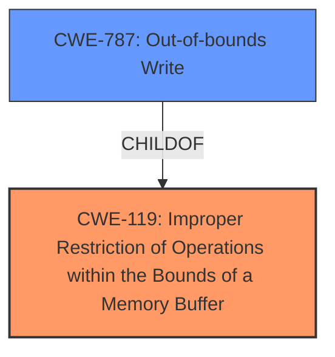

# Raw Analyzer Response for CVE-2022-32569

# Summary
| CWE ID | CWE Name | Confidence | CWE Abstraction Level | CWE Vulnerability Mapping Label | CWE-Vulnerability Mapping Notes |
|---|---|---|---|---|---|
| **CWE-119** | Improper Restriction of Operations within the Bounds of a Memory Buffer | 0.8 | Class | Primary | Discouraged |
| CWE-787 | Out-of-bounds Write | 0.6 | Base | Secondary | Allowed |

## Evidence and Confidence

*   **Confidence Score:** 0.7
*   **Evidence Strength:** MEDIUM

## Relationship Analysis
The primary relationship that influenced the decision was the hierarchical relationship between CWE-119 (Class) and CWE-787 (Base). The description points to buffer restrictions, which aligns with CWE-119, but more specifically suggests that data can be written outside the buffer's boundaries, which is characteristic of CWE-787. While CWE-119 is discouraged, it is included, and CWE-787 is considered a secondary mapping due to the lack of explicit write operation details.

## Vulnerability Chain
The vulnerability chain starts with **improper buffer restrictions** (CWE-119), potentially leading to an out-of-bounds write (CWE-787), which ultimately allows for escalation of privileges.

## Summary of Analysis
The initial assessment focused on the **improper buffer restrictions** as the root cause, aligning with CWE-119. The CVE reference summary indicates that the **lack of proper checks on buffer sizes** can allow writing past boundaries, suggesting CWE-787.

The decision to include both CWE-119 and CWE-787 reflects the available evidence. CWE-119 is a broader classification, while CWE-787 is more specific to the **out-of-bounds write** scenario, but without explicit confirmation, it remains a secondary candidate. The abstraction levels were carefully considered, with the goal of selecting the most precise and informative CWEs.

Relevant CWE Information:

# Enhanced Context (25 CWEs)

## CWE-119: Improper Restriction of Operations within the Bounds of a Memory Buffer
**Abstraction:** Class
**Status:** Stable

### Description
The product performs operations on a memory buffer, but it reads from or writes to a memory location outside the buffer's intended boundary. This may result in read or write operations on unexpected memory locations that could be linked to other variables, data structures, or internal program data.

### Mapping Guidance
**Usage:** Discouraged
**Rationale:** CWE-119 is commonly misused in low-information vulnerability reports when lower-level CWEs could be used instead, or when more details about the vulnerability are available.

## CWE-787: Out-of-bounds Write
**Abstraction:** base
**Status:** graph

### Description
CWE-787: Out-of-bounds Write

### Mapping Guidance
**Usage:** Allowed
**Rationale:** This CWE entry is at the Base level of abstraction, which is a preferred level of abstraction for mapping to the root causes of vulnerabilities.

## Technical Explanation for CWE-119
*   **How it matches:** The vulnerability description states "**Improper buffer restrictions**," which directly relates to the definition of CWE-119 as performing operations on a memory buffer without proper boundary restrictions.
*   **Security Implications:** This can lead to reading or writing to unintended memory locations, potentially corrupting data or code execution flow.
*   **Relationships:** It is a class-level CWE.
*   **Mapping Guidance:** Despite the "Discouraged" usage, it is included as it directly reflects the **improper buffer restriction**.

## Technical Explanation for CWE-787
*   **How it matches:** The CVE reference summary suggests that the **lack of proper checks on buffer sizes** could allow an attacker to write past intended buffer boundaries, aligning with the description of CWE-787.
*   **Security Implications:** Allows attackers to overwrite memory outside the allocated buffer, leading to potential code execution or privilege escalation.
*   **Relationships:** It is a base-level CWE and a child of CWE-119.
*   **Mapping Guidance:** The "Allowed" usage and base level of abstraction make it a relevant candidate, although it's included as a secondary mapping due to the absence of explicit details in the initial description.

## CWEs Considered But Not Used:
*   **CWE-20: Improper Input Validation**: While **improper buffer restrictions** could be seen as a form of input validation, the vulnerability is more specific to memory buffer operations, making CWE-119 a better fit.
*   **CWE-863: Incorrect Authorization**: The vulnerability leads to escalation of privilege, but the root cause is not an authorization flaw but rather a memory management issue, making CWE-119 more relevant.
*   **CWE-125: Out-of-bounds Read**: The CVE reference summary focuses on writing past the buffer, which is why CWE-787 was chosen over CWE-125.
*   **CWE-1285: Improper Validation of Specified Index, Position, or Offset in Input**: This is related to input validation, but the core issue is with buffer restrictions rather than the validation of indexes or offsets, making CWE-119 a better fit.