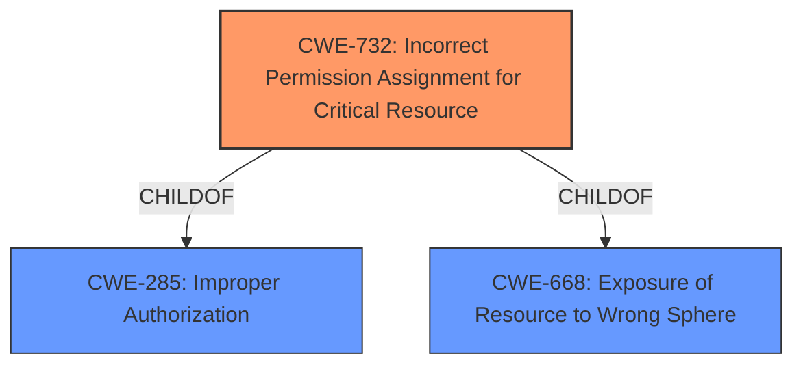

# Raw Analyzer Response for CVE-2022-3258

# Summary
| CWE ID    | CWE Name                                                 | Confidence | CWE Abstraction Level | CWE Vulnerability Mapping Label | CWE-Vulnerability Mapping Notes |
| --------- | -------------------------------------------------------- | ---------- | ----------------------- | ------------------------------- | ------------------------------- |
| CWE-732   | Incorrect Permission Assignment for Critical Resource    | 1.0        | Class                   | Primary CWE                     | Allowed-with-Review           |
| CWE-285   | Improper Authorization                                    | 0.7        | Class                   | Secondary Candidate             | Discouraged                    |

## Evidence and Confidence

*   **Confidence Score:** 0.9
*   **Evidence Strength:** HIGH

## Relationship Analysis
The primary CWE, CWE-732 **Incorrect Permission Assignment for Critical Resource**, is a child of both CWE-285 **Improper Authorization** and CWE-668 **Exposure of Resource to Wrong Sphere**. This indicates a hierarchical relationship where CWE-732 is a more specific case of a broader authorization or resource exposure issue. The relationship to CWE-285 is particularly relevant, as the mapping guidance for CWE-732 notes its frequent misuse for authorization weaknesses, which could suggest a closer alignment with the parent class. Selecting CWE-732 is based on the description of the **rootcause** of the vulnerability.

## Vulnerability Chain
The vulnerability chain starts with an **incorrect permission assignment** to a critical resource (CWE-732), which leads to **authentication abuse** as the final impact.

## Summary of Analysis
The initial analysis pointed towards CWE-732 **Incorrect Permission Assignment for Critical Resource** due to the vulnerability description stating the **rootcause** was an "**Incorrect Permission Assignment for Critical Resource**". The retriever results also ranked CWE-732 as the top candidate.

The vulnerability description explicitly states the **rootcause** is an "**Incorrect Permission Assignment for Critical Resource**", which is strong evidence for selecting CWE-732. The CVE Reference Links Content Summary further reinforces this by stating: "*Root cause of vulnerability: Incorrect Permission Assignment for Critical Resource*". The mapping guidance for CWE-732 suggests that it is often misused for authorization weaknesses, recommending careful analysis to ensure appropriate mapping. Given the direct statement of **incorrect permission assignment** as the root cause, CWE-732 is the most suitable choice.

CWE-285 **Improper Authorization** was considered as a broader classification, but the explicit mention of **incorrect permission assignment** makes CWE-732 a more precise fit.

I am basing my assessment almost entirely on the explicit statements about the **rootcause** from the vulnerability description and CVE summary.

Relevant CWE Information:

# Enhanced Context (25 CWEs)

## CWE-732: Incorrect Permission Assignment for Critical Resource
**Abstraction:** Class
**Status:** Draft

### Description
The product specifies permissions for a security-critical resource in a way that allows that resource to be read or modified by unintended actors.

### Extended Description
When a resource is given a permission setting that provides access to a wider range of actors than required, it could lead to the exposure of sensitive information, or the modification of that resource by unintended parties. This is especially dangerous when the resource is related to program configuration, execution, or sensitive user data. For example, consider a misconfigured storage account for the cloud that can be read or written by a public or anonymous user.

### Alternative Terms
None

### Relationships
ChildOf -> CWE-285
ChildOf -> CWE-668

### Mapping Guidance
**Usage:** Allowed-with-Review
**Rationale:** While the name itself indicates an assignment of permissions for resources, this is often misused for vulnerabilities in which "permissions" are not checked, which is an "authorization" weakness (CWE-285 or descendants) within CWE's model [REF-1287].
**Comments:** Closely analyze the specific mistake that is allowing the resource to be exposed, and perform a CWE mapping for that mistake.
**Reasons:**
- Frequent Misuse

### Observed Examples
- **CVE-2022-29527:** Go application for cloud management creates a world-writable sudoers file that allows local attackers to inject sudo rules and escalate privileges to root by winning a race condition.
- **CVE-2009-3482:** Anti-virus product sets insecure "Everyone: Full Control" permissions for files under the "Program Files" folder, allowing attackers to replace executables with Trojan horses.
- **CVE-2009-3897:** Product creates directories with 0777 permissions at installation, allowing users to gain privileges and access a socket used for authentication.

## CWE-285: Improper Authorization
**Abstraction:** Class
**Status:** Draft

### Description
The product does not perform or incorrectly performs an authorization check when an actor attempts to access a resource or perform an action.

### Extended Description
Assuming a user with a given identity, authorization is the process of determining whether that user can access a given resource, based on the user's privileges and any permissions or other access-control specifications that apply to the resource.

When access control checks are not applied consistently - or not at all - users are able to access data or perform actions that they should not be allowed to perform. This can lead to a wide range of problems, including information exposures, denial of service, and arbitrary code execution.

### Alternative Terms
AuthZ: "AuthZ" is typically used as an abbreviation of "authorization" within the web application security community. It is distinct from "AuthN" (or, sometimes, "AuthC") which is an abbreviation of "authentication." The use of "Auth" as an abbreviation is discouraged, since it could be used for either authentication or authorization.

### Relationships
ChildOf -> CWE-284
ChildOf -> CWE-284

### Mapping Guidance
**Usage:** Discouraged
**Rationale:** CWE-285 is high-level and lower-level CWEs can frequently be used instead. It is a level-1 Class (i.e., a child of a Pillar).
**Comments:** Look at CWE-285's children and consider mapping to CWEs such as CWE-862: Missing Authorization, CWE-863: Incorrect Authorization, CWE-732: Incorrect Permission Assignment for Critical Resource, or others.
**Reasons:**
- Abstraction
**Suggested Alternatives:**
- CWE-862: Missing Authorization
- CWE-863: Incorrect Authorization
- CWE-732: Incorrect Permission Assignment for Critical Resource

### Observed Examples
- **CVE-2022-24730:** Go-based continuous deployment product does not check that a user has certain privileges to update or create an app, allowing adversaries to read sensitive repository information
- **CVE-2009-3168:** Web application does not restrict access to admin scripts, allowing authenticated users to reset administrative passwords.
- **CVE-2009-2960:** Web application does not restrict access to admin scripts, allowing authenticated users to modify passwords of other users.