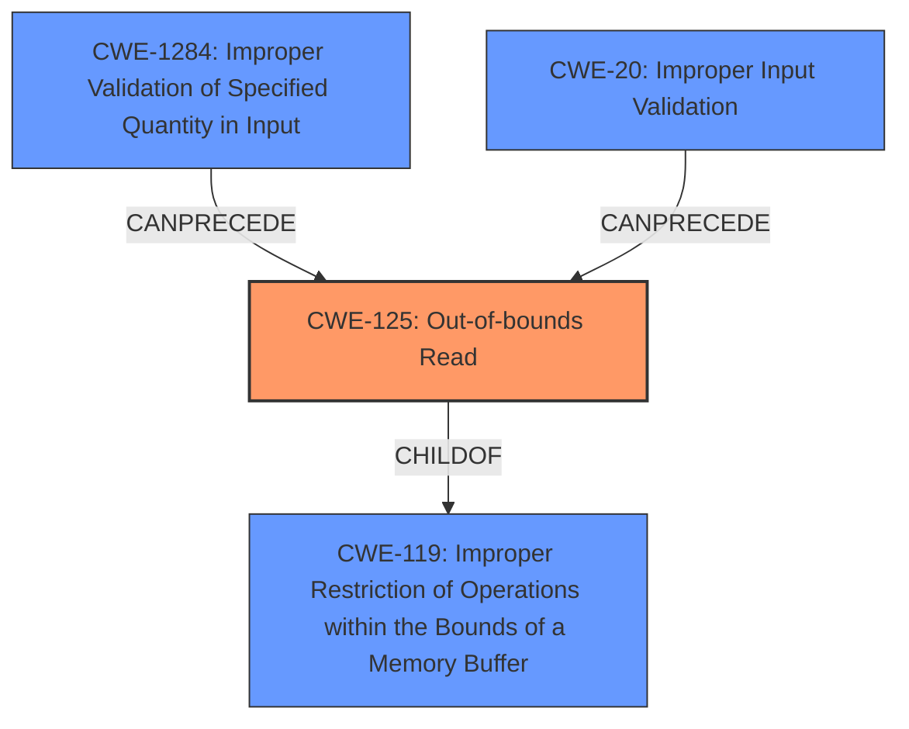

# Enhanced Analysis for CVE-2022-32591

# Summary
| CWE ID  | CWE Name                                                       | Confidence | CWE Abstraction Level | CWE Vulnerability Mapping Label | CWE-Vulnerability Mapping Notes |
| :-------- | :------------------------------------------------------------- | :--------- | :---------------------- | :------------------------------ | :------------------------------ |
| CWE-125   | Out-of-bounds Read                                              | 0.75       | Base                    | Primary                         | Allowed                       |
| CWE-1284 | Improper Validation of Specified Quantity in Input            | 0.65       | Base                    | Secondary                       | Allowed                       |
| CWE-20    | Improper Input Validation                                      | 0.50       | Class                   | Secondary                       | Discouraged                    |

## Evidence and Confidence

*   **Confidence Score:** 0.70
*   **Evidence Strength:** MEDIUM

## Relationship Analysis
The primary CWE is CWE-125, which is a base-level CWE. The vulnerability description explicitly mentions an **incorrect bounds check**, which aligns with the concept of reading data beyond the intended buffer. CWE-125 is a child of CWE-119 (Improper Restriction of Operations within the Bounds of a Memory Buffer), but since we have sufficient detail to identify the specific issue as a read, CWE-125 is the more appropriate choice. CWE-125 can be preceded by CWE-1284 and CWE-20, related to improper validation of input.



## Vulnerability Chain
The vulnerability chain starts with **improper input validation** (CWE-20) or **improper validation of specified quantity in input** (CWE-1284), leading to an **out-of-bounds read** (CWE-125), which results in a system crash and remote denial of service.

## Summary of Analysis
The initial assessment focused on the provided information, particularly the **root cause** being an **incorrect bounds check**. This led to the selection of CWE-125 (Out-of-bounds Read) as the primary CWE. The relationship graph highlights the hierarchical connection between CWE-125 and its parent CWE-119, as well as the potential preceding weaknesses, CWE-20 and CWE-1284. The decision to use CWE-125 is based on the specific evidence indicating a read operation outside the buffer's boundaries. While CWE-119 is a broader category, CWE-125 provides a more precise representation of the vulnerability.

The vulnerability description clearly points to a problem related to **incorrect bounds check**, leading to a system crash. The CVE Reference Links Content Summary supports this by stating that the root cause is an **incorrect bounds check** and the impact is remote denial of service. The Retriever Results also list CWE-119 (Improper Restriction of Operations within the Bounds of a Memory Buffer) and CWE-20 (Improper Input Validation) as potential candidates, but CWE-125 aligns more directly with the **incorrect bounds check** leading to an out-of-bounds read.

CWE-20 (Improper Input Validation) and CWE-1284 (Improper Validation of Specified Quantity in Input) are included as secondary CWEs because the **incorrect bounds check** likely stems from a failure to properly validate the input or the specified quantity related to the buffer size. However, the primary issue is the out-of-bounds read itself (CWE-125).

The selected CWEs are at the optimal level of specificity. CWE-125 is a base-level CWE that accurately represents the vulnerability. While CWE-119 is a parent CWE, it is too broad and doesn't capture the specific nature of the vulnerability. CWE-20 and CWE-1284 are related to the input validation aspect, but the core issue is the out-of-bounds read.


## CWE Relationship Analysis

Current CWEs represent these abstraction levels: .


### Vulnerability Chain Analysis

**Chain starting from CWE-1284:**
- 1284 (Improper Validation of Specified Quantity in Input) - ROOT


**Chain starting from CWE-119:**
- 119 (Improper Restriction of Operations within the Bounds of a Memory Buffer) - ROOT


### CWE Relationship Diagram

```mermaid
graph TD
    classDef primary fill:#f96,stroke:#333,stroke-width:2px
    classDef secondary fill:#69f,stroke:#333
    classDef tertiary fill:#9e9,stroke:#333
```