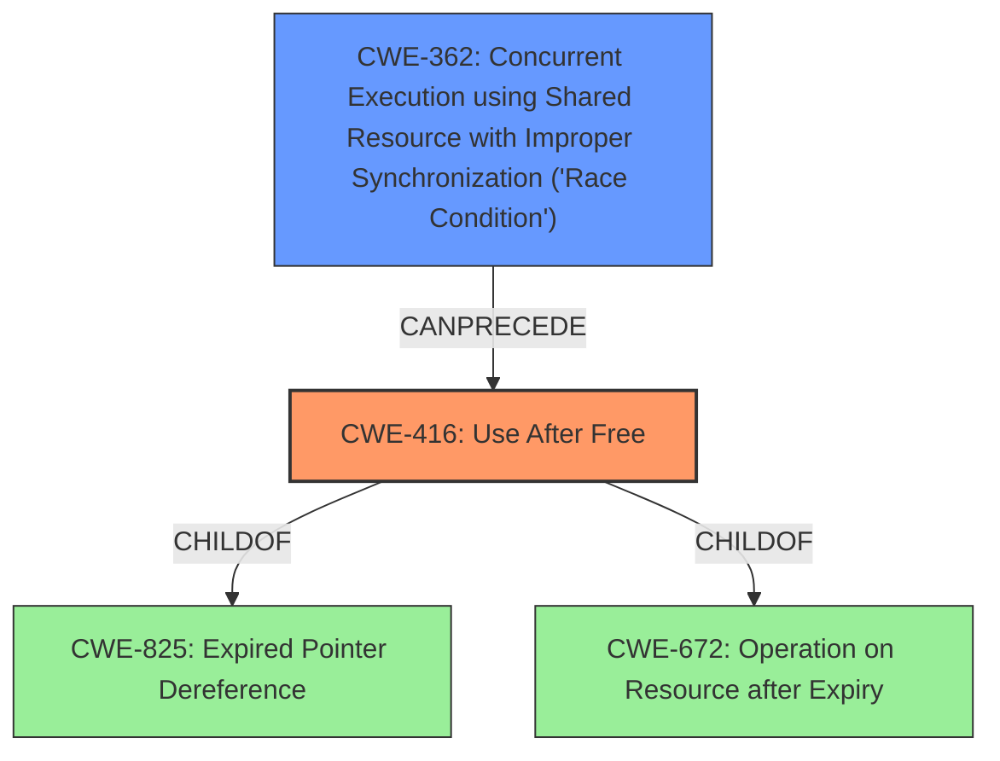

# Analysis for CVE-2022-32612

# Summary
| CWE ID    | CWE Name                                                                              | Confidence | CWE Abstraction Level | CWE Vulnerability Mapping Label | CWE-Vulnerability Mapping Notes |
| --------- | ------------------------------------------------------------------------------------- | ---------- | ----------------------- | ------------------------------- | ------------------------------- |
| CWE-416   | Use After Free                                                                      | 0.9        | Variant                 | Allowed                         | Primary CWE                     |
| CWE-362   | Concurrent Execution using Shared Resource with Improper Synchronization ('Race Condition') | 0.8        | Class                   | Allowed-with-Review           | Secondary Candidate             |

## Evidence and Confidence

*   **Confidence Score:** 0.85
*   **Evidence Strength:** HIGH

## Relationship Analysis
The primary weakness is a **use-after-free (CWE-416)** which is triggered by a **race condition (CWE-362)**. CWE-416 is a Variant of CWE-825 (Expired Pointer Dereference), and a child of CWE-672 (Operation on Resource after Expiry). CWE-362 is a Class, and it can precede CWE-416. The relationship between the **race condition** and the **use-after-free** is that the **race condition** allows the memory to be freed while another thread or process is still using it, which leads to the **use-after-free**.

## Vulnerability Chain
The vulnerability chain starts with a **race condition (CWE-362)** that leads to a **use-after-free (CWE-416)**. The impact of this vulnerability is local escalation of privilege.

## Summary of Analysis
The vulnerability description indicates a **use after free** due to a **race condition**.
The primary CWE is CWE-416 Use After Free, because the vulnerability description specifically mentions this weakness.
The secondary CWE is CWE-362 Concurrent Execution using Shared Resource with Improper Synchronization ('Race Condition'), because the vulnerability description specifically mentions a **race condition** as the root cause that leads to the **use after free**.

The selection of CWE-416 and CWE-362 is based on the evidence provided in the vulnerability description, which explicitly mentions a "**use after free** due to a **race condition**". The Retriever Results also support these selections.

The relationships between the CWEs also influence the final selection. CWE-362 (Race Condition) can precede CWE-416 (Use After Free), indicating that the **race condition** is the cause and the **use-after-free** is the result.

The selected CWEs are at the optimal level of specificity. CWE-416 is a Variant, and CWE-362 is a Class.

Relevant CWE Information:

# Enhanced Context (25 CWEs)
The following CWEs were identified as potentially relevant to this vulnerability:

## CWE-366: Race Condition within a Thread
**Abstraction Level**: Base
**Similarity Score**: 0.82
**Source**: dense

**Description**:
If two threads of execution use a resource simultaneously, there exists the possibility that resources may be used while invalid, in turn making the state of execution undefined.

**Mapping Guidance**:
- Usage: Allowed
- Rationale: This CWE entry is at the Base level of abstraction, which is a preferred level of abstraction for mapping to the root causes of vulnerabilities.

*Rationale for not selecting*: The vulnerability description does not provide sufficient detail to determine if the **race condition** is specifically within a thread. CWE-362 is a more general Class that covers **race conditions** regardless of whether they occur within a thread or between processes.

## CWE-667: Improper Locking
**Abstraction Level**: Class
**Similarity Score**: 0.81
**Source**: dense

**Description**:
The product does not properly acquire or release a lock on a resource, leading to unexpected resource state changes and behaviors.

**Mapping Guidance**:
- Usage: Allowed-with-Review
- Rationale: This CWE entry is a Class and might have Base-level children that would be more appropriate

*Rationale for not selecting*: While improper locking can lead to **race conditions**, the vulnerability description does not explicitly mention improper locking.

## CWE-362: Concurrent Execution using Shared Resource with Improper Synchronization ('Race Condition')
**Abstraction Level**: Class
**Similarity Score**: 0.80
**Source**: dense

**Description**:
The product contains a concurrent code sequence that requires temporary, exclusive access to a shared resource, but a timing window exists in which the shared resource can be modified by another code sequence operating concurrently.

**Mapping Guidance**:
- Usage: Allowed-with-Review
- Rationale: This CWE entry is a Class and might have Base-level children that would be more appropriate

*Rationale for selecting*: The vulnerability description specifically mentions a **race condition**, making this a relevant CWE.

## CWE-662: Improper Synchronization
**Abstraction Level**: Class
**Similarity Score**: 0.79
**Source**: dense

**Description**:
The product utilizes multiple threads or processes to allow temporary access to a shared resource that can only be exclusive to one process at a time, but it does not properly synchronize these actions, which might cause simultaneous accesses of this resource by multiple threads or processes.

**Mapping Guidance**:
- Usage: Discouraged
- Rationale: This CWE entry is a level-1 Class (i.e., a child of a Pillar). It might have lower-level children that would be more appropriate

*Rationale for not selecting*: While improper synchronization can lead to **race conditions**, the vulnerability description does not explicitly mention improper synchronization.

## CWE-367: Time-of-check Time-of-use (TOCTOU) Race Condition
**Abstraction Level**: Base
**Similarity Score**: 0.79
**Source**: dense

**Description**:
The product checks the state of a resource before using that resource, but the resource's state can change between the check and the use in a way that invalidates the results of the check. This can cause the product to perform invalid actions when the resource is in an unexpected state.

**Mapping Guidance**:
- Usage: Allowed
- Rationale: This CWE entry is at the Base level of abstraction, which is a preferred level of abstraction for mapping to the root causes of vulnerabilities.

*Rationale for not selecting*: The vulnerability description does not provide sufficient detail to determine if the **race condition** is specifically a TOCTOU **race condition**.

## CWE-404: Improper Resource Shutdown or Release
**Abstraction Level**: Class
**Similarity Score**: 0.78
**Source**: dense

**Description**:
The product does not release or incorrectly releases a resource before it is made available for re-use.

**Mapping Guidance**:
- Usage: Allowed-with-Review
- Rationale: This CWE entry is a Class and might have Base-level children that would be more appropriate

*Rationale for not selecting*: This is a symptom of **use-after-free**, but the vulnerability description specifies **use-after-free** and a **race condition** which is more specific.

## CWE-131: Incorrect Calculation of Buffer Size
**Abstraction Level**: Base
**Similarity Score**: 0.77
**Source**: dense

**Description**:
The product does not correctly calculate the size to be used when allocating a buffer, which could lead to a buffer overflow.

**Mapping Guidance**:
- Usage: Allowed
- Rationale: This CWE entry is at the Base level of abstraction, which is a preferred level of abstraction for mapping to the root causes of vulnerabilities.

*Rationale for not selecting*: The vulnerability description does not mention anything related to buffer size calculation or buffer overflows.

## CWE-226: Sensitive Information in Resource Not Removed Before Reuse
**Abstraction Level**: Base
**Similarity Score**: 0.77
**Source**: dense

**Description**:
The product releases a resource such as memory or a file so that it can be made available for reuse, but it does not clear or "zeroize" the information contained in the resource before the product performs a critical state transition or makes the resource available for reuse by other entities.

**Mapping Guidance**:
- Usage: Allowed
- Rationale: This CWE entry is at the Base level of abstraction, which is a preferred level of abstraction for mapping to the root causes of vulnerabilities.