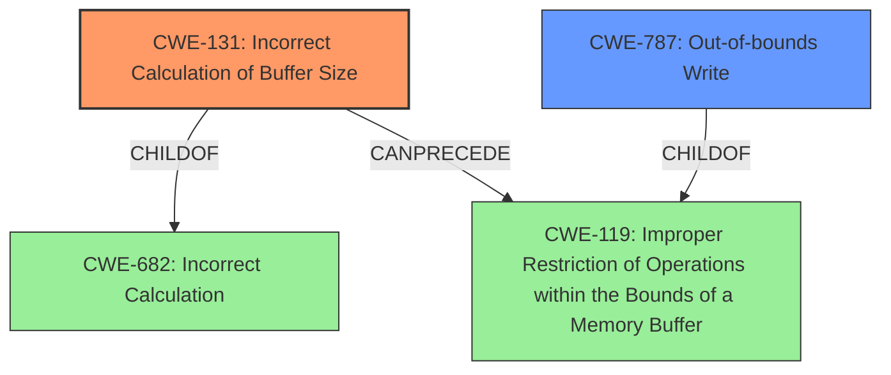

# Enhanced Analysis for CVE-2022-32617

# Summary
| CWE ID | CWE Name | Confidence | CWE Abstraction Level | CWE Vulnerability Mapping Label | CWE-Vulnerability Mapping Notes |
|---|---|---|---|---|---|
| CWE-131 | Incorrect Calculation of Buffer Size | 1.0 | Base | Primary | Allowed |
| CWE-787 | Out-of-bounds Write | 0.9 | Base | Secondary | Allowed |

## Evidence and Confidence

*   **Confidence Score:** 0.95
*   **Evidence Strength:** HIGH

## Relationship Analysis
The primary CWE is CWE-131 (**Incorrect Calculation of Buffer Size**) because the **root cause** is the **incorrect calculation of the buffer size**. This can lead to CWE-787 (**Out-of-bounds Write**) because if the buffer size is calculated incorrectly, then a write operation can occur outside the bounds of the allocated memory region. CWE-131 is a child of CWE-682 (**Incorrect Calculation**) and can precede CWE-119 (**Improper Restriction of Operations within the Bounds of a Memory Buffer**), which is a parent of CWE-787.



## Vulnerability Chain
The vulnerability chain starts with the **incorrect calculation of the buffer size** (CWE-131), which leads to an **out of bounds write** (CWE-787). The root cause is CWE-131, and the resulting weakness is CWE-787.

## Summary of Analysis
The vulnerability description clearly states that the **root cause** is an **incorrect calculation of buffer size**, which leads to an **out of bounds write**.
The "Vulnerability Description Key Phrases" section explicitly identifies "**incorrect calculation of buffer size**" as the **rootcause** and "**out of bounds write**" as the **weakness**. The "CVE Reference Links Content Summary" reinforces this by stating: "Root cause of vulnerability: Incorrect calculation of buffer size in typec." and "Weaknesses/vulnerabilities: Out-of-bounds write due to an incorrect buffer size calculation."

Based on this evidence, CWE-131 (**Incorrect Calculation of Buffer Size**) is selected as the primary CWE because it directly addresses the root cause. CWE-787 (**Out-of-bounds Write**) is selected as a secondary CWE because it represents the resulting weakness.

The Retriever Results also list CWE-131 as a top result, further supporting this selection. Other CWEs, such as CWE-190 (**Integer Overflow or Wraparound**) and CWE-191 (**Integer Underflow (Wrap or Wraparound)**), were considered but not selected because the description does not provide enough information to determine if the incorrect calculation involves an integer overflow or underflow. The primary decision driver was the explicit mention of "**incorrect calculation of buffer size**" as the root cause.

Relevant CWE Information:


## CWE Relationship Analysis

Current CWEs represent these abstraction levels: .


### Vulnerability Chain Analysis

**Chain starting from CWE-131:**
- 131 (Incorrect Calculation of Buffer Size) - ROOT


**Chain starting from CWE-190:**
- 190 (Integer Overflow or Wraparound) - ROOT


### CWE Relationship Diagram

```mermaid
graph TD
    classDef primary fill:#f96,stroke:#333,stroke-width:2px
    classDef secondary fill:#69f,stroke:#333
    classDef tertiary fill:#9e9,stroke:#333
```