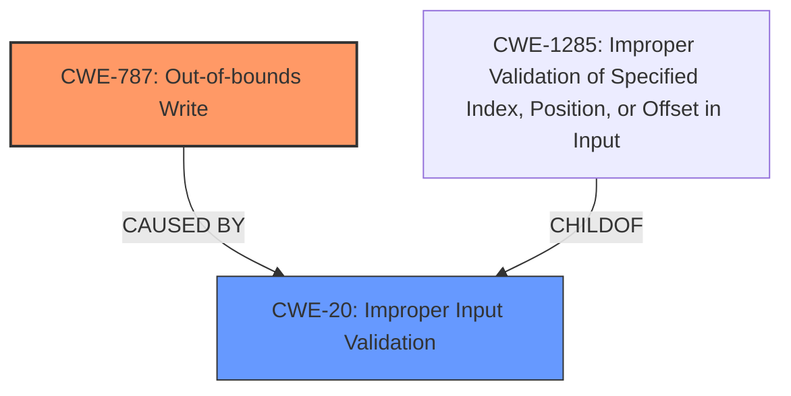

# Enhanced Analysis for CVE-2022-32632

# Summary
| CWE ID  | CWE Name | Confidence | CWE Abstraction Level | CWE Vulnerability Mapping Label | CWE-Vulnerability Mapping Notes |
|-----------------|-------------------------------------------------------------------------------------------------------|-----------------|---------------------------|----------------------------------------------------------------------------------------------|---------------------------------------------------------------------------------------------------------------------------|
| **CWE-787** | Out-of-bounds Write | 0.9 | Base | Primary | Allowed |
| CWE-20 | Improper Input Validation | 0.7 | Class | Secondary | Discouraged |

## Evidence and Confidence

*   **Confidence Score:** 0.8
*   **Evidence Strength:** HIGH

## Relationship Analysis
The primary CWE is CWE-787, which is a base-level CWE. CWE-20 is a class-level CWE and a parent of more specific input validation errors. CWE-787 is often caused by an incorrect calculation or lack of input validation, which can lead to writing data outside the intended buffer.



## Vulnerability Chain
The vulnerability chain starts with **improper input validation** (CWE-20), which leads to an **out-of-bounds write** (CWE-787). This can then result in local escalation of privilege.

## Summary of Analysis
The primary weakness is an **out-of-bounds write** (CWE-787) due to **improper input validation** (CWE-20).

The vulnerability description states: "In Wi-Fi, there is a possible **out of bounds write** due to **improper input validation**." This directly supports the selection of CWE-787 as the primary weakness and CWE-20 as a contributing factor.

The "CVE Reference Links Content Summary" confirms the root cause as improper input validation and highlights the out-of-bounds write.

CWE-787 is selected because the vulnerability description explicitly mentions an "out of bounds write," which is the defining characteristic of this CWE. This is further supported by the retriever results which listed CWE-787 as the Primary CWE Match.

CWE-20 is included as a secondary CWE because the vulnerability description also mentions "improper input validation" as the cause of the out-of-bounds write. While CWE-20 is a broad class, it accurately reflects the **root cause** of the vulnerability. The retriever results also listed CWE-20. However, since the description does not provide any specifics for the input validation, the more specific CWE-1285 was not chosen.

The selected CWEs are at the optimal level of specificity because CWE-787 directly describes the weakness, and CWE-20 identifies the **root cause** without being overly specific about the type of input validation that is missing.

# Enhanced Context (25 CWEs)
The following CWEs were identified as potentially relevant to this vulnerability:

## CWE-1289: Improper Validation of Unsafe Equivalence in Input
**Abstraction Level**: Base
**Similarity Score**: 0.76

## CWE-653: Improper Isolation or Compartmentalization
**Abstraction Level**: Class
**Similarity Score**: 0.76

## CWE-667: Improper Locking
**Abstraction Level**: Class
**Similarity Score**: 0.76

## CWE-807: Reliance on Untrusted Inputs in a Security Decision
**Abstraction Level**: Base
**Similarity Score**: 0.75

## CWE-274: Improper Handling of Insufficient Privileges
**Abstraction Level**: Base
**Similarity Score**: 0.75

## CWE-1220: Insufficient Granularity of Access Control
**Abstraction Level**: Base
**Similarity Score**: 0.75

## CWE-404: Improper Resource Shutdown or Release
**Abstraction Level**: Class
**Similarity Score**: 0.75

## CWE-280: Improper Handling of Insufficient Permissions or Privileges 
**Abstraction Level**: Base
**Similarity Score**: 0.75

## CWE-662: Improper Synchronization
**Abstraction Level**: Class
**Similarity Score**: 0.74

## CWE-405: Asymmetric Resource Consumption (Amplification)
**Abstraction Level**: Class
**Similarity Score**: 0.74

## CWE-190: Integer Overflow or Wraparound
**Abstraction Level**: Base
**Similarity Score**: 7376.93

## CWE-1284: Improper Validation of Specified Quantity in Input
**Abstraction Level**: Base
**Similarity Score**: 6974.50

## CWE-191: Integer Underflow (Wrap or Wraparound)
**Abstraction Level**: Base
**Similarity Score**: 6951.46

## CWE-125: Out-of-bounds Read
**Abstraction Level**: Base
**Similarity Score**: 6799.83

## CWE-667: Improper Locking
**Abstraction Level**: Class
**Similarity Score**: 6775.73

## CWE-41: Improper Resolution of Path Equivalence
**Abstraction Level**: base
**Similarity Score**: 5.03

## CWE-123: Write-what-where Condition
**Abstraction Level**: base
**Similarity Score**: 4.82

## CWE-131: Incorrect Calculation of Buffer Size
**Abstraction Level**: base
**Similarity Score**: 4.33

## CWE-190: Integer Overflow or Wraparound
**Abstraction Level**: base
**Similarity Score**: 4.33

## CWE-681: Incorrect Conversion between Numeric Types
**Abstraction Level**: base
**Similarity Score**: 4.33

## CWE-22: Improper Limitation of a Pathname to a Restricted Directory ('Path Traversal')
**Abstraction Level**: base
**Similarity Score**: 4.33

## CWE-770: Allocation of Resources Without Limits or Throttling
**Abstraction Level**: base
**Similarity Score**: 4.33

## CWE-73: External Control of File Name or Path
**Abstraction Level**: base
**Similarity Score**: 4.33

## CWE-1284: Improper Validation of Specified Quantity in Input
**Abstraction Level**: base
**Similarity Score**: 4.33

## CWE-476: NULL Pointer Dereference
**Abstraction Level**: base
**Similarity Score**: 4.33

### CWE Considerations and Rejections:

*   **CWE-131: Incorrect Calculation of Buffer Size:** While this could lead to an out-of-bounds write, the description specifically mentions **improper input validation**, making CWE-20 a more direct fit. Since there's no mention of incorrect calculation, this is not chosen.
*   **CWE-908: Use of Uninitialized Resource:** There is no evidence of uninitialized resources being used.
*   **CWE-667: Improper Locking:** This is related to concurrent access, and is unrelated to the vulnerability description.
*   **CWE-1285: Improper Validation of Specified Index, Position, or Offset in Input:** This is a more specific type of input validation, but the description does not provide sufficient information to determine if this is the specific type of validation that is missing.
*   **CWE-269: Improper Privilege Management:** While the impact is privilege escalation, the root cause is not directly related to privilege management but to **improper input validation**.
*   **CWE-190: Integer Overflow or Wraparound** and **CWE-191: Integer Underflow (Wrap or Wraparound):** These are potential causes of buffer overflows but are not explicitly mentioned in the description.

I have a high confidence in this assessment because the vulnerability description clearly states the **out-of-bounds write** and the **improper input validation** as the **root cause**.


## CWE Relationship Analysis

Current CWEs represent these abstraction levels: .


### Vulnerability Chain Analysis

**Chain starting from CWE-41:**
- 41 (Improper Resolution of Path Equivalence) - ROOT


**Chain starting from CWE-908:**
- 908 (Use of Uninitialized Resource) - ROOT


### CWE Relationship Diagram

```mermaid
graph TD
    classDef primary fill:#f96,stroke:#333,stroke-width:2px
    classDef secondary fill:#69f,stroke:#333
    classDef tertiary fill:#9e9,stroke:#333
```