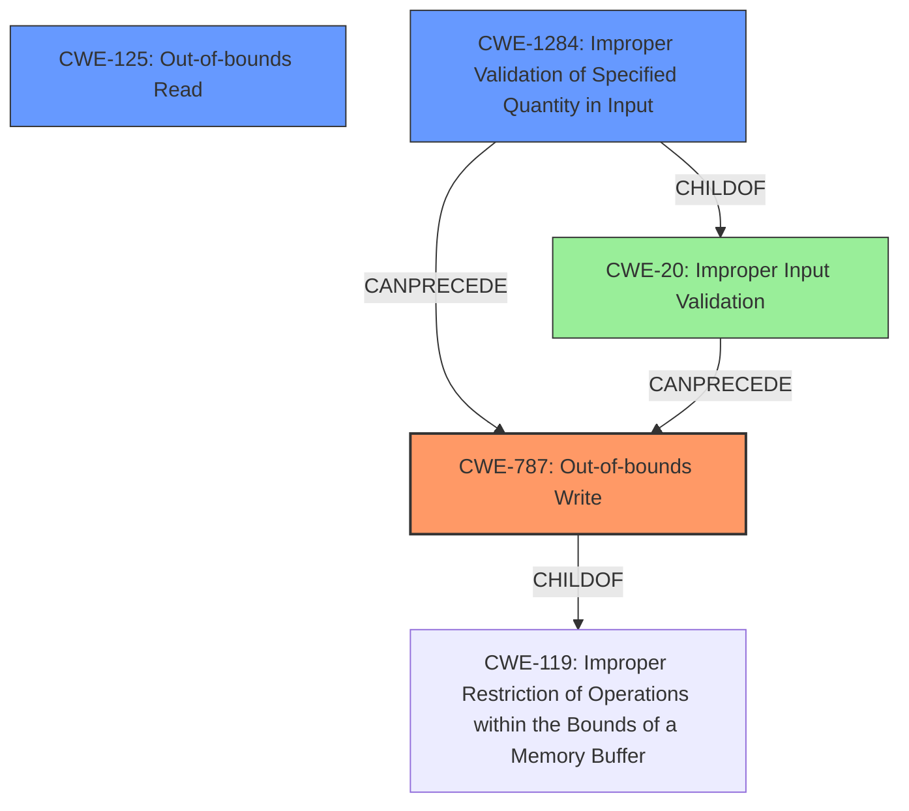

# Analysis Report for CVE-2022-32635

# Vulnerability Analysis Report: CVE-2022-32635

## Description


## Analysis (with Relationship Data)

# Summary
| CWE ID  | CWE Name                                                        | Confidence | CWE Abstraction Level | CWE Vulnerability Mapping Label | CWE-Vulnerability Mapping Notes |
| ------- | --------------------------------------------------------------- | ---------- | --------------------- | ------------------------------- | --------------------------------- |
| CWE-787 | Out-of-bounds Write                                             | 1.0        | Base                  | Primary                         | Allowed                           |
| CWE-125  | Out-of-bounds Read                                             | 0.7        | Base                  | Secondary                        | Allowed                           |
| CWE-1284 | Improper Validation of Specified Quantity in Input            | 0.6        | Base                  | Secondary                        | Allowed                           |

## Evidence and Confidence

*   **Confidence Score:** 0.8
*   **Evidence Strength:** HIGH

## Relationship Analysis
The primary weakness is an out-of-bounds write (CWE-787). This is often related to other issues like improper input validation (CWE-20), which can lead to the attacker controlling the size or offset used in a write operation. CWE-787 is a base level CWE, and a child of CWE-119 (Improper Restriction of Operations within the Bounds of a Memory Buffer).



## Vulnerability Chain
The vulnerability chain starts with a **missing bounds check**, leading to an **out-of-bounds write**, which results in a local escalation of privilege.
1.  **Missing Bounds Check**: The root cause is the **missing bounds check**, which is related to input validation.
2.  **Out-of-bounds Write (CWE-787)**: Due to the missing check, a write operation occurs outside the allocated buffer.
3.  **Local Escalation of Privilege**: The impact of the out-of-bounds write is a local escalation of privilege.

## Summary of Analysis
The primary CWE is CWE-787 (Out-of-bounds Write), as the vulnerability description explicitly states "**out of bounds write** due to a **missing bounds check**". This aligns directly with the definition of CWE-787. The evidence is strong, with the key phrases clearly indicating the nature of the vulnerability.

CWE-125 (Out-of-bounds Read) was considered because an out-of-bounds write often implies a read may also be possible, or part of the same operation that leads to the write. Though not explicitly mentioned, I added it as a secondary candidate because it is related.

CWE-1284 (Improper Validation of Specified Quantity in Input) was also considered and added as a secondary candidate because the root cause is "**missing bounds check**" which also means there was a lack of input validation.

CWE-20 (Improper Input Validation) was considered because the root cause is a **missing bounds check**. However, CWE-1284 (Improper Validation of Specified Quantity in Input) is a more specific child of CWE-20 and better captures the nature of the **missing bounds check**, and is a better fit.

Relevant CWE Information:

# Enhanced Context (25 CWEs)
The following CWEs were identified as potentially relevant to this vulnerability:

## CWE-1289: Improper Validation of Unsafe Equivalence in Input
**Abstraction Level**: Base
**Similarity Score**: 0.78
**Source**: dense

**Description**:
The product receives an input value that is used as a resource identifier or other type of reference, but it does not validate or incorrectly validates that the input is equivalent to a potentially-unsafe value.
**Rationale for not selecting**: This CWE is too specific, as the vulnerability doesn't involve checking equivalence to an unsafe value, but rather a general bounds check.

## CWE-1288: Improper Validation of Consistency within Input
**Abstraction Level**: Base
**Similarity Score**: 0.77
**Source**: dense

**Description**:
The product receives a complex input with multiple elements or fields that must be consistent with each other, but it does not validate or incorrectly validates that the input is actually consistent.
**Rationale for not selecting**: The vulnerability is not about validating consistency, but about validating the size or bounds of an input.

## CWE-131: Incorrect Calculation of Buffer Size
**Abstraction Level**: Base
**Similarity Score**: 0.75
**Source**: dense

**Description**:
The product does not correctly calculate the size to be used when allocating a buffer, which could lead to a buffer overflow.
**Rationale for not selecting**: The vulnerability description is more focused on the **missing bounds check** rather than the buffer size calculation being incorrect.

## CWE-606: Unchecked Input for Loop Condition
**Abstraction Level**: Base
**Similarity Score**: 0.74
**Source**: dense

**Description**:
The product does not properly check inputs that are used for loop conditions, potentially leading to a denial of service or other consequences because of excessive looping.
**Rationale for not selecting**: Not related to a loop condition, but a missing check on the input size.

## CWE-191: Integer Underflow (Wrap or Wraparound)
**Abstraction Level**: Base
**Similarity Score**: 0.74
**Source**: dense

**Description**:
The product subtracts one value from another, such that the result is less than the minimum allowable integer value, which produces a value that is not equal to the correct result.
**Rationale for not selecting**: The vulnerability isn't about integer underflow, but about missing a size/bounds check.

## CWE-682: Incorrect Calculation
**Abstraction Level**: Pillar
**Similarity Score**: 0.74
**Source**: dense

**Description**:
The product performs a calculation that generates incorrect or unintended results that are later used in security-critical decisions or resource management.
**Rationale for not selecting**: This is a high-level Pillar, while more specific base-level CWEs are better suited.

## CWE-681: Incorrect Conversion between Numeric Types
**Abstraction Level**: Base
**Similarity Score**: 0.74
**Source**: dense

**Description**:
When converting from one data type to another, such as long to integer, data can be omitted or translated in a way that produces unexpected values. If the resulting values are used in a sensitive context, then dangerous behaviors may occur.
**Rationale for not selecting**: Not related to numeric type conversions.

## CWE-404: Improper Resource Shutdown or Release
**Abstraction Level**: Class
**Similarity Score**: 0.73
**Source**: dense

**Description**:
The product does not release or incorrectly releases a resource before it is made available for re-use.
**Rationale for not selecting**: Not related to resource management.

## CWE-179: Incorrect Behavior Order: Early Validation
**Abstraction Level**: Base
**Similarity Score**: 0.73
**Source**: dense

**Description**:
The product validates input before applying protection mechanisms that modify the input, which could allow an attacker to bypass the validation via dangerous inputs that only arise after the modification.
**Rationale for not selecting**: Not about the order of validation.

## CWE-130: Improper Handling of Length Parameter Inconsistency
**Abstraction Level**: Base
**Similarity Score**: 0.73
**Source**: dense

**Description**:
The product parses a formatted message or structure, but it does not handle or incorrectly handles a length field that is inconsistent with the actual length of the associated data.
**Rationale for not selecting**: This is more about handling inconsistencies with length fields in messages.

## CWE-1284: Improper Validation of Specified Quantity in Input
**Abstraction Level**: Base
**Similarity Score**: 6835.29
**Source**: sparse

**Description**:
The product receives input that is expected to specify a quantity (such as size or length), but it does not validate or incorrectly validates that the quantity has the required properties.
**Rationale for selecting**: The **missing bounds check** translates to not validating the specified quantity and is a likely contributor to the root cause.

## CWE-190: Integer Overflow or Wraparound
**Abstraction Level**: Base
**Similarity Score**: 6774.74


## CWE Relationship Analysis

Current CWEs represent these abstraction levels: .


### Vulnerability Chain Analysis

**Chain starting from CWE-131:**
- 131 (Incorrect Calculation of Buffer Size) - ROOT


**Chain starting from CWE-190:**
- 190 (Integer Overflow or Wraparound) - ROOT


### CWE Relationship Diagram

```mermaid
graph TD
    classDef primary fill:#f96,stroke:#333,stroke-width:2px
    classDef secondary fill:#69f,stroke:#333
    classDef tertiary fill:#9e9,stroke:#333
```


*Report generated on 2025-03-30 11:12:43*
