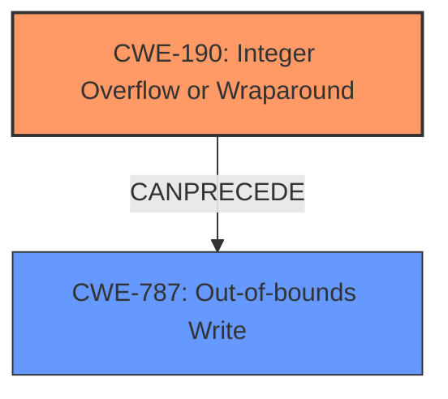

# Analysis for CVE-2022-32636

# Summary
| CWE ID | CWE Name | Confidence | CWE Abstraction Level | CWE Vulnerability Mapping Label | CWE-Vulnerability Mapping Notes |
|---|---|---|---|---|---|
| CWE-190 | Integer Overflow or Wraparound | 0.9 | Base | Primary | Allowed |
| CWE-787 | Out-of-bounds Write | 0.8 | Base | Secondary | Allowed |

## Evidence and Confidence

*   **Confidence Score:** 0.85
*   **Evidence Strength:** HIGH

## Relationship Analysis
The primary weakness is **CWE-190 (Integer Overflow or Wraparound)**, which can **CANPRECEDE** **CWE-787 (Out-of-bounds Write)**. **CWE-190** is a base-level CWE, providing a good level of detail for the root cause. **CWE-787** is also a base-level CWE, indicating the direct consequence of the integer overflow.

## Vulnerability Chain
The vulnerability chain starts with an **integer overflow (CWE-190)**, which then leads to an **out-of-bounds write (CWE-787)**. This leads to local escalation of privilege.

## Summary of Analysis
The initial analysis identified **CWE-190 (Integer Overflow or Wraparound)** as the primary root cause, supported by the vulnerability description key phrases highlighting "**integer overflow**" as the root cause. The vulnerability description also mentions "**out of bounds write**" as the resulting weakness. The CVE Reference Links Content Summary confirms that the vulnerability is caused by an integer overflow leading to an out-of-bounds write.

The retriever results also list **CWE-190 (Integer Overflow or Wraparound)** as the top combined result.

The selection of **CWE-190** is further supported by the MITRE mapping guidance, which allows its usage and recognizes it as a base-level weakness.

The relationship analysis shows that **CWE-190** can precede **CWE-787 (Out-of-bounds Write)**, aligning with the vulnerability description.

The evidence clearly supports the selection of **CWE-190** as the primary weakness due to the **integer overflow**, with **CWE-787** as a secondary weakness due to the **out-of-bounds write**.

Other CWEs were considered but not used:

*   **CWE-131 (Incorrect Calculation of Buffer Size)**: While related to buffer overflows, the root cause is specifically an integer overflow, not a general miscalculation.
*   **CWE-191 (Integer Underflow (Wrap or Wraparound))**: The description specifically mentions an overflow, not an underflow.
*   **CWE-704 (Incorrect Type Conversion or Cast)**: While type conversion might be involved, the core issue is the overflow itself.
*   **CWE-908 (Use of Uninitialized Resource)**: Not relevant to the described vulnerability.
*   **CWE-250 (Execution with Unnecessary Privileges)**: While privilege escalation is the impact, it's not the direct cause.
*   **CWE-1260 (Improper Handling of Overlap Between Protected Memory Ranges)**: Not relevant to the described vulnerability.
*   **CWE-667 (Improper Locking)**: Not relevant to the described vulnerability.
*   **CWE-20 (Improper Input Validation)**: While input validation might be a mitigating factor, the core issue is the integer overflow itself.
*   **CWE-122 (Heap-based Buffer Overflow)**: While a potential consequence, **CWE-787** is more general and accurate as the overflow isn't explicitly stated to be heap-based.

The selected CWEs are at the optimal level of specificity, providing a clear and accurate representation of the vulnerability. The confidence level is high due to the clear evidence and alignment with MITRE mapping guidance.

Relevant CWE Information:

# Enhanced Context (25 CWEs)

## CWE-191: Integer Underflow (Wrap or Wraparound)
**Abstraction Level**: Base
**Similarity Score**: 0.78
**Source**: dense

**Description**:
The product subtracts one value from another, such that the result is less than the minimum allowable integer value, which produces a value that is not equal to the correct result.

**Mapping Guidance**:
- Usage: Allowed
- Rationale: This CWE entry is at the Base level of abstraction, which is a preferred level of abstraction for mapping to the root causes of vulnerabilities.

## CWE-680: Integer Overflow to Buffer Overflow
**Abstraction Level**: Compound
**Similarity Score**: 0.77
**Source**: dense

**Description**:
The product performs a calculation to determine how much memory to allocate, but an integer overflow can occur that causes less memory to be allocated than expected, leading to a buffer overflow.

**Mapping Guidance**:
- Usage: Discouraged
- Rationale: This CWE entry is a named chain, which combines multiple weaknesses.

## CWE-681: Incorrect Conversion between Numeric Types
**Abstraction Level**: Base
**Similarity Score**: 0.76
**Source**: dense

**Description**:
When converting from one data type to another, such as long to integer, data can be omitted or translated in a way that produces unexpected values. If the resulting values are used in a sensitive context, then dangerous behaviors may occur.

**Mapping Guidance**:
- Usage: Allowed
- Rationale: This CWE entry is at the Base level of abstraction, which is a preferred level of abstraction for mapping to the root causes of vulnerabilities.

## CWE-131: Incorrect Calculation of Buffer Size
**Abstraction Level**: Base
**Similarity Score**: 0.76
**Source**: dense

**Description**:
The product does not correctly calculate the size to be used when allocating a buffer, which could lead to a buffer overflow.

**Mapping Guidance**:
- Usage: Allowed
- Rationale: This CWE entry is at the Base level of abstraction, which is a preferred level of abstraction for mapping to the root causes of vulnerabilities.

## CWE-197: Numeric Truncation Error
**Abstraction Level**: Base
**Similarity Score**: 0.76
**Source**: dense

**Description**:
Truncation errors occur when a primitive is cast to a primitive of a smaller size and data is lost in the conversion.

**Mapping Guidance**:
- Usage: Allowed
- Rationale: This CWE entry is at the Base level of abstraction, which is a preferred level of abstraction for mapping to the root causes of vulnerabilities.

## CWE-1289: Improper Validation of Unsafe Equivalence in Input
**Abstraction Level**: Base
**Similarity Score**: 0.76
**Source**: dense

**Description**:
The product receives an input value that is used as a resource identifier or other type of reference, but it does not validate or incorrectly validates that the input is equivalent to a potentially-unsafe value.

**Mapping Guidance**:
- Usage: Allowed
- Rationale: This CWE entry is at the Base level of abstraction, which is a preferred level of abstraction for mapping to the root causes of vulnerabilities.

## CWE-190: Integer Overflow or Wraparound
**Abstraction Level**: Base
**Similarity Score**: 0.75
**Source**: dense

**Description**:
The product performs a calculation that can
         produce an integer overflow or wraparound when the logic
         assumes that the resulting value will always be larger than
         the original value. This occurs when an integer value is
         incremented to a value that is too large to store in the
         associated representation. When this occurs, the value may
         become a very small or negative number.

**Mapping Guidance**:
- Usage: Allowed
- Rationale: This CWE entry is at the Base level of abstraction, which is a preferred level of abstraction for mapping to the root causes of vulnerabilities.

## CWE-805: Buffer Access with Incorrect Length Value
**Abstraction Level**: Base
**Similarity Score**: 0.74
**Source**: dense

**Description**:
The product uses a sequential operation to read or write a buffer, but it uses an incorrect length value that causes it to access memory that is outside of the bounds of the buffer.

**Mapping Guidance**:
- Usage: Allowed
- Rationale: This CWE entry is at the Base level of abstraction, which is a preferred level of abstraction for mapping to the root causes of vulnerabilities.

## CWE-667: Improper Locking
**Abstraction Level**: Class
**Similarity Score**: 0.74
**Source**: dense

**Description**:
The product does not properly acquire or release a lock on a resource, leading to unexpected resource state changes and behaviors.

**Mapping Guidance**:
- Usage: Allowed-with-Review
- Rationale: