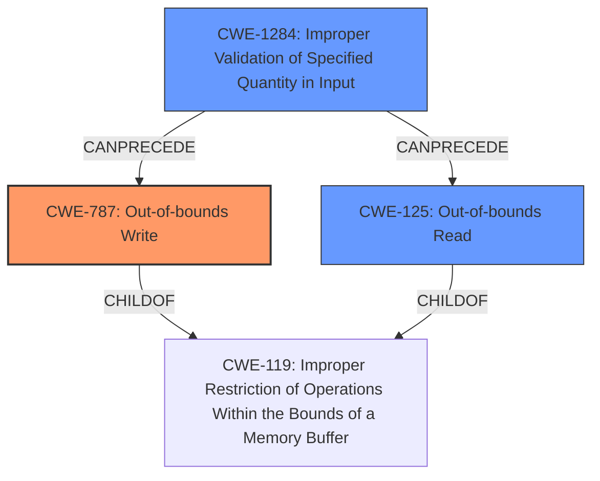

# Analysis for CVE-2022-32637

# Summary
| CWE ID | CWE Name | Confidence | CWE Abstraction Level | CWE Vulnerability Mapping Label | CWE-Vulnerability Mapping Notes |
|---|---|---|---|---|---|
| CWE-787 | Out-of-bounds Write | 1.0 | Base | Allowed | Primary CWE |
| CWE-125 | Out-of-bounds Read | 0.7 | Base | Allowed | Secondary CWE |
| CWE-1284 | Improper Validation of Specified Quantity in Input | 0.6 | Base | Allowed | Secondary CWE |

## Evidence and Confidence

*   **Confidence Score:** 0.9
*   **Evidence Strength:** HIGH

## Relationship Analysis
The primary weakness is an **out-of-bounds write (CWE-787)**, which stems from a **missing bounds check** in the hevc decoder. **CWE-787** is a base-level CWE, making it specific enough to describe the vulnerability. **CWE-125** (Out-of-bounds Read) is related to **CWE-787** as a possible consequence of incorrect memory access and can be considered as a secondary weakness if read operations are also affected. **CWE-1284** (Improper Validation of Specified Quantity in Input) is also related, as the missing bounds check means the input quantity is not properly validated.

## Vulnerability Chain
The vulnerability chain starts with a **missing bounds check**, leading to an **out-of-bounds write**. The impact is a local escalation of privilege.

`Missing Bounds Check -> Out-of-bounds Write -> Local Escalation of Privilege`

## Summary of Analysis
The vulnerability description clearly indicates an **out-of-bounds write** due to a **missing bounds check** in the hevc decoder. The "Vulnerability Description Key Phrases" section explicitly mentions the **missing bounds check** as the root cause and the **out-of-bounds write** as the weakness. The "CVE Reference Links Content Summary" section confirms this, stating that the vulnerability is caused by a **missing bounds check**, leading to an **out-of-bounds write**. This aligns perfectly with **CWE-787 (Out-of-bounds Write)**.

The relationship graph indicates that **CWE-787** is related to **CWE-119 (Improper Restriction of Operations Within the Bounds of a Memory Buffer)**. **CWE-125 (Out-of-bounds Read)** and **CWE-1284 (Improper Validation of Specified Quantity in Input)** are also related, as potential consequences or contributing factors. Given the explicit mention of an **out-of-bounds write**, **CWE-787** is the most accurate and specific classification.

The retriever results also suggest **CWE-1284** and **CWE-125**, which could be contributing factors or potential impacts of the vulnerability. **CWE-1284** is related to the **missing bounds check**, as the quantity of input is not properly validated. **CWE-125** could be a consequence if the write operation corrupts data that is later read.

I considered **CWE-20 (Improper Input Validation)**, but it is too general, and the description provides enough detail to pinpoint the specific type of weakness (**out-of-bounds write**). I also considered **CWE-190 (Integer Overflow or Wraparound)** and **CWE-191 (Integer Underflow (Wrap or Wraparound))**, but there's no direct evidence of integer overflow or underflow in the provided description. The root cause is explicitly stated as a **missing bounds check**, making **CWE-787** the most appropriate choice.

The selection of **CWE-787** is at the optimal level of specificity because it directly addresses the core issue of an **out-of-bounds write** due to a **missing bounds check**. The evidence is strong and clearly supports this classification.

Relevant CWE Information:

# Enhanced Context (25 CWEs)
The following CWEs were identified as potentially relevant to this vulnerability:

## CWE-191: Integer Underflow (Wrap or Wraparound)
**Abstraction Level**: Base
**Similarity Score**: 0.80
**Source**: dense

**Description**:
The product subtracts one value from another, such that the result is less than the minimum allowable integer value, which produces a value that is not equal to the correct result.

**Mapping Guidance**:
- Usage: Allowed
- Rationale: This CWE entry is at the Base level of abstraction, which is a preferred level of abstraction for mapping to the root causes of vulnerabilities.

## CWE-197: Numeric Truncation Error
**Abstraction Level**: Base
**Similarity Score**: 0.77
**Source**: dense

**Description**:
Truncation errors occur when a primitive is cast to a primitive of a smaller size and data is lost in the conversion.

**Mapping Guidance**:
- Usage: Allowed
- Rationale: This CWE entry is at the Base level of abstraction, which is a preferred level of abstraction for mapping to the root causes of vulnerabilities.

## CWE-680: Integer Overflow to Buffer Overflow
**Abstraction Level**: Compound
**Similarity Score**: 0.77
**Source**: dense

**Description**:
The product performs a calculation to determine how much memory to allocate, but an integer overflow can occur that causes less memory to be allocated than expected, leading to a buffer overflow.

**Mapping Guidance**:
- Usage: Discouraged
- Rationale: This CWE entry is a named chain, which combines multiple weaknesses.

## CWE-681: Incorrect Conversion between Numeric Types
**Abstraction Level**: Base
**Similarity Score**: 0.76
**Source**: dense

**Description**:
When converting from one data type to another, such as long to integer, data can be omitted or translated in a way that produces unexpected values. If the resulting values are used in a sensitive context, then dangerous behaviors may occur.

**Mapping Guidance**:
- Usage: Allowed
- Rationale: This CWE entry is at the Base level of abstraction, which is a preferred level of abstraction for mapping to the root causes of vulnerabilities.

## CWE-190: Integer Overflow or Wraparound
**Abstraction Level**: Base
**Similarity Score**: 0.76
**Source**: dense

**Description**:
The product performs a calculation that can
         produce an integer overflow or wraparound when the logic
         assumes that the resulting value will always be larger than
         the original value. This occurs when an integer value is
         incremented to a value that is too large to store in the
         associated representation. When this occurs, the value may
         become a very small or negative number.

**Mapping Guidance**:
- Usage: Allowed
- Rationale: This CWE entry is at the Base level of abstraction, which is a preferred level of abstraction for mapping to the root causes of vulnerabilities.

## CWE-131: Incorrect Calculation of Buffer Size
**Abstraction Level**: Base
**Similarity Score**: 0.76
**Source**: dense

**Description**:
The product does not correctly calculate the size to be used when allocating a buffer, which could lead to a buffer overflow.

**Mapping Guidance**:
- Usage: Allowed
- Rationale: This CWE entry is at the Base level of abstraction, which is a preferred level of abstraction for mapping to the root causes of vulnerabilities.

## CWE-823: Use of Out-of-range Pointer Offset
**Abstraction Level**: Base
**Similarity Score**: 0.75
**Source**: dense

**Description**:
The product performs pointer arithmetic on a valid pointer, but it uses an offset that can point outside of the intended range of valid memory locations for the resulting pointer.

**Mapping Guidance**:
- Usage: Allowed
- Rationale: This CWE entry is at the Base level of abstraction, which is a preferred level of abstraction for mapping to the root causes of vulnerabilities.

## CWE-124: Buffer Underwrite ('Buffer Underflow')
**Abstraction Level**: Base
**Similarity Score**: 0.75
**Source**: dense

**Description**:
The product writes to a buffer using an index or pointer that references a memory