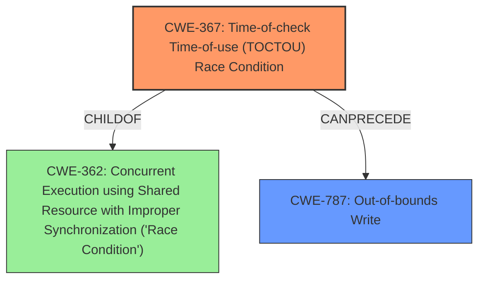

# Raw Analyzer Response for CVE-2022-32638

# Summary
| CWE ID | CWE Name | Confidence | CWE Abstraction Level | CWE Vulnerability Mapping Label | CWE-Vulnerability Mapping Notes |
|---|---|---|---|---|---|
| CWE-367 | Time-of-check Time-of-use (TOCTOU) Race Condition | 0.9 | Base | Primary | Allowed |
| CWE-787 | Out-of-bounds Write | 0.8 | Base | Secondary | Allowed |

## Evidence and Confidence

*   **Confidence Score:** 0.85
*   **Evidence Strength:** HIGH

## Relationship Analysis
The primary weakness is a Time-of-check Time-of-use (TOCTOU) **race condition** (CWE-367) which can **lead** to an **out-of-bounds write** (CWE-787). CWE-367 is a child of CWE-362 (Concurrent Execution using Shared Resource with Improper Synchronization ('Race Condition')). This hierarchical relationship indicates that CWE-367 provides a more specific description of the **race condition**. Also, CWE-367 can precede CWE-416 (Use After Free) and CWE-476 (NULL Pointer Dereference)

## Vulnerability Chain
The vulnerability chain starts with a **race condition** (CWE-367), where a resource's state changes between the check and the use. This leads to an **out-of-bounds write** (CWE-787), where data is written outside the allocated memory region. The final impact is local escalation of privilege.

## Summary of Analysis
The vulnerability description clearly states that the **root cause** is a **race condition** and the **weakness** is an **out-of-bounds write**: "In isp, there is a possible **out of bounds write** due to a **race condition**".

The "CVE Reference Links Content Summary" section confirms this analysis, stating:
"**root_cause**: Time-of-check time-of-use (TOCTOU) **race condition**" and "**weaknesses**: [ "CWE-367" ]".

The "CWE for similar CVE Descriptions" section lists CWE-787 as the Primary CWE Match. However, the **Vulnerability Description Key Phrases** section indicates that the **rootcause** is the **race condition** and the **weakness** is the **out-of-bounds write**.

The "Retriever Results" list CWE-362 (Concurrent Execution using Shared Resource with Improper Synchronization ('Race Condition')) and CWE-367 (Time-of-check Time-of-use (TOCTOU) Race Condition) as top candidates. CWE-367 is preferred over CWE-362 because CWE-367 (Time-of-check Time-of-use (TOCTOU) Race Condition) is a Base level CWE and is more specific than CWE-362.

Therefore, the primary CWE is CWE-367 (Time-of-check Time-of-use (TOCTOU) Race Condition) and the secondary CWE is CWE-787 (Out-of-bounds Write). This assessment is based on the provided evidence and the relationships between the CWEs. The selected CWEs are at the optimal level of specificity, with CWE-367 being a Base level CWE and a child of CWE-362.

Relevant CWE Information:

# Enhanced Context (25 CWEs)

## CWE-362: Concurrent Execution using Shared Resource with Improper Synchronization ('Race Condition')
**Abstraction:** Class
**Status:** Draft

### Description
The product contains a concurrent code sequence that requires temporary, exclusive access to a shared resource, but a timing window exists in which the shared resource can be modified by another code sequence operating concurrently.

### Extended Description
A race condition occurs within concurrent environments, and it is effectively a property of a code sequence. Depending on the context, a code sequence may be in the form of a function call, a small number of instructions, a series of program invocations, etc.

A race condition violates these properties, which are closely related:

*   Exclusivity - the code sequence is given exclusive access to the shared resource, i.e., no other code sequence can modify properties of the shared resource before the original sequence has completed execution.

*   Atomicity - the code sequence is behaviorally atomic, i.e., no other thread or process can concurrently execute the same sequence of instructions (or a subset) against the same resource.

A race condition exists when an "interfering code sequence" can still access the shared resource, violating exclusivity.

The interfering code sequence could be "trusted" or "untrusted." A trusted interfering code sequence occurs within the product; it cannot be modified by the attacker, and it can only be invoked indirectly. An untrusted interfering code sequence can be authored directly by the attacker, and typically it is external to the vulnerable product.

### Alternative Terms
Race Condition

### Relationships
ChildOf -> CWE-691
CanPrecede -> CWE-416
CanPrecede -> CWE-476

### Mapping Guidance
**Usage:** Allowed-with-Review
**Rationale:** This CWE entry is a Class and might have Base-level children that would be more appropriate
**Comments:** Examine children of this entry to see if there is a better fit
**Reasons:**
- Abstraction

### Additional Notes
**[Maintenance]** The relationship between race conditions and synchronization problems (CWE-662) needs to be further developed. They are not necessarily two perspectives of the same core concept, since synchronization is only one technique for avoiding race conditions, and synchronization can be used for other purposes besides race condition prevention.

**[Research Gap]** Race conditions in web applications are under-studied and probably under-reported. However, in 2008 there has been growing interest in this area.

**[Research Gap]** Much of the focus of race condition research has been in Time-of-check Time-of-use (TOCTOU) variants (CWE-367), but many race conditions are related to synchronization problems that do not necessarily require a time-of-check.

**[Research Gap]** From a classification/taxonomy perspective, the relationships between concurrency and program state need closer investigation and may be useful in organizing related issues.

### Observed Examples

*   **CVE-2022-29527:** Go application for cloud management creates a world-writable sudoers file that allows local attackers to inject sudo rules and escalate privileges to root by winning a race condition.
*   **CVE-2021-1782:** Chain: improper locking (CWE-667) leads to **race condition** (CWE-362), as exploited in the wild per CISA KEV.
*   **CVE-2021-0920:** Chain: mobile platform **race condition** (CWE-362) leading to use-after-free (CWE-416), as exploited in the wild per CISA KEV.

## CWE-367: Time-of-check Time-of-use (TOCTOU) Race Condition
**Abstraction:** Base
**Status:** Incomplete

### Description
The product checks the state of a resource before using that resource, but the resource's state can change between the check and the use in a way that invalidates the results of the check. This can cause the product to perform invalid actions when the resource is in an unexpected state.

### Extended Description
This weakness can be security-relevant when an attacker can influence the state of the resource between check and use. This can happen with shared resources such as files, memory, or even variables in multithreaded programs.

### Alternative Terms
TOCTTOU: The TOCTTOU acronym expands to "Time Of Check To Time Of Use".
TOCCTOU: The TOCCTOU acronym is most likely a typo of TOCTTOU, but it has been used in some influential documents, so the typo is repeated fairly frequently.

### Relationships
ChildOf -> CWE-362

### Mapping Guidance
**Usage:** Allowed
**Rationale:** This CWE entry is at the Base level of abstraction, which is a preferred level of abstraction for mapping to the root causes of vulnerabilities.
**Comments:** Carefully read both the name and description to ensure that this mapping is an appropriate fit. Do not try to 'force' a mapping to a lower-level Base/Variant simply to comply with this