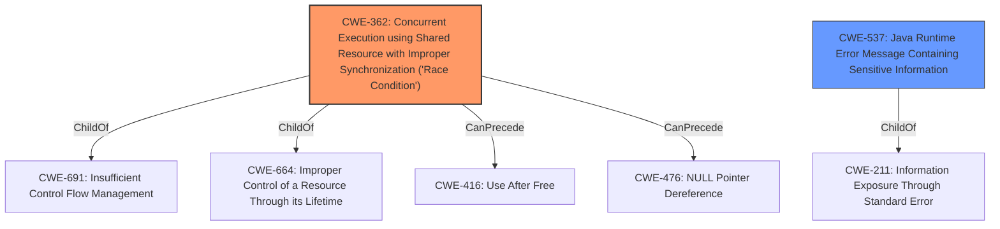

# Analysis Report for CVE-2022-32645

# Vulnerability Analysis Report: CVE-2022-32645

## Description


## Analysis (with Relationship Data)

# Summary
| CWE ID | CWE Name | Confidence | CWE Abstraction Level | CWE Vulnerability Mapping Label | CWE-Vulnerability Mapping Notes |
|---|---|---|---|---|---|
| CWE-362 | Concurrent Execution using Shared Resource with Improper Synchronization ('Race Condition') | 1.0 | Class | Primary | Allowed-with-Review |
| CWE-537 | Java Runtime Error Message Containing Sensitive Information | 0.4 | Variant | Secondary | Allowed |

## Evidence and Confidence

*   **Confidence Score:** 0.8
*   **Evidence Strength:** HIGH

## Relationship Analysis
The primary CWE is CWE-362, which is a Class-level CWE. Its relationships include ChildOf relationships to CWE-691 (Insufficient Control Flow Management) and CWE-664 (Improper Control of a Resource Through its Lifetime), and CanPrecede relationships to CWE-416 (Use After Free) and CWE-476 (NULL Pointer Dereference). The secondary CWE is CWE-537, a Variant, and a ChildOf to CWE-211 (Information Exposure Through Standard Error). The retriever results pointed to CWE-362 as the best fit, and the vulnerability description mentioned "race condition", which aligns perfectly with CWE-362's definition.



## Vulnerability Chain
The chain of events begins with a **race condition** (CWE-362) due to **improper synchronization** within the `vow` component. This leads to **information disclosure**.
  - Root Cause: CWE-362 (Concurrent Execution using Shared Resource with Improper Synchronization ('Race Condition'))
  - Impact: Information disclosure

## Summary of Analysis
The initial assessment strongly points towards CWE-362 due to the explicit mention of a **race condition** in the vulnerability description and supporting CVE reference links. The vulnerability description states: "In vow, there is a possible information disclosure due to a **race condition**." The CVE Reference Links Content Summary confirms this by stating the root cause as "**improper synchronization** in the `vow` component leading to a race condition" and the presence of a "Race condition" as a weakness.

While CWE-362 is a Class, the provided information doesn't provide sufficient detail to pinpoint a more specific Base or Variant. The mapping guidance for CWE-362 suggests examining children for a better fit, but none of the children CWEs are a better fit based on the description.

CWE-537 (Java Runtime Error Message Containing Sensitive Information) was considered because the vulnerability results in information disclosure. However, it is less directly related to the root cause, which is the **race condition**. The connection is that the race condition *could* potentially lead to sensitive information being exposed in an error message, but this is not explicitly stated. Therefore, CWE-537 is considered a secondary, less confident mapping.

CWE-662 (Improper Synchronization) and CWE-667 (Improper Locking) were also considered because the root cause was described as **improper synchronization**. While **improper synchronization** is likely the reason for the **race condition**, CWE-362 is a better fit because it is more specific, and **race condition** is explicitly mentioned.

The final decision is to assign CWE-362 as the primary CWE, representing the **race condition** due to **improper synchronization**, with CWE-537 as a secondary consideration due to the resulting information disclosure, even though the evidence for this is weak.

Relevant CWE Information:

# Enhanced Context (25 CWEs)
The following CWEs were identified as potentially relevant to this vulnerability:

## CWE-667: Improper Locking
**Abstraction Level**: Class
**Similarity Score**: 0.79
**Source**: dense

**Description**:
The product does not properly acquire or release a lock on a resource, leading to unexpected resource state changes and behaviors.

**Mapping Guidance**:
- Usage: Allowed-with-Review
- Rationale: This CWE entry is a Class and might have Base-level children that would be more appropriate

## CWE-404: Improper Resource Shutdown or Release
**Abstraction Level**: Class
**Similarity Score**: 0.78
**Source**: dense

**Description**:
The product does not release or incorrectly releases a resource before it is made available for re-use.

**Mapping Guidance**:
- Usage: Allowed-with-Review
- Rationale: This CWE entry is a Class and might have Base-level children that would be more appropriate

## CWE-662: Improper Synchronization
**Abstraction Level**: Class
**Similarity Score**: 0.78
**Source**: dense

**Description**:
The product utilizes multiple threads or processes to allow temporary access to a shared resource that can only be exclusive to one process at a time, but it does not properly synchronize these actions, which might cause simultaneous accesses of this resource by multiple threads or processes.

**Mapping Guidance**:
- Usage: Discouraged
- Rationale: This CWE entry is a level-1 Class (i.e., a child of a Pillar). It might have lower-level children that would be more appropriate

## CWE-226: Sensitive Information in Resource Not Removed Before Reuse
**Abstraction Level**: Base
**Similarity Score**: 0.77
**Source**: dense

**Description**:
The product releases a resource such as memory or a file so that it can be made available for reuse, but it does not clear or "zeroize" the information contained in the resource before the product performs a critical state transition or makes the resource available for reuse by other entities.

**Mapping Guidance**:
- Usage: Allowed
- Rationale: This CWE entry is at the Base level of abstraction, which is a preferred level of abstraction for mapping to the root causes of vulnerabilities.

## CWE-665: Improper Initialization
**Abstraction Level**: Class
**Similarity Score**: 0.76
**Source**: dense

**Description**:
The product does not initialize or incorrectly initializes a resource, which might leave the resource in an unexpected state when it is accessed or used.

**Mapping Guidance**:
- Usage: Discouraged
- Rationale: This CWE entry is a level-1 Class (i.e., a child of a Pillar). It might have lower-level children that would be more appropriate

## CWE-754: Improper Check for Unusual or Exceptional Conditions
**Abstraction Level**: Class
**Similarity Score**: 0.76
**Source**: dense

**Description**:
The product does not check or incorrectly checks for unusual or exceptional conditions that are not expected to occur frequently during day to day operation of the product.

**Mapping Guidance**:
- Usage: Allowed-with-Review
- Rationale: This CWE entry is a Class and might have Base-level children that would be more appropriate

## CWE-362: Concurrent Execution using Shared Resource with Improper Synchronization ('Race Condition')
**Abstraction Level**: Class
**Similarity Score**: 0.76
**Source**: dense

**Description**:
The product contains a concurrent code sequence that requires temporary, exclusive access to a shared resource, but a timing window exists in which the shared resource can be modified by another code sequence operating concurrently.

**Mapping Guidance**:
- Usage: Allowed-with-Review
- Rationale: This CWE entry is a Class and might have Base-level children that would be more appropriate

## CWE-366: Race Condition within a Thread
**Abstraction Level**: Base
**Similarity Score**: 0.76
**Source**: dense

**Description**:
If two threads of execution use a resource simultaneously, there exists the possibility that resources may be used while invalid, in turn making the state of execution undefined.

**Mapping Guidance**:
- Usage: Allowed
- Rationale: This CWE entry is at the Base level of abstraction, which is a preferred level of abstraction for mapping to the root causes of vulnerabilities.

## CWE-367: Time-of-check Time-of-use (TOCTOU) Race Condition


## CWE Relationship Analysis

Current CWEs represent these abstraction levels: .


### Vulnerability Chain Analysis

**Chain starting from CWE-476:**
- 476 (NULL Pointer Dereference) - ROOT


**Chain starting from CWE-211:**
- 211 (Externally-Generated Error Message Containing Sensitive Information) - ROOT


### CWE Relationship Diagram

```mermaid
graph TD
    classDef primary fill:#f96,stroke:#333,stroke-width:2px
    classDef secondary fill:#69f,stroke:#333
    classDef tertiary fill:#9e9,stroke:#333
```


*Report generated on 2025-03-31 05:27:58*
