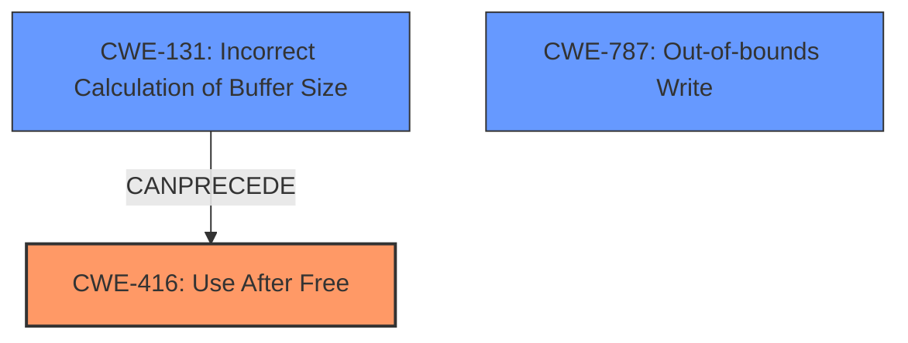

# Analysis for CVE-2022-32650

# Summary
| CWE ID | CWE Name | Confidence | CWE Abstraction Level | CWE Vulnerability Mapping Label | CWE-Vulnerability Mapping Notes |
|---|---|---|---|---|---|
| CWE-416 | Use After Free | 0.9 | Variant | Allowed | Primary CWE |
| CWE-131 | Incorrect Calculation of Buffer Size | 0.7 | Base | Allowed | Secondary Candidate |

## Evidence and Confidence

*   **Confidence Score:** 0.8
*   **Evidence Strength:** MEDIUM

## Relationship Analysis
The primary relationship that influenced the decision was the direct match of the vulnerability description to CWE-416, Use After Free. Although CWE-787 was suggested as the primary match for similar CVE descriptions, the presence of "**use after free**" as a **weakness** in the description led to prioritizing CWE-416.  CWE-131, Incorrect Calculation of Buffer Size, was considered a possible contributing factor, aligning with details in the CVE Reference Links Content Summary and the "logic error" root cause. This suggests a potential chain where an incorrect buffer size calculation could lead to memory management issues, ultimately resulting in a use-after-free condition.

## Vulnerability Chain
The vulnerability chain begins with a "**logic error**" which leads to "**incorrect calculation of buffer size**" (CWE-131), then leading to a **use after free** condition (CWE-416).
  - **Root Cause:** Logic Error leading to Incorrect Calculation of Buffer Size (CWE-131)
  - **Weakness:** Use After Free (CWE-416)
  - **Impact:** Local escalation of privilege

## Summary of Analysis
The initial assessment considered CWE-787 due to its prevalence in similar CVE descriptions. However, the explicit mention of "**use after free**" in the vulnerability description and the detailed summary of the CVE reference links content pointing to **incorrect calculation of buffer size** led to prioritizing CWE-416 and CWE-131.

The evidence for CWE-416 is clear: "In mtk-isp, there is a possible **use after free** due to a **logic error**." This direct statement makes CWE-416 the primary weakness.

The evidence for CWE-131 comes from the CVE Reference Links Content Summary: "Root cause: Incorrect calculation of buffer size in isp" and "Weaknesses: [ "CWE-131 Incorrect Calculation of Buffer Size" ]". This suggests a potential contributing factor to the use-after-free condition.

The selected CWEs are at the optimal level of specificity. CWE-416 is a Variant, which is preferred over the more general Class or Pillar levels. CWE-131, being a Base CWE, provides a specific root cause related to buffer management.

Relevant CWE Information:

# Enhanced Context (25 CWEs)

## CWE-667: Improper Locking
**Abstraction Level**: Class
**Similarity Score**: 0.79
**Source**: dense

**Description**:
The product does not properly acquire or release a lock on a resource, leading to unexpected resource state changes and behaviors.

**Mapping Guidance**:
- Usage: Allowed-with-Review
- Rationale: This CWE entry is a Class and might have Base-level children that would be more appropriate

*Not Selected*: This CWE relates to locking mechanisms, which are not mentioned in the vulnerability description.

## CWE-754: Improper Check for Unusual or Exceptional Conditions
**Abstraction Level**: Class
**Similarity Score**: 0.78
**Source**: dense

**Description**:
The product does not check or incorrectly checks for unusual or exceptional conditions that are not expected to occur frequently during day to day operation of the product.

**Mapping Guidance**:
- Usage: Allowed-with-Review
- Rationale: This CWE entry is a Class and might have Base-level children that would be more appropriate

*Not Selected*: This CWE is too general and doesn't directly relate to the specific vulnerability of a use-after-free condition.

## CWE-404: Improper Resource Shutdown or Release
**Abstraction Level**: Class
**Similarity Score**: 0.78
**Source**: dense

**Description**:
The product does not release or incorrectly releases a resource before it is made available for re-use.

**Mapping Guidance**:
- Usage: Allowed-with-Review
- Rationale: This CWE entry is a Class and might have Base-level children that would be more appropriate

*Not Selected*: While this could be related, CWE-416 more directly addresses the use-after-free condition.

## CWE-226: Sensitive Information in Resource Not Removed Before Reuse
**Abstraction Level**: Base
**Similarity Score**: 0.77
**Source**: dense

**Description**:
The product releases a resource such as memory or a file so that it can be made available for reuse, but it does not clear or "zeroize" the information contained in the resource before the product performs a critical state transition or makes the resource available for reuse by other entities.

**Mapping Guidance**:
- Usage: Allowed
- Rationale: This CWE entry is at the Base level of abstraction, which is a preferred level of abstraction for mapping to the root causes of vulnerabilities.

*Not Selected*: This CWE is not directly related to the vulnerability description. The focus is on sensitive information, which is not mentioned.

## CWE-703: Improper Check or Handling of Exceptional Conditions
**Abstraction Level**: Pillar
**Similarity Score**: 0.77
**Source**: dense

**Description**:
The product does not properly anticipate or handle exceptional conditions that rarely occur during normal operation of the product.

**Mapping Guidance**:
- Usage: Discouraged
- Rationale: This CWE entry is extremely high-level, a Pillar.

*Not Selected*: This CWE is too high-level and doesn't provide specific information about the vulnerability.

## CWE-362: Concurrent Execution using Shared Resource with Improper Synchronization ('Race Condition')
**Abstraction Level**: Class
**Similarity Score**: 0.77
**Source**: dense

**Description**:
The product contains a concurrent code sequence that requires temporary, exclusive access to a shared resource, but a timing window exists in which the shared resource can be modified by another code sequence operating concurrently.

**Mapping Guidance**:
- Usage: Allowed-with-Review
- Rationale: This CWE entry is a Class and might have Base-level children that would be more appropriate

*Not Selected*: While concurrency issues can lead to use-after-free conditions, there's no direct evidence of concurrent execution in the vulnerability description.

## CWE-668: Exposure of Resource to Wrong Sphere
**Abstraction Level**: Class
**Similarity Score**: 0.77
**Source**: dense

**Description**:
The product exposes a resource to the wrong control sphere, providing unintended actors with inappropriate access to the resource.

**Mapping Guidance**:
- Usage: Discouraged
- Rationale: CWE-668 is high-level and is often misused as a catch-all when lower-level CWE IDs might be applicable. It is sometimes used for low-information vulnerability reports [REF-1287]. It is a level-1 Class (i.e., a child of a Pillar). It is not useful for trend analysis.

*Not Selected*: This CWE is not relevant to the vulnerability description.

## CWE-662: Improper Synchronization
**Abstraction Level**: Class
**Similarity Score**: 0.76
**Source**: dense

**Description**:
The product utilizes multiple threads or processes to allow temporary access to a shared resource that can only be exclusive to one process at a time, but it does not properly synchronize these actions, which might cause simultaneous accesses of this resource by multiple threads or processes.

**Mapping Guidance**:
- Usage: Discouraged
- Rationale: This CWE entry is a level-1 Class (i.e., a child of a Pillar). It might have lower-level children that would be more appropriate

*Not Selected*: This CWE is not directly related to the vulnerability description. Synchronization issues are not explicitly mentioned.

## CWE-274: Improper Handling of Insufficient Privileges
**Abstraction Level**: Base
**Similarity Score**: 0.76
**Source**: dense

**Description**:
The product does not handle or incorrectly handles when it has insufficient privileges to perform an operation, leading to resultant weaknesses.

**Mapping Guidance**:
- Usage: Discouraged
- Rationale: This CWE entry could be deprecated in a future version of CWE.

*Not Selected*: While the impact is local escalation of privilege, the root cause is not related to privilege handling.

## CWE-653: