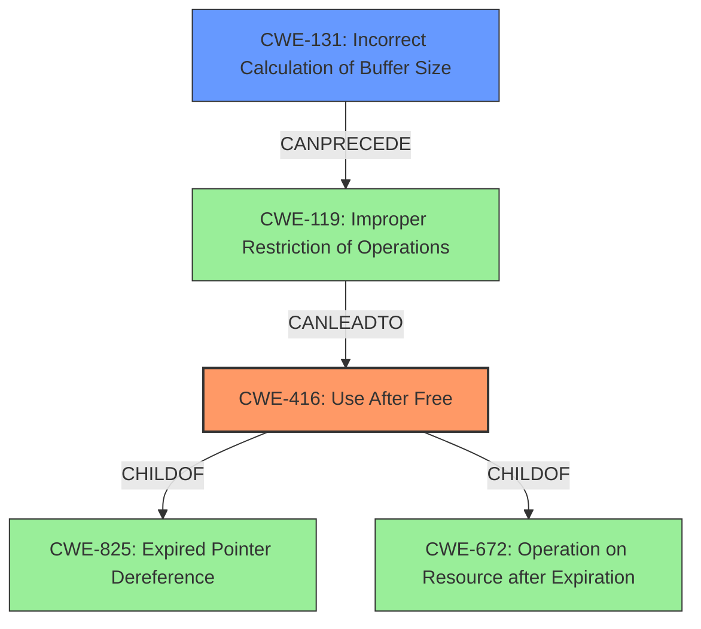

# Raw Analyzer Response for CVE-2022-32651

# Summary
| CWE ID | CWE Name | Confidence | CWE Abstraction Level | CWE Vulnerability Mapping Label | CWE-Vulnerability Mapping Notes |
|---|---|---|---|---|---|
| CWE-416 | Use After Free | 0.9 | Variant | Primary | Allowed |
| CWE-131 | Incorrect Calculation of Buffer Size | 0.7 | Base | Secondary | Allowed |

## Evidence and Confidence

*   **Confidence Score:** 0.8
*   **Evidence Strength:** HIGH

## Relationship Analysis
The primary CWE, CWE-416, is a variant of CWE-825 (Expired Pointer Dereference) and CWE-672 (Operation on Resource after Expiration). The secondary CWE, CWE-131 (Incorrect Calculation of Buffer Size), can precede CWE-119 (Improper Restriction of Operations within the Bounds of a Memory Buffer). This indicates a potential chain where an incorrect buffer size calculation leads to a use-after-free condition.

## Vulnerability Chain
The vulnerability chain starts with a **logic error** that results in an **incorrect calculation of buffer size (CWE-131)**. This leads to a **use-after-free (CWE-416)** condition, which allows for local escalation of privilege.
- **Root Cause:** **Logic Error** leading to Incorrect Buffer Size Calculation
- **Weakness:** **Use After Free**
- **Impact:** Local Escalation of Privilege

## Summary of Analysis
The initial assessment identified **CWE-787 (Out-of-bounds Write)** as the primary candidate based on similar CVE descriptions. However, a closer examination of the vulnerability description and the provided **CVE Reference Links Content Summary** indicates that the root cause is a **logic error** that leads to a **use-after-free** condition, which is best represented by **CWE-416 (Use After Free)**. The **CVE Reference Links Content Summary** also points towards "Incorrect calculation of buffer size leading to a use-after-free vulnerability" which supports the inclusion of **CWE-131 (Incorrect Calculation of Buffer Size)** as a secondary CWE.

The evidence from the vulnerability description, specifically the phrases "**use after free** due to a **logic error**" and the **CVE Reference Links Content Summary** stating "Incorrect calculation of buffer size leading to a use-after-free vulnerability", supports the selection of **CWE-416 (Use After Free)** and **CWE-131 (Incorrect Calculation of Buffer Size)**. **CWE-416 (Use After Free)** accurately describes the weakness, while **CWE-131 (Incorrect Calculation of Buffer Size)** captures the root cause mentioned in the **CVE Reference Links Content Summary**. Both CWEs are at the preferred Variant and Base abstraction levels, respectively.

Other CWEs considered but not used:

-   **CWE-787 (Out-of-bounds Write)**: While initially considered due to the "Top CWEs" listing, the vulnerability description explicitly states "**use after free**" rather than an out-of-bounds write. Therefore, **CWE-787 (Out-of-bounds Write)** is not the most accurate representation of the vulnerability.
-   **CWE-415 (Double Free)**: Although similar to **CWE-416 (Use After Free)**, the vulnerability description does not indicate a double free condition.
-   **CWE-908 (Use of Uninitialized Resource)**: This CWE was considered, but the description explicitly mentions a resource being freed and then reused, rather than an uninitialized resource.
-   **CWE-362 (Concurrent Execution using Shared Resource with Improper Synchronization ('Race Condition'))**, **CWE-662 (Improper Synchronization)**, **CWE-667 (Improper Locking)**, **CWE-364 (Signal Handler Race Condition)**: These CWEs relate to concurrency and synchronization issues, but the vulnerability description does not provide sufficient evidence to suggest that concurrency or synchronization is a factor in this vulnerability.
-   **CWE-755 (Improper Handling of Exceptional Conditions)**: While a **logic error** is present, there isn't sufficient information to determine it is related to exception handling.
-   **CWE-862 (Missing Authorization)**: The vulnerability description mentions privilege escalation but lacks information to suggest it originates from missing authorization checks.

Relevant CWE Information:

# Enhanced Context (25 CWEs)

## CWE-415: Double Free
**Abstraction Level**: Variant
**Similarity Score**: 0.78
**Source**: dense

**Description**:
The product calls free() twice on the same memory address, potentially leading to modification of unexpected memory locations.

**Mapping Guidance**:
- Usage: Allowed
- Rationale: This CWE entry is at the Variant level of abstraction, which is a preferred level of abstraction for mapping to the root causes of vulnerabilities.

## CWE-226: Sensitive Information in Resource Not Removed Before Reuse
**Abstraction Level**: Base
**Similarity Score**: 0.77
**Source**: dense

**Description**:
The product releases a resource such as memory or a file so that it can be made available for reuse, but it does not clear or "zeroize" the information contained in the resource before the product performs a critical state transition or makes the resource available for reuse by other entities.

**Mapping Guidance**:
- Usage: Allowed
- Rationale: This CWE entry is at the Base level of abstraction, which is a preferred level of abstraction for mapping to the root causes of vulnerabilities.

## CWE-404: Improper Resource Shutdown or Release
**Abstraction Level**: Class
**Similarity Score**: 0.77
**Source**: dense

**Description**:
The product does not release or incorrectly releases a resource before it is made available for re-use.

**Mapping Guidance**:
- Usage: Allowed-with-Review
- Rationale: This CWE entry is a Class and might have Base-level children that would be more appropriate

## CWE-667: Improper Locking
**Abstraction Level**: Class
**Similarity Score**: 0.77
**Source**: dense

**Description**:
The product does not properly acquire or release a lock on a resource, leading to unexpected resource state changes and behaviors.

**Mapping Guidance**:
- Usage: Allowed-with-Review
- Rationale: This CWE entry is a Class and might have Base-level children that would be more appropriate

## CWE-366: Race Condition within a Thread
**Abstraction Level**: Base
**Similarity Score**: 0.77
**Source**: dense

**Description**:
If two threads of execution use a resource simultaneously, there exists the possibility that resources may be used while invalid, in turn making the state of execution undefined.

**Mapping Guidance**:
- Usage: Allowed
- Rationale: This CWE entry is at the Base level of abstraction, which is a preferred level of abstraction for mapping to the root causes of vulnerabilities.

## CWE-362: Concurrent Execution using Shared Resource with Improper Synchronization ('Race Condition')
**Abstraction Level**: Class
**Similarity Score**: 0.75
**Source**: dense

**Description**:
The product contains a concurrent code sequence that requires temporary, exclusive access to a shared resource, but a timing window exists in which the shared resource can be modified by another code sequence operating concurrently.

**Mapping Guidance**:
- Usage: Allowed-with-Review
- Rationale: This CWE entry is a Class and might have Base-level children that would be more appropriate

## CWE-754: Improper Check for Unusual or Exceptional Conditions
**Abstraction Level**: Class
**Similarity Score**: 0.75
**Source**: dense

**Description**:
The product does not check or incorrectly checks for unusual or exceptional conditions that are not expected to occur frequently during day to day operation of the product.

**Mapping Guidance**:
- Usage: Allowed-with-Review
- Rationale: This CWE entry is a Class and might have Base-level children that would be more appropriate

## CWE-131: Incorrect Calculation of Buffer Size
**Abstraction Level**: Base
**Similarity Score**: 0.74
**Source**: dense

**