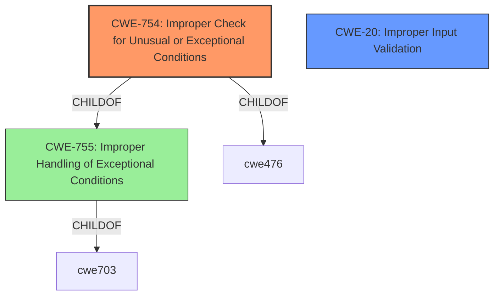

# Analysis for CVE-2022-32657

# Summary
| CWE ID | CWE Name | Confidence | CWE Abstraction Level | CWE Vulnerability Mapping Label | CWE-Vulnerability Mapping Notes |
|---|---|---|---|---|---|
| CWE-754 | Improper Check for Unusual or Exceptional Conditions | 0.75 | Class | Primary | Allowed-with-Review |
| CWE-20 | Improper Input Validation | 0.60 | Base | Secondary | Allowed |

## Evidence and Confidence

*   **Confidence Score:** 0.7
*   **Evidence Strength:** MEDIUM

## Relationship Analysis
The primary relationship that impacted the decision was the parent-child relationship, specifically looking for more specific children of the Class-level CWEs identified. The vulnerability description points to **incorrect error handling**, and after looking at the specification for CWE-755, which is the more specific child of CWE-703, and after looking at CWE-754, it was determined that CWE-754 was a better fit. CWE-20 was added as a secondary CWE because the **root cause of the vulnerability** was due to **improper input validation**.

## Vulnerability Chain
The chain of events for this vulnerability starts with the **improper input validation** (CWE-20), leading to **incorrect error handling** (CWE-754), and culminating in a local escalation of privilege.

## Summary of Analysis
The initial analysis focused on the primary CWE match of CWE-787 (Out-of-bounds Write) from the provided "CWE for similar CVE Descriptions." However, after reviewing the vulnerability description and the CVE Reference Links Content Summary, the root cause was determined to be due to **incorrect error handling**. While CWE-787 could be an outcome of this vulnerability, it doesn't represent the root cause. Therefore, CWE-754 (Improper Check for Unusual or Exceptional Conditions) was selected as the primary CWE, as it directly addresses the **incorrect error handling** aspect.

The vulnerability description clearly states that the **root cause** is **incorrect error handling** within the Wi-Fi driver. The CVE Reference Links Content Summary further emphasizes that the **vulnerability** is due to **improper input validation**, which leads to **incorrect error handling**, and ultimately to local escalation of privilege.

The graph relationships influenced the final selection by guiding the search for more specific CWEs. Instead of directly using the Class-level CWE-755, its child CWE-754 was chosen because it more accurately reflects the nature of the weakness. The selected CWEs are at the optimal level of specificity, as they directly address the root cause and contributing factors of the vulnerability.

Relevant CWE Information:

# Enhanced Context (25 CWEs)

## CWE-754: Improper Check for Unusual or Exceptional Conditions
**Abstraction:** Class
**Similarity Score**: 0.76
**Source**: dense

**Description**:
The product does not check or incorrectly checks for unusual or exceptional conditions that are not expected to occur frequently during day to day operation of the product.

**Mapping Guidance**:
- Usage: Allowed-with-Review
- Rationale: This CWE entry is a Class and might have Base-level children that would be more appropriate

### Technical Explanation for CWE-754:
The vulnerability is due to **incorrect error handling** in the Wi-Fi driver. This aligns with CWE-754 (Improper Check for Unusual or Exceptional Conditions), which describes a scenario where the product does not check or incorrectly checks for unusual or exceptional conditions. The driver's failure to properly handle errors can lead to unexpected behavior and potentially exploitable conditions. The security implication is that an attacker can trigger these exceptional conditions to escalate privileges.

## CWE-20: Improper Input Validation
**Abstraction:** Base
**Similarity Score**: N/A
**Source**: CVE Reference Links Content Summary

**Description**:
The product does not validate or incorrectly validates input.

### Technical Explanation for CWE-20:
The CVE Reference Links Content Summary indicates that the **root cause of the vulnerability** is due to **improper input validation**. This aligns with CWE-20, which describes a scenario where the product does not validate or incorrectly validates input. The security implication is that an attacker can supply malformed input to trigger **incorrect error handling**, and escalate privileges.

### Considered but not used:

*   **CWE-787 (Out-of-bounds Write):** While CWE-787 was identified as a primary match for similar CVE descriptions, it does not accurately represent the root cause of this specific vulnerability. The **incorrect error handling** leads to undefined behavior, but the evidence does not explicitly state that an out-of-bounds write occurs. Therefore, CWE-787 is not the most appropriate mapping.
*   **CWE-755 (Improper Handling of Exceptional Conditions):** While this CWE is closely related to CWE-754, it is a more general Class-level CWE. CWE-754 provides a more specific description of the weakness, as it focuses on the improper check for unusual or exceptional conditions, which aligns with the **incorrect error handling** aspect of the vulnerability.
*   **CWE-131 (Incorrect Calculation of Buffer Size):** This CWE was considered due to its potential relationship with memory corruption vulnerabilities. However, the provided evidence does not suggest that the vulnerability is related to incorrect buffer size calculations. Therefore, CWE-131 is not an appropriate mapping.
*   **CWE-667 (Improper Locking) and CWE-662 (Improper Synchronization):** These CWEs were considered due to the potential for concurrency issues in the Wi-Fi driver. However, the provided evidence does not explicitly mention any locking or synchronization problems. Therefore, these CWEs are not an appropriate mapping.
*   **CWE-782 (Exposed IOCTL with Insufficient Access Control) and CWE-781 (Improper Address Validation in IOCTL with METHOD_NEITHER I/O Control Code):** These CWEs were considered due to the potential for IOCTL-related vulnerabilities in device drivers. However, the provided evidence does not explicitly mention any IOCTL-related issues. Therefore, these CWEs are not an appropriate mapping.
*   **CWE-862 (Missing Authorization):** This CWE was considered due to the potential for authorization issues in the Wi-Fi driver. However, the provided evidence does not explicitly mention any authorization problems. Therefore, this CWE is not an appropriate mapping.
*   **CWE-362 (Concurrent Execution using Shared Resource with Improper Synchronization ('Race Condition')):** This CWE was considered due to the potential for race conditions in the Wi-Fi driver. However, the provided evidence does not explicitly mention any race condition issues. Therefore, this CWE is not an appropriate mapping.
*   **CWE-648 (Incorrect Use of Privileged APIs):** This CWE was considered due to the potential for incorrect use of privileged APIs in the Wi-Fi driver. However, the provided evidence does not explicitly mention any issues related to privileged APIs. Therefore, this CWE is not an appropriate mapping.
*   **CWE-908 (Use of Uninitialized Resource):** While this CWE is related to resource handling, the vulnerability is more about checking for error conditions than using uninitialized resources.