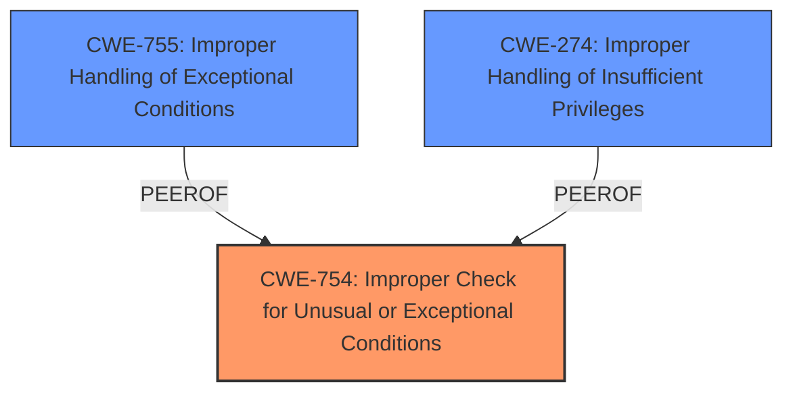

# Analysis for CVE-2022-32658

# Summary
| CWE ID  | CWE Name                                                                                     | Confidence | CWE Abstraction Level | CWE Vulnerability Mapping Label | CWE-Vulnerability Mapping Notes |
| :-------- | :------------------------------------------------------------------------------------------- | :---------- | :---------------------- | :------------------------------ | :------------------------------ |
| CWE-754 | Improper Check for Unusual or Exceptional Conditions | 0.7        | Class                   | Primary                       | Allowed-with-Review             |
| CWE-755 | Improper Handling of Exceptional Conditions                                                        | 0.6       | Class                   | Secondary                       | Discouraged                     |
| CWE-274 | Improper Handling of Insufficient Privileges                                                           | 0.5       | Base                  | Secondary                      | Discouraged                     |

## Evidence and Confidence

*   **Confidence Score:** 0.7
*   **Evidence Strength:** MEDIUM

## Relationship Analysis
The primary relationship influencing the decision is the parent-child relationship between CWE-754 and CWE-476 (NULL Pointer Dereference). CWE-754 is a class-level CWE, and CWE-476 is a base-level CWE that is a child of CWE-754. The vulnerability description points to **incorrect error handling** which can be interpreted as failing to properly check for unusual conditions. Although there is no direct evidence of a NULL pointer, it is a common consequence of **incorrect error handling**.

## Vulnerability Chain
The vulnerability chain starts with **incorrect error handling** which can lead to **undefined behavior** and finally results in local escalation of privilege.

## Summary of Analysis
The initial assessment considered CWE-787 (Out-of-bounds Write) as the primary CWE, as suggested by the "CWE for similar CVE Descriptions" section. However, the vulnerability description and CVE Reference Links Content Summary point to **incorrect error handling** as the root cause. The "Vulnerability Description Key Phrases" section also identifies **incorrect error handling** as the root cause and **possible undefined behavior** as the weakness.

The "CVE Reference Links Content Summary" states: "The vulnerability is caused by improper input validation in the Wi-Fi driver" and "Improper Input Validation (CWE-20): The Wi-Fi driver does not correctly validate input, which leads to a potential undefined behavior."

Considering the root cause and the retriever results, CWE-754 (Improper Check for Unusual or Exceptional Conditions) is chosen as the primary CWE. CWE-754 captures the essence of the **incorrect error handling** and lack of proper checks for exceptional conditions.

CWE-755 (Improper Handling of Exceptional Conditions) is similar to CWE-754 and can be considered a secondary CWE.

CWE-274 (Improper Handling of Insufficient Privileges) is also considered since the vulnerability could lead to local escalation of privilege.

CWE-787 was rejected because the evidence points to **incorrect error handling** and not a memory corruption issue.

The selected CWEs are at an appropriate level of specificity, as they directly relate to the **incorrect error handling** described in the vulnerability.