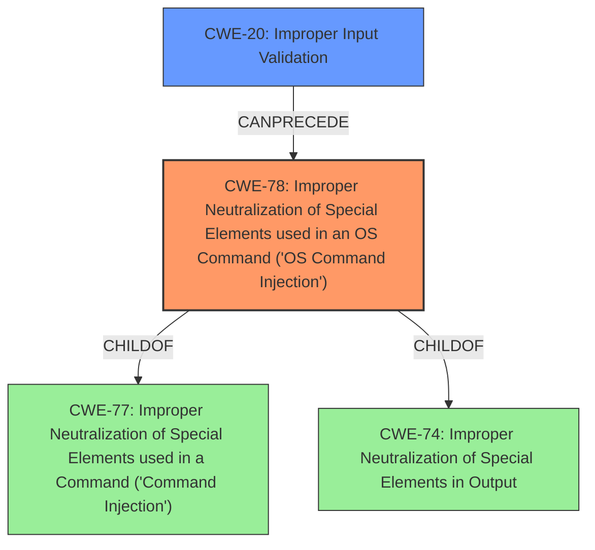

# Analysis Report for CVE-2022-32664

# Vulnerability Analysis Report: CVE-2022-32664

## Description


## Analysis (with Relationship Data)

# Summary
| CWE ID | CWE Name | Confidence | CWE Abstraction Level | CWE Vulnerability Mapping Label | CWE-Vulnerability Mapping Notes |
|---|---|---|---|---|---|
| CWE-78 | Improper Neutralization of Special Elements used in an OS Command ('OS Command Injection') | 1.0 | Base | Allowed | Primary CWE |
| CWE-20 | Improper Input Validation | 0.7 | Class | Discouraged | Secondary CWE |

## Evidence and Confidence

*   **Confidence Score:** 0.9
*   **Evidence Strength:** HIGH

## Relationship Analysis
The primary CWE is CWE-78, which is a Base level CWE and a child of CWE-77 (Class) and CWE-74 (Class). CWE-78 describes the specific case of OS command injection, which aligns with the vulnerability description. CWE-20 is a Class level CWE, and it is a more general case of input validation issues. CWE-20 can precede CWE-78 in a vulnerability chain.



## Vulnerability Chain
The vulnerability chain starts with **improper input validation** (CWE-20), which leads to **command injection** (CWE-78), resulting in remote escalation of privilege.

## Summary of Analysis
The vulnerability description indicates a **command injection** vulnerability due to **improper input validation** in Config Manager. The CVE Reference Links Content Summary confirms this, stating "Command injection vulnerability due to improper input validation."

The Retriever Results identify CWE-77 (Improper Neutralization of Special Elements used in a Command ('Command Injection')) as the top candidate. However, the description also mentions that CWE-77 is often misused when OS command injection (CWE-78) was intended. Given that the vulnerability leads to the execution of OS commands, CWE-78 (Improper Neutralization of Special Elements used in an OS Command ('OS Command Injection')) is a more appropriate choice. CWE-78 is a base level CWE which is preferred.

CWE-20 (Improper Input Validation) is also relevant because the root cause is **improper input validation**. However, CWE-20 is a Class level CWE and is often misused when lower-level CWEs could be used instead. In this case, the lower-level CWE is CWE-78. Therefore, CWE-20 is classified as a secondary CWE.

The selection of CWE-78 is based on the evidence that the vulnerability involves the execution of OS commands due to **improper input validation**. The relationship analysis shows that CWE-78 is a child of CWE-77 and CWE-74, and CWE-20 can precede CWE-78. This confirms that CWE-78 is the most specific and appropriate CWE for this vulnerability.

Relevant CWE Information:

# Enhanced Context (25 CWEs)

## CWE-78: Improper Neutralization of Special Elements used in an OS Command ('OS Command Injection')
**Abstraction:** Base
**Status:** Stable

### Description
The product constructs all or part of an OS command using externally-influenced input from an upstream component, but it does not neutralize or incorrectly neutralizes special elements that could modify the intended OS command when it is sent to a downstream component.

### Extended Description
This weakness can lead to a vulnerability in environments in which the attacker does not have direct access to the operating system, such as in web applications. Alternately, if the weakness occurs in a privileged program, it could allow the attacker to specify commands that normally would not be accessible, or to call alternate commands with privileges that the attacker does not have. The problem is exacerbated if the compromised process does not follow the principle of least privilege, because the attacker-controlled commands may run with special system privileges that increases the amount of damage.

## CWE-20: Improper Input Validation
**Abstraction:** Class
**Status:** Stable

### Description
The product receives input or data, but it does
        not validate or incorrectly validates that the input has the
        properties that are required to process the data safely and
        correctly.

### Extended Description
Input validation is a frequently-used technique for checking potentially dangerous inputs in order to ensure that the inputs are safe for processing within the code, or when communicating with other components. When software does not validate input properly, an attacker is able to craft the input in a form that is not expected by the rest of the application. This will lead to parts of the system receiving unintended input, which may result in altered control flow, arbitrary control of a resource, or arbitrary code execution.

Other CWEs considered but not used:
- CWE-77: Improper Neutralization of Special Elements used in a Command ('Command Injection') - This is a more general form of command injection, but since the vulnerability leads to OS command execution, CWE-78 is more specific.
- CWE-862: Missing Authorization - The vulnerability is not directly related to missing authorization checks.
- CWE-667: Improper Locking, CWE-269: Improper Privilege Management, CWE-73: External Control of File Name or Path, CWE-662: Improper Synchronization, CWE-908: Use of Uninitialized Resource, CWE-665: Improper Initialization - These CWEs are not directly related to the root cause or the resulting vulnerability.


## CWE Relationship Analysis

Current CWEs represent these abstraction levels: .


### Vulnerability Chain Analysis

**Chain starting from CWE-862:**
- 862 (Missing Authorization) - ROOT


**Chain starting from CWE-908:**
- 908 (Use of Uninitialized Resource) - ROOT


### CWE Relationship Diagram

```mermaid
graph TD
    classDef primary fill:#f96,stroke:#333,stroke-width:2px
    classDef secondary fill:#69f,stroke:#333
    classDef tertiary fill:#9e9,stroke:#333
```


*Report generated on 2025-03-31 10:52:22*
