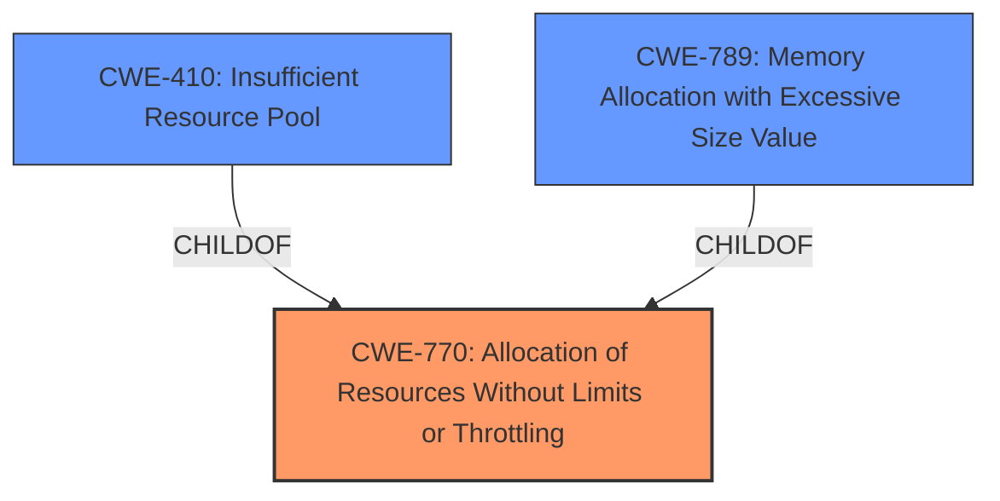

# Analysis for CVE-2022-3273

# Summary
| CWE ID | CWE Name | Confidence | CWE Abstraction Level | CWE Vulnerability Mapping Label | CWE-Vulnerability Mapping Notes |
|---|---|---|---|---|---|
| CWE-770 | Allocation of Resources Without Limits or Throttling | 1 | Base | Allowed | Primary CWE |
| CWE-410 | Insufficient Resource Pool | 0.7 | Base | Allowed | Secondary Candidate |
| CWE-789 | Memory Allocation with Excessive Size Value | 0.6 | Variant | Allowed | Secondary Candidate |

## Evidence and Confidence

*   **Confidence Score:** 0.9
*   **Evidence Strength:** HIGH

## Relationship Analysis
The primary CWE selected is CWE-770, which represents the **allocation of resources without limits or throttling**. This has child CWEs like CWE-789 (**memory allocation with excessive size value**) and CWE-410 (**insufficient resource pool**). The vulnerability description indicates that there are no limits on resource allocation, directly aligning with CWE-770. While CWE-789 and CWE-410 could be potential consequences or related issues, the root cause is the lack of any limits, making CWE-770 the most accurate primary classification.

## Vulnerability Chain
The vulnerability chain starts with the **root cause**, **allocation of resources without limits or throttling** (CWE-770). This can lead to a situation where the resource pool becomes insufficient (CWE-410) or excessive memory allocation occurs (CWE-789), ultimately causing a denial-of-service.
  - Root Cause: CWE-770
  - Potential Impacts: CWE-410, CWE-789

## Summary of Analysis
Initial assessment pointed towards CWE-770 (**Allocation of Resources Without Limits or Throttling**) due to the **rootcause** explicitly mentioning "**allocation of resources without limits or throttling**".

The "**Vulnerability Description Key Phrases**" section confirms the presence of "**allocation of resources without limits or throttling**."

The analysis considered the retriever results, particularly the high scores for CWE-770, CWE-789, and CWE-410. After examining the relationships and descriptions, CWE-770 was selected as the primary CWE, as the other options are more specific consequences of the unlimited resource allocation.

The choice of CWE-770 is based on direct evidence from the vulnerability description and supported by the retriever results. The CWE's description aligns with the **lack of** any restrictions on resource allocation. The mapping guidance for CWE-770 indicates that it's at the base level of abstraction, which is a preferred level.

Relevant CWE Information:

# Enhanced Context (25 CWEs)

## CWE-770: Allocation of Resources Without Limits or Throttling
**Abstraction:** Base
**Status:** Incomplete

### Description
The product allocates a reusable resource or group of resources on behalf of an actor without imposing any restrictions on the size or number of resources that can be allocated, in violation of the intended security policy for that actor.

## CWE-410: Insufficient Resource Pool
**Abstraction:** Base
**Status:** Incomplete

### Description
The product's resource pool is not large enough to handle peak demand, which allows an attacker to prevent others from accessing the resource by using a (relatively) large number of requests for resources.

## CWE-789: Memory Allocation with Excessive Size Value
**Abstraction:** Variant
**Status:** Draft

### Description
The product allocates memory based on an untrusted, large size value, but it does not ensure that the size is within expected limits, allowing arbitrary amounts of memory to be allocated.