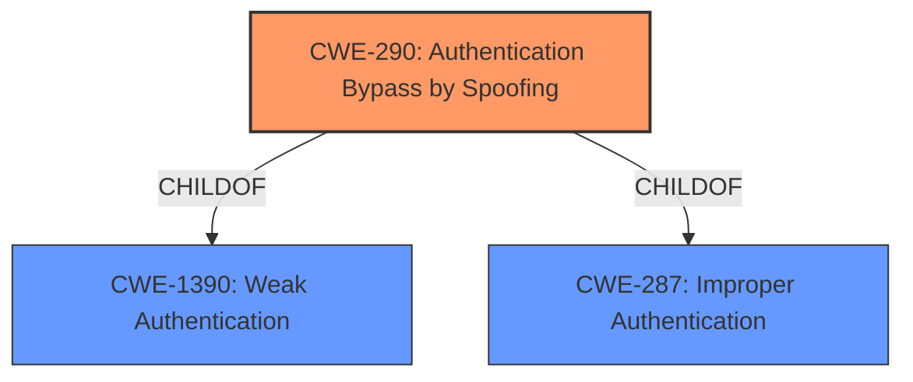

# Enhanced Analysis for CVE-2022-32747

# Summary
| CWE ID | CWE Name | Confidence | CWE Abstraction Level | CWE Vulnerability Mapping Label | CWE-Vulnerability Mapping Notes |
|---|---|---|---|---|---|
| CWE-290 | Authentication Bypass by Spoofing | 1.0 | Base | Allowed | Primary CWE |

## Evidence and Confidence

*   **Confidence Score:** 1.0
*   **Evidence Strength:** HIGH

## Relationship Analysis
The primary CWE selected is CWE-290, which is a Base level CWE. This choice is supported by its direct match to the vulnerability description, which explicitly mentions "Authentication Bypass by Spoofing". The vulnerability description key phrases also contain "authentication bypass by spoofing" as a rootcause. The retriever results listed CWE-290 first. The provided information does not lead to a child CWE.



## Vulnerability Chain
The chain of events is as follows:
1.  **Root Cause:** CWE-290 (**Authentication Bypass by Spoofing**) - The system **incorrectly implements authentication schemes that are subject to spoofing attacks**.
2.  **Impact:** Legitimate users are locked out of devices and backdoor accounts can be created.

## Summary of Analysis
The analysis is based on the provided vulnerability description and associated information. The vulnerability description clearly states "Authentication Bypass by Spoofing" and the CVE Reference Links Content Summary reinforces this by stating "Root cause of vulnerability: Authentication Bypass by Spoofing" and "Weaknesses/vulnerabilities present: CWE-290: Authentication Bypass by Spoofing".

The retriever results also listed CWE-290 first.

The selected CWE, CWE-290, is at the Base level of abstraction, which is the preferred level according to the mapping guidance. This CWE accurately captures the root cause of the vulnerability, which is the **incorrect implementation of authentication schemes that are subject to spoofing attacks**.

The evidence provided strongly supports the selection of CWE-290 as the primary CWE for this vulnerability.

Relevant CWE Information:
- CWE-290: Authentication Bypass by Spoofing
- CWE-347: Improper Verification of Cryptographic Signature
- CWE-522: Insufficiently Protected Credentials
- CWE-306: Missing Authentication for Critical Function
- CWE-294: Authentication Bypass by Capture-replay
- CWE-291: Reliance on IP Address for Authentication
- CWE-178: Improper Handling of Case Sensitivity
- CWE-295: Improper Certificate Validation
- CWE-287: Improper Authentication
- CWE-350: Reliance on Reverse DNS Resolution for a Security-Critical Action
- CWE-923: Improper Restriction of Communication Channel to Intended Endpoints
- CWE-1289: Improper Validation of Unsafe Equivalence in Input
- CWE-1391: Use of Weak Credentials
- CWE-297: Improper Validation of Certificate with Host Mismatch
- CWE-322: Key Exchange without Entity Authentication
- CWE-433: Unparsed Raw Web Content Delivery
- CWE-1282: Assumed-Immutable Data is Stored in Writable Memory
- CWE-425: Direct Request ('Forced Browsing')
- CWE-942: Permissive Cross-domain Policy with Untrusted Domains


## CWE Relationship Analysis

Current CWEs represent these abstraction levels: .


### Vulnerability Chain Analysis

**Chain starting from CWE-942:**
- 942 (Permissive Cross-domain Policy with Untrusted Domains) - ROOT


**Chain starting from CWE-297:**
- 297 (Improper Validation of Certificate with Host Mismatch) - ROOT


### CWE Relationship Diagram

```mermaid
graph TD
    classDef primary fill:#f96,stroke:#333,stroke-width:2px
    classDef secondary fill:#69f,stroke:#333
    classDef tertiary fill:#9e9,stroke:#333
```