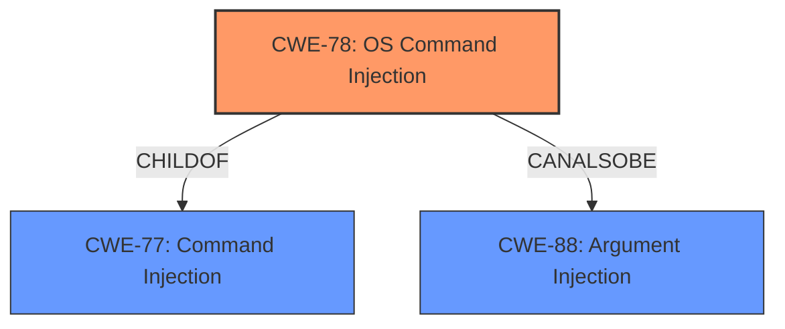

# Analysis for CVE-2022-3275

# Summary
| CWE ID | CWE Name | Confidence | CWE Abstraction Level | CWE Vulnerability Mapping Label | CWE-Vulnerability Mapping Notes |
|---|---|---|---|---|---|
| CWE-78 | Improper Neutralization of Special Elements used in an OS Command ('OS Command Injection') | 0.9 | Base | Primary | Allowed |
| CWE-77 | Improper Neutralization of Special Elements used in a Command ('Command Injection') | 0.7 | Class | Secondary | Allowed-with-Review |

## Evidence and Confidence

*   **Confidence Score:** 0.9
*   **Evidence Strength:** HIGH

## Relationship Analysis
The primary relationship influencing the decision is the parent-child relationship between CWE-77 (Command Injection) and CWE-78 (OS Command Injection). Since the vulnerability involves the injection of OS commands, CWE-78 is more specific and thus a better fit. CWE-88 (Argument Injection) was also considered due to its peer relationship with CWE-78, but the description indicates a more general command injection rather than specifically argument-based injection.

## Vulnerability Chain
The vulnerability chain starts with the **improper handling of unsanitized input** by the `puppetlabs-apt` module. This leads to **OS command injection**, allowing a malicious actor to execute arbitrary commands on the system, potentially resulting in **remote code execution** and complete system compromise.

## Summary of Analysis
The initial analysis correctly identifies **command injection** as the core **weakness**. The description explicitly mentions that a malicious actor can exploit the vulnerability by providing unsanitized input to the module, leading to the execution of arbitrary commands.

The choice of CWE-78 is based on the description highlighting the injection of OS commands, which aligns directly with the definition of CWE-78: "The product constructs all or part of an OS command using externally-influenced input...". While CWE-77 (Command Injection) is a broader category, CWE-78 is more specific and accurately reflects the nature of the vulnerability.

The mapping guidance for CWE-78 explicitly states that it is at the Base level of abstraction, which is preferred, and the description should be carefully read to ensure an appropriate fit. This condition is satisfied by the clear presence of OS command construction using external input.

The retriever results also support this decision, with CWE-78 having a high score due to the term "command injection" appearing in the vulnerability description.

CWE-20 (Improper Input Validation) was considered but deemed less appropriate as it is a more general weakness. The specific issue here is the **improper neutralization** of special elements in the input, leading to command execution, making CWE-78 a more precise classification.

Relevant CWE Information:
*   **CWE-77:** Improper Neutralization of Special Elements used in a Command ('Command Injection')
    *   **Description:** The product constructs all or part of a command using externally-influenced input from an upstream component, but it does not neutralize or incorrectly neutralizes special elements that could modify the intended command when it is sent to a downstream component.
    *   **Mapping Guidance:** Usage: Allowed-with-Review, Rationale: CWE-77 is often misused when OS command injection (CWE-78) was intended instead.
*   **CWE-78:** Improper Neutralization of Special Elements used in an OS Command ('OS Command Injection')
    *   **Description:** The product constructs all or part of an OS command using externally-influenced input from an upstream component, but it does not neutralize or incorrectly neutralizes special elements that could modify the intended OS command when it is sent to a downstream component.
    *   **Mapping Guidance:** Usage: Allowed, Rationale: This CWE entry is at the Base level of abstraction, which is a preferred level of abstraction for mapping to the root causes of vulnerabilities.

The evidence is clear: "Command injection is possible in the puppetlabs-apt module prior to version 9.0.0. A malicious actor is able to exploit this vulnerability only if they are able to provide unsanitized input to the module." This directly supports the classification of CWE-78.