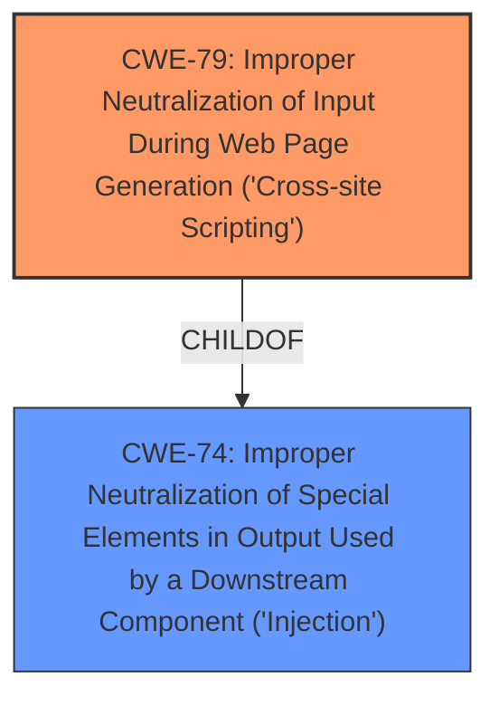

# Enhanced Analysis for CVE-2022-32763

# Summary
| CWE ID | CWE Name | Confidence | CWE Abstraction Level | CWE Vulnerability Mapping Label | CWE-Vulnerability Mapping Notes |
|---|---|---|---|---|---|
| CWE-79 | Improper Neutralization of Input During Web Page Generation ('Cross-site Scripting') | 1.0 | Base | Allowed | Primary CWE: This CWE accurately reflects the **cross-site scripting (xss) sanitization vulnerability bypass**. The core issue is the **improper neutralization** of input, leading to arbitrary Javascript code injection. |

## Evidence and Confidence

*   **Confidence Score:** 1.0
*   **Evidence Strength:** HIGH

## Relationship Analysis
The primary relationship that influenced the decision was the parent-child relationship between CWE-74 (Improper Neutralization of Special Elements in Output Used by a Downstream Component ('Injection')) and CWE-79. While CWE-74 is a broader class, CWE-79 is a base-level CWE specifically tailored to XSS vulnerabilities, making it a more precise fit.



## Vulnerability Chain
The vulnerability chain starts with the **incomplete blacklist** in the `HtmlSanitizer` class (**root cause**), leading to the **improper neutralization** of the `formaction` attribute of the `button` tag. This ultimately results in the **injection of arbitrary JavaScript code** and a **cross-site scripting (XSS) vulnerability** (**impact**).

## Summary of Analysis
The analysis strongly supports the selection of CWE-79 as the primary CWE for this vulnerability. The vulnerability description clearly indicates a **cross-site scripting (xss) sanitization vulnerability bypass** due to an **incomplete blacklist**, leading to arbitrary Javascript code injection. The "CVE Reference Links Content Summary" confirms that the root cause is an incomplete blacklist in the `HtmlSanitizer` class, specifically the `formaction` attribute of the `button` tag not being properly sanitized.

The Retriever Results further reinforce this selection, with CWE-79 having the highest score (0.800). The mapping guidance for CWE-79 states that it is at the Base level of abstraction and that its usage is ALLOWED, making it an appropriate fit.

The relationship analysis highlighted the parent-child relationship between CWE-74 and CWE-79, further solidifying the selection of CWE-79 as the more specific and accurate classification.

The provided evidence is sufficient to confidently classify this vulnerability as CWE-79.

Relevant CWE Information:

# Enhanced Context (25 CWEs)
The following CWEs were identified as potentially relevant to this vulnerability:

## CWE-80: Improper Neutralization of Script-Related HTML Tags in a Web Page (Basic XSS)
**Abstraction Level**: Variant
**Similarity Score**: 0.79
**Source**: dense

**Description**:
The product receives input from an upstream component, but it does not neutralize or incorrectly neutralizes special characters such as "<", ">", and "&" that could be interpreted as web-scripting elements when they are sent to a downstream component that processes web pages.

**Mapping Guidance**:
- Usage: Allowed
- Rationale: This CWE entry is at the Variant level of abstraction, which is a preferred level of abstraction for mapping to the root causes of vulnerabilities.

**Reason for not selecting:** CWE-80 is a variant of CWE-79, focusing on the improper neutralization of script-related HTML tags. While relevant, the root cause described is the bypass of sanitization due to the `formaction` attribute being missed, which is more directly addressed by the broader scope of CWE-79.

## CWE-184: Incomplete List of Disallowed Inputs
**Abstraction Level**: Base
**Similarity Score**: 0.78
**Source**: dense

**Description**:
The product implements a protection mechanism that relies on a list of inputs (or properties of inputs) that are not allowed by policy or otherwise require other action to neutralize before additional processing takes place, but the list is incomplete.

**Mapping Guidance**:
- Usage: Allowed
- Rationale: This CWE entry is at the Base level of abstraction, which is a preferred level of abstraction for mapping to the root causes of vulnerabilities.

**Reason for not selecting:** This CWE is too general. The vulnerability stems from the improper sanitization of specific HTML attributes, rather than an incomplete list of disallowed inputs in a broader sense. Although the summary mentions an **incomplete blacklist**, it is in relation to the XSS.

## CWE-434: Unrestricted Upload of File with Dangerous Type
**Abstraction Level**: Base
**Similarity Score**: 0.78
**Source**: dense

**Description**:
The product allows the upload or transfer of dangerous file types that are automatically processed within its environment.

**Mapping Guidance**:
- Usage: Allowed
- Rationale: This CWE entry is at the Base level of abstraction, which is a preferred level of abstraction for mapping to the root causes of vulnerabilities.

**Reason for not selecting:** This CWE is not relevant because the vulnerability doesn't involve file uploads.

## CWE-74: Improper Neutralization of Special Elements in Output Used by a Downstream Component ('Injection')
**Abstraction Level**: Class
**Similarity Score**: 0.77
**Source**: dense

**Description**:
The product constructs all or part of a command, data structure, or record using externally-influenced input from an upstream component, but it does not neutralize or incorrectly neutralizes special elements that could modify how it is parsed or interpreted when it is sent to a downstream component.

**Mapping Guidance**:
- Usage: Discouraged
- Rationale: CWE-74 is high-level and often misused when lower-level weaknesses are more appropriate.

**Reason for not selecting:** While CWE-74 is related to injection vulnerabilities, it is a more general category. The specific vulnerability is a cross-site scripting issue, which is better represented by CWE-79. The mapping guidance also discourages using CWE-74 when lower-level weaknesses are more appropriate.

## CWE-1289: Improper Validation of Unsafe Equivalence in Input
**Abstraction Level**: Base
**Similarity Score**: 0.77
**Source**: dense

**Description**:
The product receives an input value that is used as a resource identifier or other type of reference, but it does not validate or incorrectly validates that the input is equivalent to a potentially-unsafe value.

**Mapping Guidance**:
- Usage: Allowed
- Rationale: This CWE entry is at the Base level of abstraction, which is a preferred level of abstraction for mapping to the root causes of vulnerabilities.

**Reason for not selecting:** This CWE is not directly relevant to the described XSS vulnerability.

## CWE-113: Improper Neutralization of CRLF Sequences in HTTP Headers ('HTTP Request/Response Splitting')
**Abstraction Level**: Variant
**Similarity Score**: 0.76
**Source**: dense

**Description**:
The product receives data from an HTTP agent/component (e.g., web server, proxy, browser, etc.), but it does not neutralize or incorrectly neutralizes CR and LF characters before the data is included in outgoing HTTP headers.

**Mapping Guidance**:
- Usage: Allowed
- Rationale: This CWE entry is at the Variant level of abstraction, which is a preferred level of abstraction for mapping to the root causes of vulnerabilities.

**Reason for not selecting:** This CWE is not relevant as the vulnerability is not related to HTTP request/response splitting.

## CWE-41: Improper Resolution of Path Equivalence
**Abstraction Level**: Base
**Similarity Score**: 0.76
**Source**: dense

**Description**:
The product is vulnerable to file system contents disclosure through path equivalence. Path equivalence involves the use of special characters in file and directory names. The associated manipulations are intended to generate multiple names for the same object.

**Mapping Guidance**:
- Usage: Allowed
- Rationale: This CWE entry is at the Base level of abstraction, which is a preferred level of abstraction for mapping to the root causes of vulnerabilities.

**Reason for not selecting:** This CWE is not relevant because the vulnerability is not related to file system path equivalence.

## CWE-138: Improper Neutralization of Special Elements
**Abstraction Level**: Class
**Similarity Score**: 0.76
**Source**: dense

**Description**:
The product receives input from an upstream component, but it does not neutralize or incorrectly neutralizes special elements that could be interpreted as control elements or syntactic markers when they are sent to a downstream component.

**Mapping Guidance**:
- Usage: Discouraged
- Rationale: This CWE entry is a level-1 Class (i.e., a child of a Pillar). It might have lower-level children that would be more appropriate

**Reason for not selecting:** This is a high-level class. CWE-79 is a better fit.

## CWE-116: Improper Encoding or Escaping of Output
**Abstraction Level**:


## CWE Relationship Analysis

Current CWEs represent these abstraction levels: .


### Vulnerability Chain Analysis

**Chain starting from CWE-80:**
- 80 (Improper Neutralization of Script-Related HTML Tags in a Web Page (Basic XSS)) - ROOT


**Chain starting from CWE-434:**
- 434 (Unrestricted Upload of File with Dangerous Type) - ROOT


### CWE Relationship Diagram

```mermaid
graph TD
    classDef primary fill:#f96,stroke:#333,stroke-width:2px
    classDef secondary fill:#69f,stroke:#333
    classDef tertiary fill:#9e9,stroke:#333
```