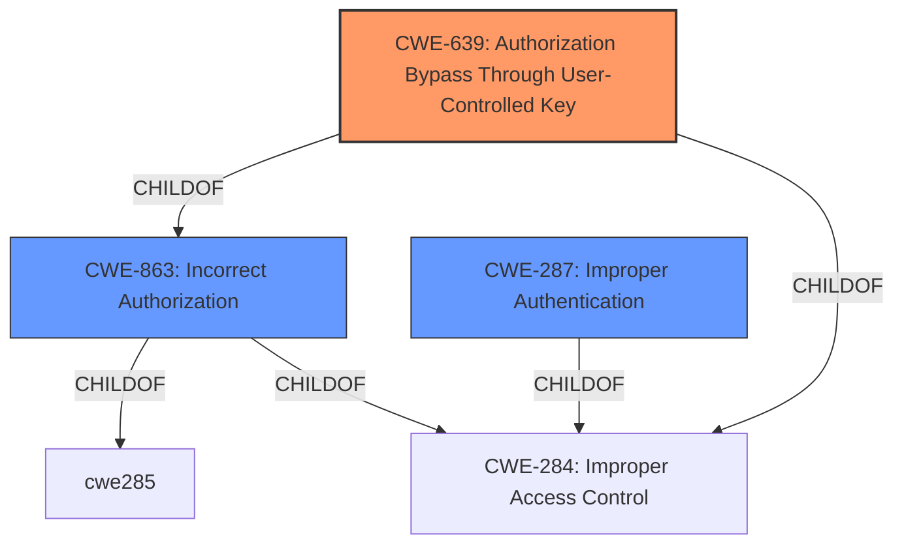

# Raw Analyzer Response for CVE-2022-32768

# Summary
| CWE ID | CWE Name | Confidence | CWE Abstraction Level | CWE Vulnerability Mapping Label | CWE-Vulnerability Mapping Notes |
|---|---|---|---|---|---|
| CWE-639 | Authorization Bypass Through User-Controlled Key | 1.0 | Base | Allowed | Primary CWE |
| CWE-862 | Missing Authorization | 0.7 | Class | Allowed-with-Review | Secondary Candidate |
| CWE-287 | Improper Authentication | 0.5 | Class | Discouraged | Secondary Candidate |

## Evidence and Confidence

*   **Confidence Score:** 0.8
*   **Evidence Strength:** HIGH

## Relationship Analysis
The primary CWE is CWE-639, which is a base-level CWE that is a child of CWE-863 (Incorrect Authorization). CWE-863 is a class-level CWE, which means that CWE-639 is more specific. CWE-639 also has a peer relationship with CWE-284 (Improper Access Control). The choice of CWE-639 is based on the fact that the vulnerability involves an authorization bypass through a user-controlled key.

## Vulnerability Chain
The vulnerability chain starts with a **missing authorization** check, leading to the ability for an attacker to **bypass authentication** and gain unauthorized access to resources.

## Summary of Analysis
The analysis is based on the provided evidence, specifically the "CVE Reference Links Content Summary" section. This section clearly states that the root cause of the vulnerability is a **missing authorization** check when handling object IDs. The application **fails to verify** if the user requesting a modification of a live schedule owns the live schedule resource, leading to unauthorized access.

The choice of CWE-639 is based on the fact that the vulnerability involves an authorization bypass through a user-controlled key. The attacker can guess a sequential ID and use it to take over another user's stream. This aligns perfectly with the description of CWE-639, which states that the system's authorization functionality does not prevent one user from gaining access to another user's data or record by modifying the key value identifying the data.

The selected CWE is at the optimal level of specificity. CWE-639 is a base-level CWE, which is more specific than the class-level CWE-862 (Missing Authorization). While CWE-862 could also be considered, CWE-639 provides a more precise description of the vulnerability.

The "Vulnerability Description Key Phrases" also supports this selection, mentioning "**impact:** bypass authentication".

The retriever results also support this selection, with CWE-639 having a high similarity score.

Relevant CWE Information:

# Enhanced Context (25 CWEs)

## CWE-639: Authorization Bypass Through User-Controlled Key
**Abstraction Level**: Base
**Similarity Score**: 0.77
**Source**: dense

**Description**:
The system's authorization functionality does not prevent one user from gaining access to another user's data or record by modifying the key value identifying the data.

**Mapping Guidance**:
- Usage: Allowed
- Rationale: This CWE entry is at the Base level of abstraction, which is a preferred level of abstraction for mapping to the root causes of vulnerabilities.

### Explanation of Selected CWEs:

*   **CWE-639: Authorization Bypass Through User-Controlled Key**
    *   **Technical Explanation:** The vulnerability allows an attacker to bypass authorization by guessing a sequential ID and using it to take over another user's stream. This matches the description of CWE-639, which states that the system's authorization functionality does not prevent one user from gaining access to another user's data or record by modifying the key value identifying the data.
    *   **Security Implications:** An attacker can gain unauthorized access to resources and take over another user's stream.
    *   **Relationship Analysis:** CWE-639 is a child of CWE-863 (Incorrect Authorization) and CWE-284 (Improper Access Control).
    *   **Mapping Guidance:** The mapping guidance for CWE-639 states that it is at the Base level of abstraction, which is a preferred level of abstraction for mapping to the root causes of vulnerabilities.
    *   **Primary/Secondary:** Primary

*   **CWE-862: Missing Authorization**
    *   **Technical Explanation:** The application fails to verify if the user requesting a modification of a live schedule owns the live schedule resource, leading to unauthorized access.
    *   **Security Implications:** An attacker can gain unauthorized access to resources.
    *   **Relationship Analysis:** CWE-862 is a parent of CWE-639.
    *   **Mapping Guidance:** The mapping guidance for CWE-862 states that it is a Class and might have Base-level children that would be more appropriate.
    *   **Primary/Secondary:** Secondary

*   **CWE-287: Improper Authentication**
    *   **Technical Explanation:** While the vulnerability description mentions authentication bypass, the root cause is more related to authorization. The attacker needs to be an authenticated user to exploit the vulnerability.
    *   **Security Implications:** An attacker can bypass authentication.
    *   **Relationship Analysis:** CWE-287 is a child of CWE-284 (Improper Access Control).
    *   **Mapping Guidance:** The mapping guidance for CWE-287 states that it is a Class and might be misused when lower-level CWE entries are likely to be applicable.
    *   **Primary/Secondary:** Secondary

### Explanation of Omitted CWEs:

*   **CWE-89: Improper Neutralization of Special Elements used in an SQL Command ('SQL Injection')**: This CWE is not applicable because the vulnerability does not involve SQL injection.
*   **CWE-306: Missing Authentication for Critical Function**: This CWE is not applicable because the vulnerability requires the attacker to be an authenticated user.
*   **CWE-1287: Improper Validation of Specified Type of Input**: This CWE is not applicable because the vulnerability does not involve improper validation of input types.
*   **CWE-289: Authentication Bypass by Alternate Name**: This CWE is not applicable because the vulnerability does not involve bypassing authentication by using alternate names.
*   **CWE-178: Improper Handling of Case Sensitivity**: This CWE is not applicable because the vulnerability does not involve case sensitivity issues.
*   **CWE-639: Authorization Bypass Through User-Controlled Key**: Selected as the primary CWE.
*   **CWE-863: Incorrect Authorization**: This CWE is a parent of CWE-639 and is a more general description of the vulnerability. It was considered but CWE-639 was more specific.