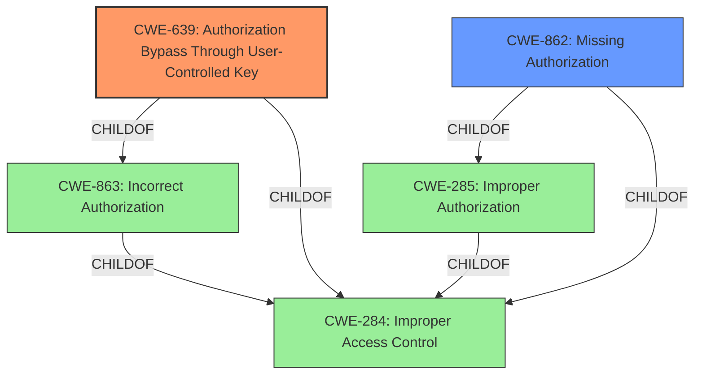

# Enhanced Analysis for CVE-2022-32769

# Summary
| CWE ID | CWE Name | Confidence | CWE Abstraction Level | CWE Vulnerability Mapping Label | CWE-Vulnerability Mapping Notes |
|---|---|---|---|---|---|
| CWE-639 | Authorization Bypass Through User-Controlled Key | 1.0 | Base | Allowed | Primary CWE |
| CWE-862 | Missing Authorization | 0.8 | Class | Allowed-with-Review | Secondary Candidate |

## Evidence and Confidence

*   **Confidence Score:** 0.9
*   **Evidence Strength:** HIGH

## Relationship Analysis
The primary CWE is CWE-639, which is a Base level CWE, providing a specific description of the vulnerability, where an attacker can modify a key value to gain access to another user's data. CWE-639 is a child of CWE-863 (Incorrect Authorization) and CWE-284 (Improper Access Control). CWE-862, Missing Authorization, is a class-level CWE and a child of CWE-285 (Improper Authorization) and CWE-284 (Improper Access Control). Because CWE-639 is a more specific description of the vulnerability than CWE-862, it is the better choice.



## Vulnerability Chain
The chain of events is as follows:
1.  **Missing Authorization:** The application **fails to check** if the user has the proper permissions to modify the playlist (root cause).
2.  **User-Controlled Key:** The attacker can **manipulate the `id` parameter** in the HTTP request (key value) to target another user's playlist.
3.  **Authorization Bypass:** Due to the missing authorization check and the user-controlled key, the attacker **bypasses authorization** and gains unauthorized access.
4.  **Playlist Takeover:** The attacker can **modify the playlist** name and status, effectively taking over the playlist.

## Summary of Analysis
Initially, the **authentication bypass** was the main focus, but further analysis of the provided information revealed that the root cause is an authorization issue.
The vulnerability occurs because the application **does not verify if the user making the request is the owner of the playlist being modified.** The attacker can exploit this by manipulating the `id` parameter in the request to target a playlist belonging to another user.
The key evidence supporting this analysis is:
*"The vulnerability stems from a **lack of authorization checks** in the `objects/playlistAddNew.json.php` endpoint within the AVideo application. Specifically, when modifying a playlist object, the application **does not verify if the user making the request is the owner of the playlist being modified.**"*
The graph relationships influenced the decision to choose CWE-639 over CWE-862 because it is a more specific description of the vulnerability and it is at the Base level of abstraction, which is a preferred level of abstraction for mapping to the root causes of vulnerabilities.

Relevant CWE Information:

*   **CWE-639: Authorization Bypass Through User-Controlled Key** The system's authorization functionality **does not prevent one user from gaining access to another user's data or record by modifying the key value identifying the data.** This aligns directly with the vulnerability description.

*   **CWE-862: Missing Authorization** The product **does not perform an authorization check** when an actor attempts to access a resource or perform an action. This also aligns with the vulnerability description, but is less specific than CWE-639.

CWEs Considered but Not Used:

*   CWE-89: Improper Neutralization of Special Elements used in an SQL Command ('SQL Injection') - This CWE is not applicable because there is no evidence of SQL injection in the vulnerability description.
*   CWE-1004: Sensitive Cookie Without 'HttpOnly' Flag - This CWE is not applicable because there is no evidence of sensitive cookies being used without the HttpOnly flag.
*   CWE-306: Missing Authentication for Critical Function - This CWE is not applicable because the vulnerability is an authorization issue, not an authentication issue.
*   CWE-287: Improper Authentication - This CWE is not applicable because the vulnerability is an authorization issue, not an authentication issue.
*   CWE-289: Authentication Bypass by Alternate Name - This CWE is not applicable because the vulnerability is an authorization issue, not an authentication issue.
*   CWE-613: Insufficient Session Expiration - This CWE is not applicable because there is no evidence of session expiration issues in the vulnerability description.
*   CWE-863: Incorrect Authorization - This CWE is a class-level CWE and is less specific than CWE-639, which is a more accurate description of the vulnerability.
*   CWE-620: Unverified Password Change - This CWE is not applicable because there is no evidence of password change issues in the vulnerability description.


## CWE Relationship Analysis

Current CWEs represent these abstraction levels: .


### Vulnerability Chain Analysis

**Chain starting from CWE-862:**
- 862 (Missing Authorization) - ROOT


**Chain starting from CWE-89:**
- 89 (Improper Neutralization of Special Elements used in an SQL Command ('SQL Injection')) - ROOT


### CWE Relationship Diagram

```mermaid
graph TD
    classDef primary fill:#f96,stroke:#333,stroke-width:2px
    classDef secondary fill:#69f,stroke:#333
    classDef tertiary fill:#9e9,stroke:#333
```