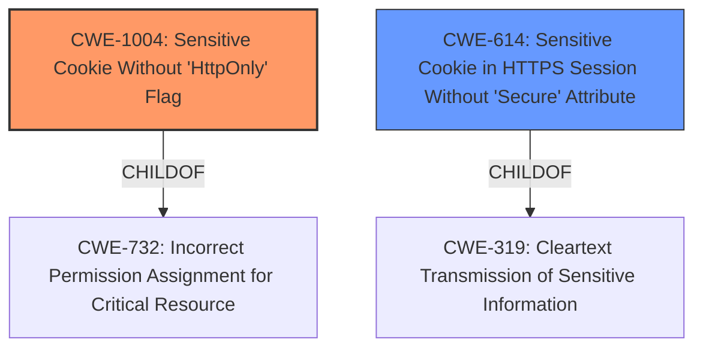

# Enhanced Analysis for CVE-2022-32778

# Summary
| CWE ID    | CWE Name                                                        | Confidence | CWE Abstraction Level | CWE Vulnerability Mapping Label | CWE-Vulnerability Mapping Notes |
| :--------- | :-------------------------------------------------------------- | :--------- | :-------------------- | :------------------------------ | :------------------------------ |
| CWE-1004   | Sensitive Cookie Without 'HttpOnly' Flag                       | 1          | Variant               | Primary                         | Allowed                       |
| CWE-614   | Sensitive Cookie in HTTPS Session Without 'Secure' Attribute                       | 1          | Variant               | Secondary                         | Allowed                       |

## Evidence and Confidence

*   **Confidence Score:** 1
*   **Evidence Strength:** HIGH

## Relationship Analysis
The primary CWE is CWE-1004, which is a variant and child of CWE-732. CWE-614 is a Variant and ChildOf CWE-319. Both are good fits based on the description.



## Vulnerability Chain
The vulnerability chain is as follows:
1.  **Root Cause:** **Missing HttpOnly and Secure flags** on the "pass" cookie.
2.  **Weakness:** Exposure of the password hash to JavaScript.
3.  **Impact:** Potential session hijacking and account takeover via XSS or MitM attacks.

## Summary of Analysis
The initial analysis focused on identifying the **root cause** of the vulnerability, which is the **missing HttpOnly and Secure flags** on the "pass" cookie. The "Vulnerability Description Key Phrases" section clearly indicates this **root cause**. The "CVE Reference Links Content Summary" confirms this, stating that the `HttpOnly` flag is explicitly set to `false` during the cookie's creation.

CWE-1004 (Sensitive Cookie Without 'HttpOnly' Flag) is the primary CWE because the vulnerability description explicitly states that the session cookie and the pass cookie miss the HttpOnly flag, making them accessible via JavaScript. This aligns directly with the CWE's description: "The product uses a cookie to store sensitive information, but the cookie is not marked with the HttpOnly flag." The "CVE Reference Links Content Summary" also confirms that the HttpOnly flag is missing. The confidence level is 1 because there is a direct statement on the **rootcause** and the cookie name and the summary also confirms this.

CWE-614 (Sensitive Cookie in HTTPS Session Without 'Secure' Attribute) is a secondary CWE because the vulnerability description mentions that the session cookie also misses the secure flag, which allows the session cookie to be leaked over non-HTTPS connections. This aligns directly with the CWE's description: "The Secure attribute for sensitive cookies in HTTPS sessions is not set, which could cause the user agent to send those cookies in plaintext over an HTTP session." The confidence level is 1 because there is a direct statement that secure flag is **missing**.

I considered other CWEs from the "Retriever Results" and "Complete CWE Specifications" sections, but they were not as directly applicable as CWE-1004 and CWE-614. For example, CWE-312 (Cleartext Storage of Sensitive Information) was considered, but the primary issue is the **missing flags** rather than the storage itself. CWE-201 (Insertion of Sensitive Information Into Sent Data) and CWE-1390 (Weak Authentication) were also considered but did not fit the **root cause** as precisely.


## CWE Relationship Analysis

Current CWEs represent these abstraction levels: .


### Vulnerability Chain Analysis

**Chain starting from CWE-201:**
- 201 (Insertion of Sensitive Information Into Sent Data) - ROOT


**Chain starting from CWE-319:**
- 319 (Cleartext Transmission of Sensitive Information) - ROOT


### CWE Relationship Diagram

```mermaid
graph TD
    classDef primary fill:#f96,stroke:#333,stroke-width:2px
    classDef secondary fill:#69f,stroke:#333
    classDef tertiary fill:#9e9,stroke:#333
```