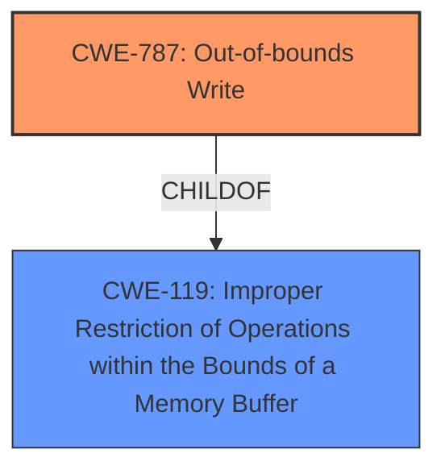

# Analysis for CVE-2022-32796

# Summary
| CWE ID | CWE Name | Confidence | CWE Abstraction Level | CWE Vulnerability Mapping Label | CWE-Vulnerability Mapping Notes |
|---|---|---|---|---|---|
| CWE-787 | Out-of-bounds Write | 1.0 | Base | Allowed | Primary CWE |

## Evidence and Confidence

*   **Confidence Score:** 1.0
*   **Evidence Strength:** HIGH

## Relationship Analysis
The primary relationship influencing the selection is the ChildOf relationship between CWE-787 **CWE-787: Out-of-bounds Write** and CWE-119 **CWE-119: Improper Restriction of Operations within the Bounds of a Memory Buffer**, indicating that out-of-bounds write is a specific type of memory buffer error. There are no chain relationships for this particular single CWE assignment. The abstraction level is Base, which is the preferred level.

## Vulnerability Chain
The vulnerability chain starts with a **memory corruption** issue, leading to the ability to execute arbitrary code with kernel privileges.
  - **Root Cause:** **Memory corruption** (CWE-787)
  - **Impact:** Execute arbitrary code with kernel privileges

## Summary of Analysis
The vulnerability description indicates a **memory corruption** issue that allows an app to execute arbitrary code with kernel privileges. The key evidence is the phrase "**memory corruption**" in both the Vulnerability Description and the CVE Reference Links Content Summary. The Retriever Results list CWE-787 **CWE-787: Out-of-bounds Write** as the top combined result with a score of 1.000, making it the primary candidate.

CWE-787 **CWE-787: Out-of-bounds Write** is a Base level CWE that describes writing data past the end or before the beginning of the intended buffer, which aligns with the general description of **memory corruption**. The "Alternative Terms" section of CWE-787 lists "Memory Corruption" which directly matches the vulnerability description. The Mapping Guidance for CWE-787 states that it is Allowed and that it is at the Base level of abstraction, which is preferred.

Other CWEs were considered but ultimately not selected:

*   CWE-667 **CWE-667: Improper Locking**: While **memory corruption** can sometimes be related to locking issues, there's no specific evidence in the description to suggest a problem with locking mechanisms.
*   CWE-843 **CWE-843: Access of Resource Using Incompatible Type ('Type Confusion')**: Similar to locking, type confusion can lead to **memory corruption**, but the description doesn't provide specific evidence of type mismatches or incompatible type usage.
*   CWE-415 **CWE-415: Double Free**: There is no evidence of double freeing of any resources from the description.
*   CWE-665 **CWE-665: Improper Initialization**: There is no evidence that improper initialization caused the **memory corruption**.
*   CWE-277 **CWE-277: Insecure Inherited Permissions**: This is unrelated to **memory corruption**.
*   CWE-123 **CWE-123: Write-what-where Condition**: This is a more general case of CWE-787 **CWE-787: Out-of-bounds Write**, so the latter is a better fit.
*   CWE-20 **CWE-20: Improper Input Validation**: There is no mention of input validation.
*   CWE-187 **CWE-187: Partial String Comparison**: This is unrelated to **memory corruption**.
*   CWE-822 **CWE-822: Untrusted Pointer Dereference**: There is no evidence of untrusted pointer dereferences.

The decision to assign CWE-787 **CWE-787: Out-of-bounds Write** is based on the direct match of "**memory corruption**" in the vulnerability description and the CWE's alternative terms, along with its high score in the Retriever Results. The CWE is at the optimal level of specificity (Base) and aligns with the provided evidence.