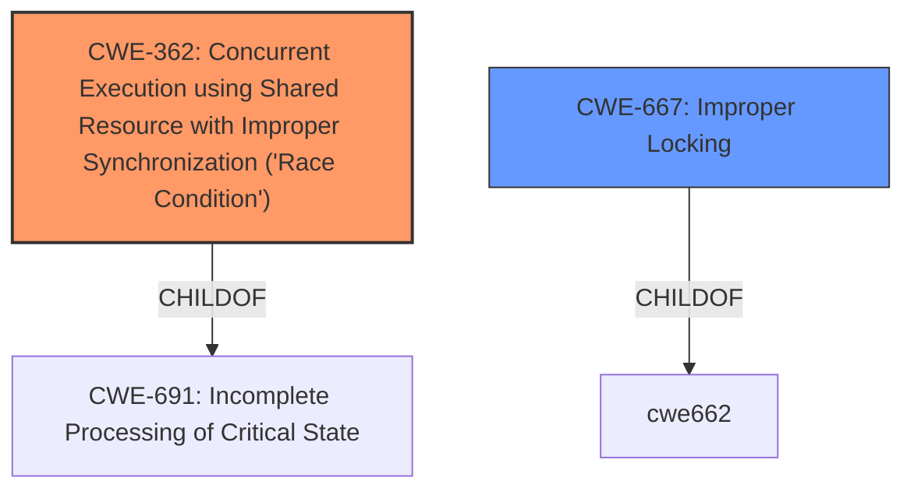

# Analysis Report for CVE-2022-32844

# Vulnerability Analysis Report: CVE-2022-32844

## Description


## Analysis (with Relationship Data)

# Summary
| CWE ID | CWE Name | Confidence | CWE Abstraction Level | CWE Vulnerability Mapping Label | CWE-Vulnerability Mapping Notes |
|---|---|---|---|---|---|
| CWE-362 | Concurrent Execution using Shared Resource with Improper Synchronization ('Race Condition') | 1.0 | Class | Allowed-with-Review | Primary CWE |
| CWE-667 | Improper Locking | 0.6 | Class | Allowed-with-Review | Secondary Candidate |

## Evidence and Confidence

*   **Confidence Score:** 0.8
*   **Evidence Strength:** HIGH

## Relationship Analysis
The primary relationship impacting the CWE selection is the parent-child relationship, where CWE-362 is a class-level CWE. The vulnerability description clearly indicates a **race condition**, which aligns directly with the description of CWE-362. Additionally, the description mentions improved state handling which could imply improper locking.



## Vulnerability Chain
The vulnerability chain starts with a **race condition** (CWE-362) due to missing or improper synchronization, possibly linked to state handling issues. This **race condition** allows an attacker with arbitrary kernel read and write capability to bypass Pointer Authentication. The root cause is the **race condition**, and the impact is the bypass of Pointer Authentication.

## Summary of Analysis
The initial analysis strongly pointed towards CWE-362 due to the explicit mention of a **race condition** in the vulnerability description. Further review of the "CVE Reference Links Content Summary" section confirmed this, highlighting "a **race condition**" as a root cause. The retriever results also listed CWE-362 as the top candidate. While CWE-362 is a Class-level CWE and the mapping guidance suggests reviewing child entries for a more specific fit, none of the children seem directly applicable based on the available information. The description also mentions that this issue was fixed with "improved state handling". This may mean that **improper locking** (CWE-667) was also a factor.

Relevant CWE Information:

# Enhanced Context (25 CWEs)
The following CWEs were identified as potentially relevant to this vulnerability:

## CWE-362: Concurrent Execution using Shared Resource with Improper Synchronization ('Race Condition')

**CWE-362: Concurrent Execution using Shared Resource with Improper Synchronization ('Race Condition')** is selected as the primary CWE because the vulnerability description explicitly mentions a **race condition**. The "CVE Reference Links Content Summary" further supports this by listing "a **race condition**" as a root cause. The description of CWE-362 states: "The product contains a concurrent code sequence that requires temporary, exclusive access to a shared resource, but a timing window exists in which the shared resource can be modified by another code sequence operating concurrently." This aligns directly with the vulnerability, where concurrent execution allows bypassing Pointer Authentication.
The security implication is that an attacker can bypass security mechanisms, and the impact is arbitrary kernel read and write capability.

## CWE-667: Improper Locking

**CWE-667: Improper Locking** is considered as a secondary CWE. The vulnerability description mentions that the **race condition** was addressed with "improved state handling." This suggests that the **race condition** might have been caused by improper locking mechanisms, a condition that CWE-667 aims to address.
The description of CWE-667 states: "The product does not properly acquire or release a lock on a resource, leading to unexpected resource state changes and behaviors." This is potentially related to the vulnerability because improved state handling might involve fixing improper locking, even if it's not explicitly mentioned.
The security implication is that an attacker might exploit improper locking to cause unexpected resource state changes, leading to security vulnerabilities.
CWE-667 is a Class-level CWE, and further investigation might reveal a more specific Base or Variant CWE related to locking mechanisms.

## Other CWEs Considered

*   **CWE-787: Out-of-bounds Write** was considered but is not directly supported by the provided information. While a **race condition** could potentially lead to out-of-bounds writes, there is no explicit evidence of this in the vulnerability description or the CVE summary.
*   **CWE-665: Improper Initialization** was considered, but the description focuses on a **race condition** and not necessarily on initialization issues.
*   **CWE-415: Double Free** and **CWE-416: Use After Free** were also considered because **race conditions** can lead to memory corruption issues. However, there is no direct evidence to support these CWEs in the provided text.
*   **CWE-20: Improper Input Validation** was considered but discarded because the vulnerability is more specifically related to concurrency issues than input validation.

I am choosing CWE-362 and CWE-667 because the primary root cause evidence refers to a **race condition**, which is fixed by improved state handling.


## CWE Relationship Analysis

Current CWEs represent these abstraction levels: .


### Vulnerability Chain Analysis

**Chain starting from CWE-20:**
- 20 (Improper Input Validation) - ROOT


**Chain starting from CWE-415:**
- 415 (Double Free) - ROOT


### CWE Relationship Diagram

```mermaid
graph TD
    classDef primary fill:#f96,stroke:#333,stroke-width:2px
    classDef secondary fill:#69f,stroke:#333
    classDef tertiary fill:#9e9,stroke:#333
```


*Report generated on 2025-03-30 19:08:26*
